# 文件管理与OSS集成

<cite>
**本文档引用的文件**
- [application.yml](file://src/main/resources/application.yml)
- [OssConfig.java](file://src/main/java/com/redmoon2333/config/OssConfig.java)
- [OssUtil.java](file://src/main/java/com/redmoon2333/util/OssUtil.java)
- [MaterialController.java](file://src/main/java/com/redmoon2333/controller/MaterialController.java)
- [MaterialService.java](file://src/main/java/com/redmoon2333/service/MaterialService.java)
- [Material.java](file://src/main/java/com/redmoon2333/entity/Material.java)
- [MaterialRequest.java](file://src/main/java/com/redmoon2333/dto/MaterialRequest.java)
- [MaterialResponse.java](file://src/main/java/com/redmoon2333/dto/MaterialResponse.java)
</cite>

## 目录
1. [简介](#简介)
2. [项目结构概览](#项目结构概览)
3. [OSS配置与客户端管理](#oss配置与客户端管理)
4. [OSS工具类设计](#oss工具类设计)
5. [文件上传流程](#文件上传流程)
6. [文件下载与访问](#文件下载与访问)
7. [资料管理服务](#资料管理服务)
8. [数据模型设计](#数据模型设计)
9. [权限控制机制](#权限控制机制)
10. [错误处理与异常管理](#错误处理与异常管理)
11. [性能优化策略](#性能优化策略)
12. [部署配置指南](#部署配置指南)
13. [故障排除指南](#故障排除指南)
14. [总结](#总结)

## 简介

本系统是一个基于Spring Boot的人力资源管理系统，集成了阿里云OSS（对象存储服务）来实现高效的文件存储和管理功能。系统支持大文件上传（最大100MB），采用UUID命名策略确保文件唯一性，并提供了完整的文件生命周期管理，包括上传、存储、访问和删除等操作。

核心特性包括：
- 支持100MB以内文件上传
- UUID文件命名机制
- MIME类型自动检测
- 文件格式验证
- 分类化的资料管理
- 权限控制的文件访问
- 错误处理和异常恢复
- 性能优化和缓存策略

## 项目结构概览

系统采用标准的Spring Boot架构，文件管理相关的核心组件分布在以下目录结构中：

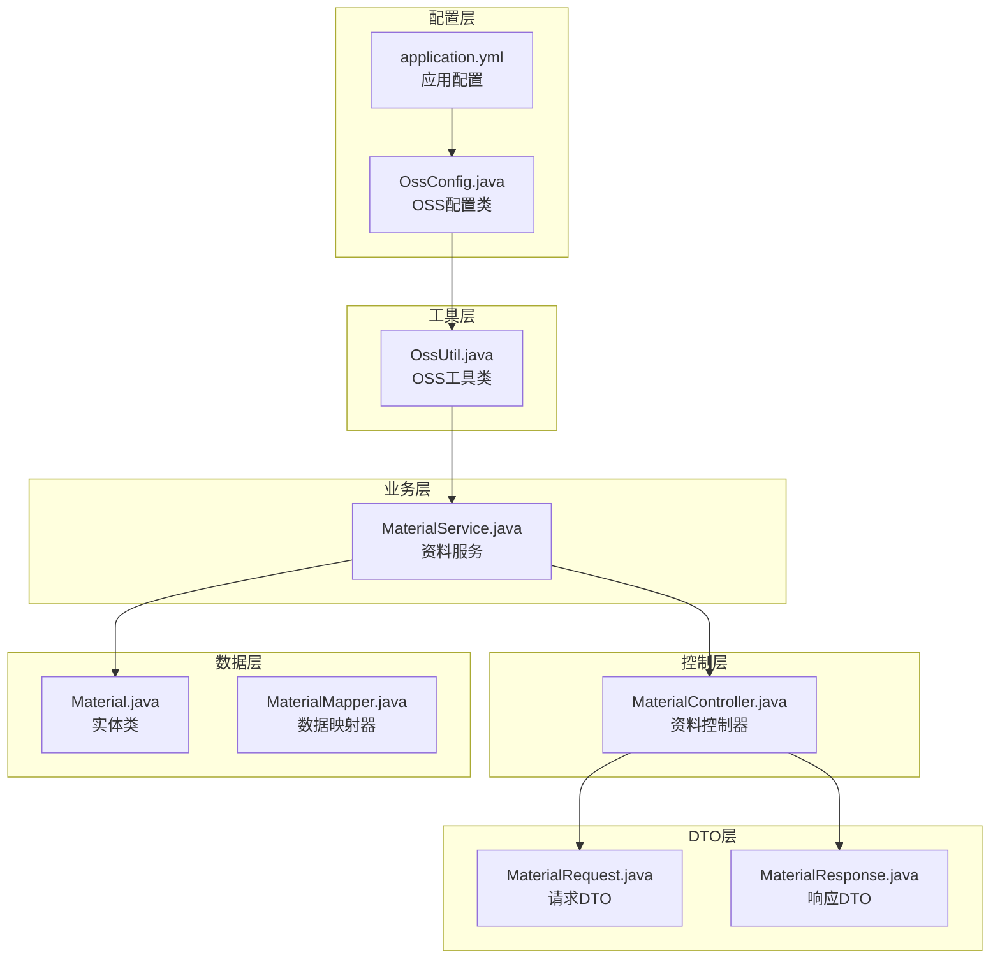

**图表来源**
- [application.yml](file://src/main/resources/application.yml#L1-L62)
- [OssConfig.java](file://src/main/java/com/redmoon2333/config/OssConfig.java#L1-L71)
- [OssUtil.java](file://src/main/java/com/redmoon2333/util/OssUtil.java#L1-L211)

## OSS配置与客户端管理

### 配置类设计

OssConfig类负责管理阿里云OSS客户端的创建和配置，采用条件化配置策略确保只有在必要时才创建客户端实例。

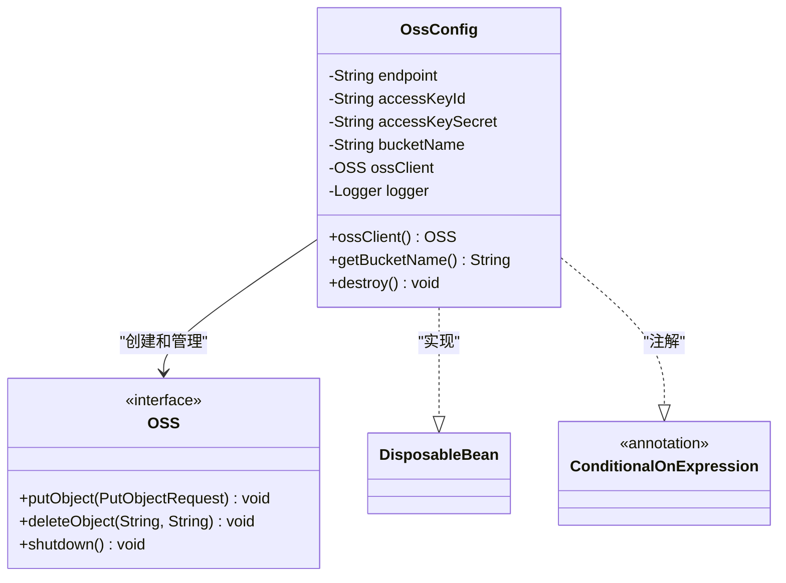

**图表来源**
- [OssConfig.java](file://src/main/java/com/redmoon2333/config/OssConfig.java#L15-L71)

### 配置参数详解

系统通过application.yml文件进行OSS配置，支持环境变量注入：

```yaml
aliyun:
  oss:
    endpoint: ${ALIYUN_OSS_ENDPOINT:}
    accessKeyId: ${ALIYUN_OSS_ACCESS_KEY_ID:}
    accessKeySecret: ${ALIYUN_OSS_ACCESS_KEY_SECRET:}
    bucketName: ${ALIYUN_OSS_BUCKET_NAME:}
    domain: ${ALIYUN_OSS_DOMAIN:}
```

关键配置项说明：
- **endpoint**: OSS服务端点，默认为杭州区域
- **accessKeyId**: 阿里云访问密钥ID
- **accessKeySecret**: 阿里云访问密钥
- **bucketName**: 存储桶名称
- **domain**: 自定义域名（可选）

### 客户端生命周期管理

OssConfig实现了DisposableBean接口，在应用关闭时优雅地释放OSS客户端资源：

```java
// 实现 DisposableBean 接口来处理资源清理
public void destroy() throws Exception {
    if (ossClient != null) {
        ossClient.shutdown();
        logger.info("OSS客户端已关闭");
    }
}
```

**章节来源**
- [OssConfig.java](file://src/main/java/com/redmoon2333/config/OssConfig.java#L1-L71)
- [application.yml](file://src/main/resources/application.yml#L40-L46)

## OSS工具类设计

### 工具类架构

OssUtil作为核心工具类，封装了OSS的所有操作，提供简洁的API接口：

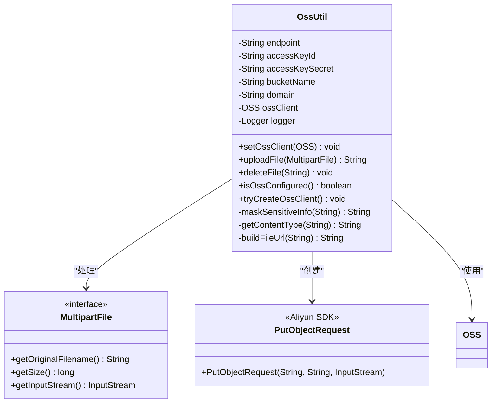

**图表来源**
- [OssUtil.java](file://src/main/java/com/redmoon2333/util/OssUtil.java#L15-L211)

### 文件上传机制

OssUtil的uploadFile方法实现了完整的文件上传流程：

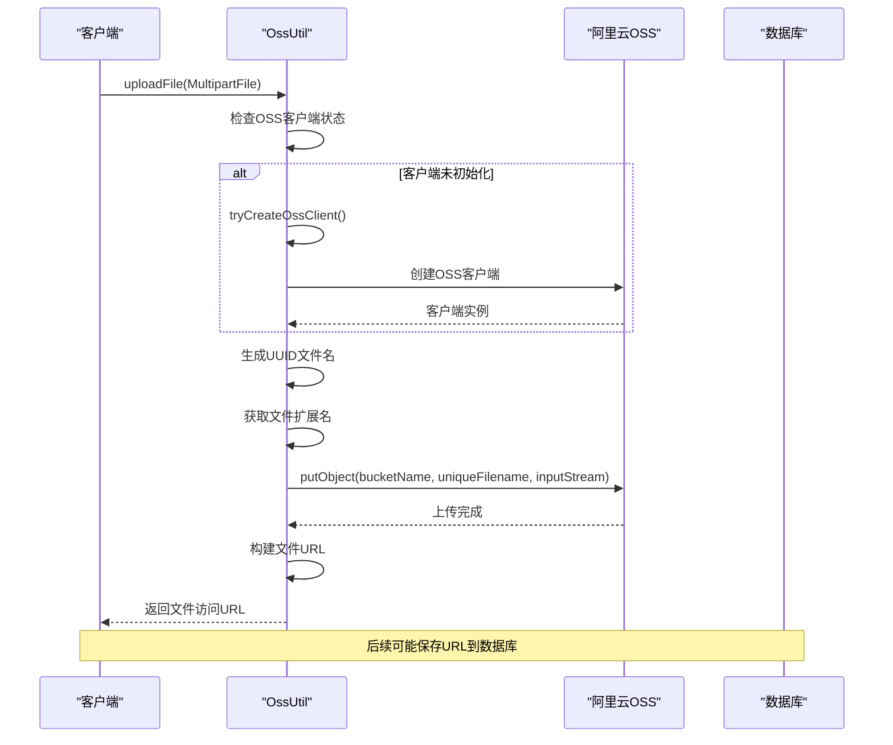

**图表来源**
- [OssUtil.java](file://src/main/java/com/redmoon2333/util/OssUtil.java#L65-L105)

### UUID命名策略

系统采用UUID命名策略确保文件名的唯一性：

```java
// 生成唯一文件名
String originalFilename = file.getOriginalFilename();
String extension = originalFilename != null ? 
    originalFilename.substring(originalFilename.lastIndexOf(".")) : "";
String uniqueFilename = UUID.randomUUID().toString() + extension;
```

这种策略的优势：
- 避免文件名冲突
- 提高安全性
- 支持并发上传
- 方便文件追踪

### MIME类型检测

OssUtil内置了文件类型检测机制：

```java
private String getContentType(String filename) {
    String ext = filename.substring(filename.lastIndexOf(".") + 1).toLowerCase();
    switch (ext) {
        case "jpg": case "jpeg": return "image/jpeg";
        case "png": return "image/png";
        case "pdf": return "application/pdf";
        case "doc": case "docx": return "application/msword";
        case "xls": case "xlsx": return "application/vnd.ms-excel";
        default: return "application/octet-stream";
    }
}
```

**章节来源**
- [OssUtil.java](file://src/main/java/com/redmoon2333/util/OssUtil.java#L1-L211)

## 文件上传流程

### 控制器层处理

MaterialController负责接收HTTP请求并协调文件上传流程：

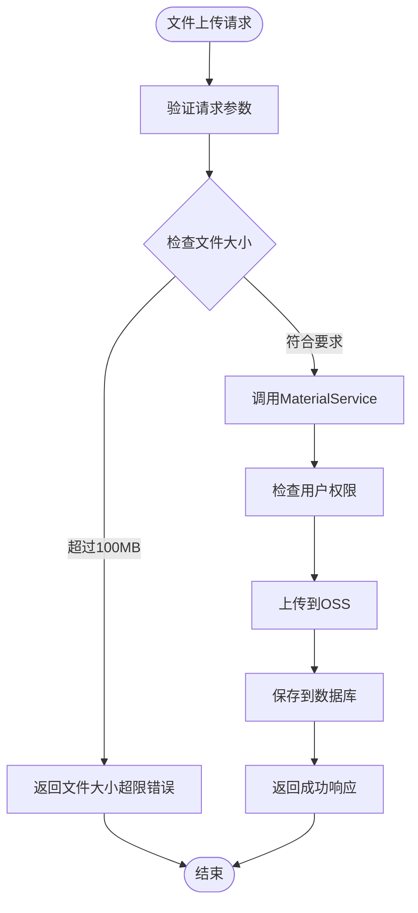

**图表来源**
- [MaterialController.java](file://src/main/java/com/redmoon2333/controller/MaterialController.java#L35-L55)

### 服务层业务逻辑

MaterialService实现了完整的业务逻辑处理：

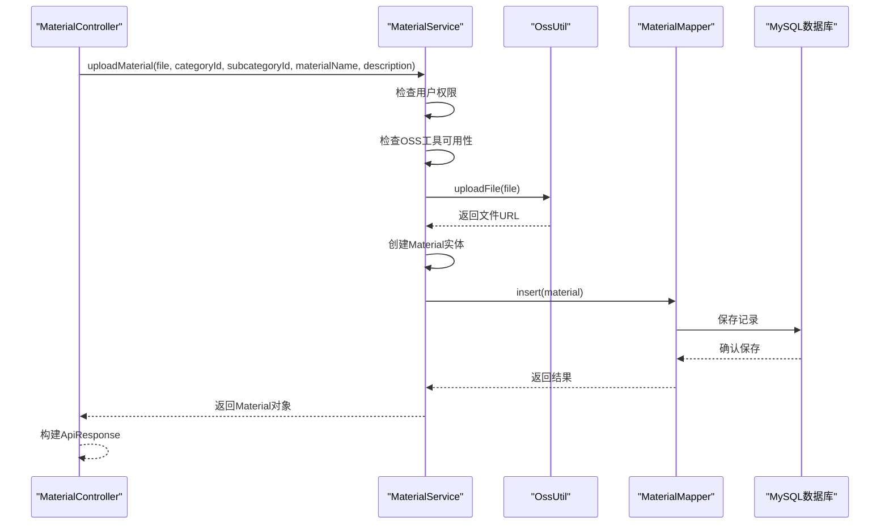

**图表来源**
- [MaterialService.java](file://src/main/java/com/redmoon2333/service/MaterialService.java#L40-L85)

### 大文件上传支持

系统通过Spring配置支持大文件上传：

```yaml
spring:
  servlet:
    multipart:
      max-file-size: 100MB
      max-request-size: 100MB
```

这确保了：
- 单个文件最大100MB
- 整个请求最大100MB
- 支持多文件上传场景

**章节来源**
- [MaterialController.java](file://src/main/java/com/redmoon2333/controller/MaterialController.java#L35-L55)
- [MaterialService.java](file://src/main/java/com/redmoon2333/service/MaterialService.java#L40-L85)
- [application.yml](file://src/main/resources/application.yml#L10-L13)

## 文件下载与访问

### 下载流程设计

系统支持两种文件访问模式：本地文件系统和OSS存储。对于OSS存储的文件，系统直接返回文件URL：

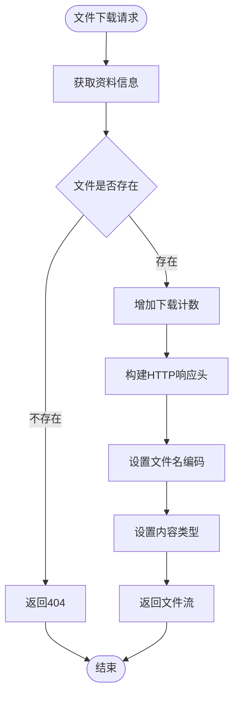

**图表来源**
- [MaterialController.java](file://src/main/java/com/redmoon2333/controller/MaterialController.java#L60-L100)

### 文件访问优化

系统实现了多种文件访问优化策略：

1. **URL重定向**: 对于OSS存储的文件，直接返回文件URL
2. **内容类型检测**: 自动识别文件类型并设置正确的MIME类型
3. **文件名编码**: 支持中文文件名的URL编码
4. **缓存控制**: 利用HTTP缓存机制提高访问效率

### 文件删除机制

系统提供了完整的文件删除功能：

```java
public void deleteMaterialFile(String fileUrl) {
    if (fileUrl != null && !fileUrl.isEmpty()) {
        String filePath = extractOssFilePath(fileUrl);
        if (filePath != null && ossUtil != null) {
            ossUtil.deleteFile(filePath);
        }
    }
}
```

删除流程包括：
- 从URL中提取文件路径
- 检查OSS配置状态
- 执行文件删除操作
- 清理数据库记录

**章节来源**
- [MaterialController.java](file://src/main/java/com/redmoon2333/controller/MaterialController.java#L60-L100)
- [MaterialService.java](file://src/main/java/com/redmoon2333/service/MaterialService.java#L110-L135)

## 资料管理服务

### 服务架构设计

MaterialService是资料管理的核心服务，负责协调文件操作和数据库交互：

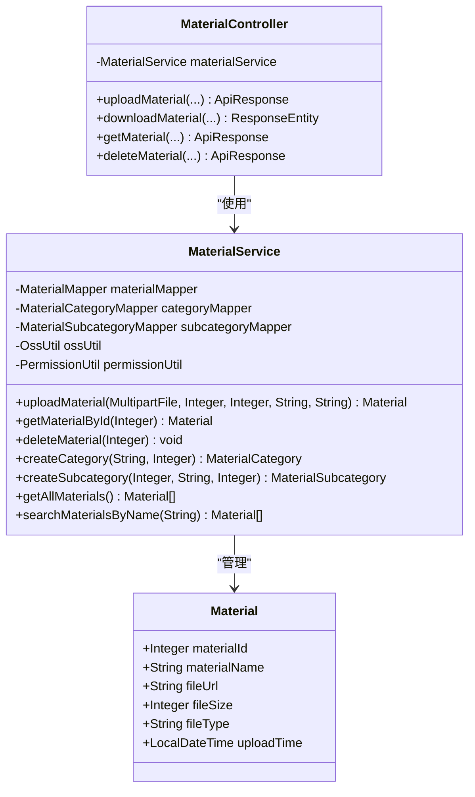

**图表来源**
- [MaterialService.java](file://src/main/java/com/redmoon2333/service/MaterialService.java#L20-L459)
- [MaterialController.java](file://src/main/java/com/redmoon2333/controller/MaterialController.java#L30-L328)

### 分类体系管理

系统实现了两级分类体系：

1. **主分类（Category）**: 大类别的划分
2. **子分类（Subcategory）**: 细分领域的组织

分类管理功能包括：
- 创建分类和子分类
- 查询分类列表
- 分类层级关系维护
- 权限控制的分类管理

### 数据库操作优化

MaterialService通过MyBatis实现高效的数据访问：

```java
@Transactional
public Material uploadMaterial(MultipartFile file, Integer categoryId, Integer subcategoryId, 
                             String materialName, String description) throws IOException {
    // 事务保证数据一致性
    // 异常回滚机制
    // 并发安全考虑
}
```

**章节来源**
- [MaterialService.java](file://src/main/java/com/redmoon2333/service/MaterialService.java#L20-L459)

## 数据模型设计

### 实体类结构

Material实体类定义了资料的基本属性：

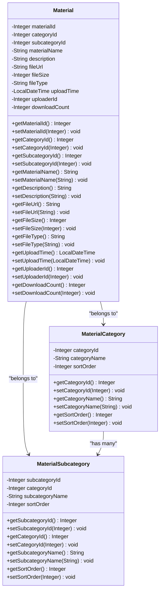

**图表来源**
- [Material.java](file://src/main/java/com/redmoon2333/entity/Material.java#L8-L164)

### DTO数据传输对象

系统使用DTO模式分离数据传输和业务逻辑：

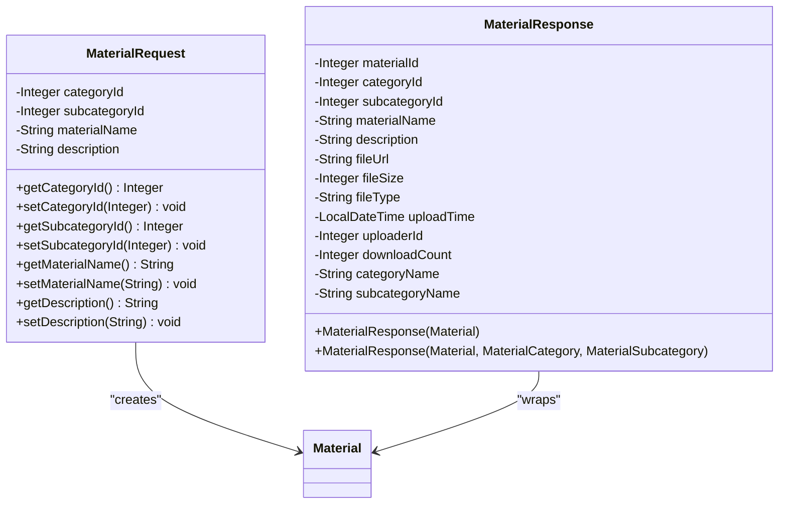

**图表来源**
- [MaterialRequest.java](file://src/main/java/com/redmoon2333/dto/MaterialRequest.java#L3-L41)
- [MaterialResponse.java](file://src/main/java/com/redmoon2333/dto/MaterialResponse.java#L8-L156)

**章节来源**
- [Material.java](file://src/main/java/com/redmoon2333/entity/Material.java#L1-L164)
- [MaterialRequest.java](file://src/main/java/com/redmoon2333/dto/MaterialRequest.java#L1-L41)
- [MaterialResponse.java](file://src/main/java/com/redmoon2333/dto/MaterialResponse.java#L1-L156)

## 权限控制机制

### 角色权限体系

系统实现了基于角色的权限控制：

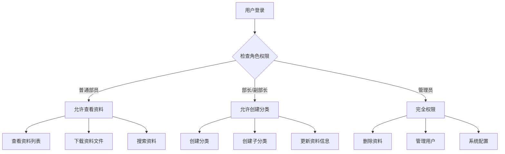

### 注解驱动的权限控制

系统使用自定义注解实现声明式权限控制：

```java
@PostMapping("/upload")
@RequireMemberRole("上传内部资料")
public ApiResponse<MaterialResponse> uploadMaterial(...) {
    // 只有具备相应权限的用户才能访问
}

@PostMapping("/category")
@RequireMinisterRole("创建资料分类")
public ApiResponse<CategoryResponse> createCategory(...) {
    // 只有部长/副部长才能创建分类
}
```

权限检查流程：
1. 解析请求中的用户身份
2. 验证用户角色权限
3. 检查具体操作权限
4. 执行业务逻辑或拒绝访问

**章节来源**
- [MaterialController.java](file://src/main/java/com/redmoon2333/controller/MaterialController.java#L35-L328)

## 错误处理与异常管理

### 异常层次结构

系统实现了完善的异常处理机制：

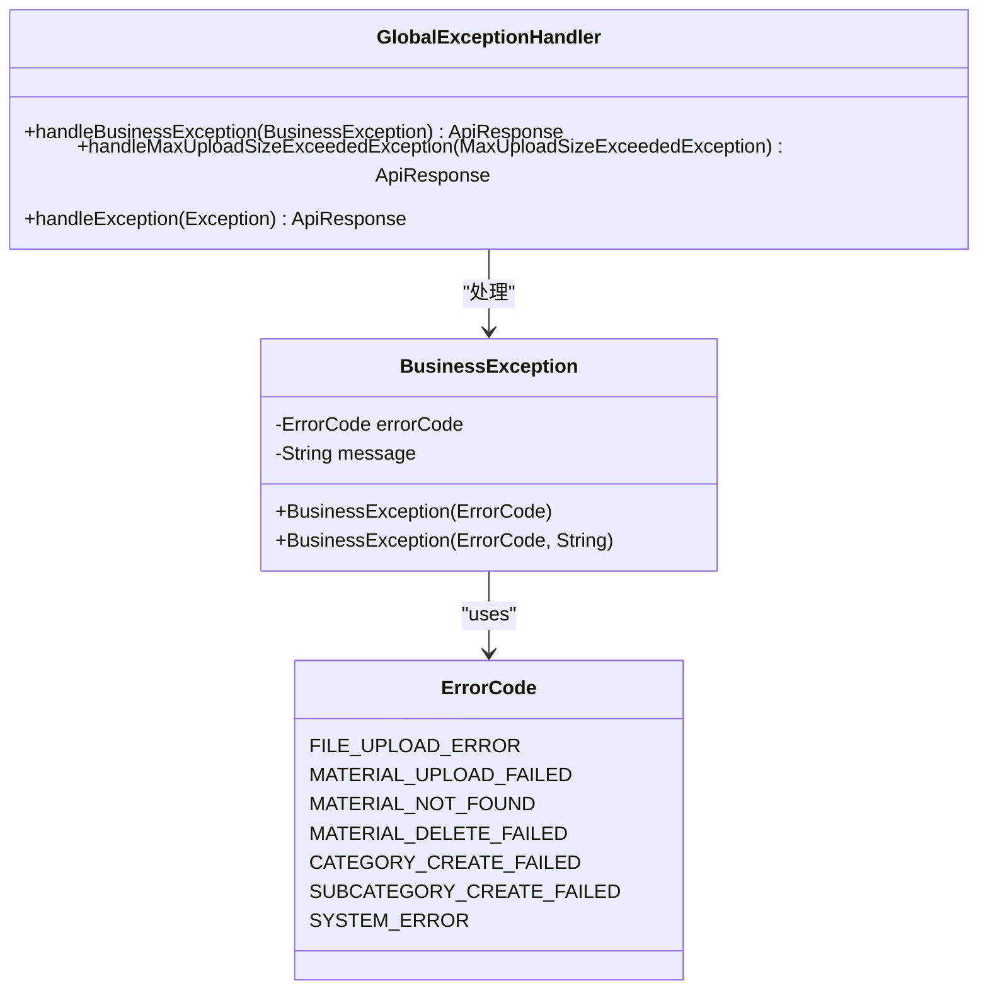

### 错误处理策略

系统针对不同类型的错误采用相应的处理策略：

1. **文件大小超限**: 返回明确的错误消息和错误码
2. **OSS配置缺失**: 提供详细的配置指导
3. **权限不足**: 返回适当的HTTP状态码
4. **网络异常**: 实现重试机制和降级策略
5. **存储配额不足**: 提示用户清理空间或升级配额

### 日志记录机制

系统全面的日志记录帮助问题诊断：

```java
logger.info("开始上传文件: 文件名={}, 大小={}, 用户ID={}", 
    file.getOriginalFilename(), file.getSize(), uploaderId);
logger.error("文件上传失败: {}", e.getMessage(), e);
logger.warn("OSS未配置，跳过文件删除: {}", filePath);
```

**章节来源**
- [MaterialController.java](file://src/main/java/com/redmoon2333/controller/MaterialController.java#L40-L55)
- [MaterialService.java](file://src/main/java/com/redmoon2333/service/MaterialService.java#L60-L70)

## 性能优化策略

### 缓存策略

系统采用多层缓存提升性能：

1. **Redis缓存**: 缓存热点资料信息
2. **浏览器缓存**: 利用HTTP缓存头
3. **CDN加速**: OSS自带全球CDN支持

### 异步处理

对于耗时操作采用异步处理：

```java
@Transactional
public void incrementDownloadCount(Integer materialId) {
    // 异步增加下载计数
    materialMapper.updateDownloadCount(materialId);
}
```

### 连接池优化

OSS客户端连接池配置：

```java
// OSS客户端连接池配置
OSSClientBuilder builder = new OSSClientBuilder();
OSS ossClient = builder.build(endpoint, accessKeyId, accessKeySecret);
```

### 批量操作支持

系统支持批量资料操作：

```java
@GetMapping("/search")
public ApiResponse<List<MaterialResponse>> searchMaterials(@RequestParam("name") String materialName) {
    List<Material> materials = materialService.searchMaterialsByName(materialName);
    // 批量转换为响应对象
}
```

## 部署配置指南

### 环境变量配置

生产环境需要设置以下环境变量：

```bash
# 阿里云OSS配置
export ALIYUN_OSS_ENDPOINT=oss-cn-hangzhou.aliyuncs.com
export ALIYUN_OSS_ACCESS_KEY_ID=your-access-key-id
export ALIYUN_OSS_ACCESS_KEY_SECRET=your-access-key-secret
export ALIYUN_OSS_BUCKET_NAME=your-bucket-name
export ALIYUN_OSS_DOMAIN=custom-domain.com

# 数据库配置
export SPRING_DATASOURCE_URL=jdbc:mysql://localhost:3306/hrofficial
export SPRING_DATASOURCE_USERNAME=root
export SPRING_DATASOURCE_PASSWORD=your-password

# Redis配置
export SPRING_DATA_REDIS_HOST=localhost
export SPRING_DATA_REDIS_PORT=6379
export SPRING_DATA_REDIS_PASSWORD=
```

### 生产环境优化

生产环境推荐配置：

```yaml
# 生产环境配置
spring:
  servlet:
    multipart:
      max-file-size: 100MB
      max-request-size: 100MB
  jackson:
    time-zone: GMT+8
    date-format: yyyy-MM-dd HH:mm:ss

# Redis连接池优化
spring:
  data:
    redis:
      timeout: 5000ms
      lettuce:
        pool:
          max-active: 16
          max-wait: 2000ms
          max-idle: 16
          min-idle: 4
```

### 监控指标

关键监控指标包括：
- 文件上传成功率
- OSS存储使用量
- 下载响应时间
- 数据库连接池状态
- Redis缓存命中率

**章节来源**
- [application.yml](file://src/main/resources/application.yml#L1-L62)

## 故障排除指南

### 常见问题及解决方案

1. **OSS配置错误**
   - 检查环境变量是否正确设置
   - 验证AccessKey的有效性
   - 确认存储桶权限设置

2. **文件上传失败**
   - 检查文件大小是否超过限制
   - 验证网络连接稳定性
   - 查看OSS存储配额情况

3. **权限访问问题**
   - 确认用户角色权限
   - 检查JWT令牌有效性
   - 验证API端点权限

4. **性能问题**
   - 监控Redis连接池状态
   - 检查数据库索引优化
   - 分析OSS访问延迟

### 调试技巧

启用调试日志：

```yaml
logging:
  level:
    com.redmoon2333.service.MaterialService: DEBUG
    com.redmoon2333.util.OssUtil: DEBUG
    com.redmoon2333.config.OssConfig: DEBUG
```

### 监控告警

设置关键指标告警：
- OSS上传失败率 > 5%
- 数据库连接池使用率 > 80%
- Redis内存使用率 > 90%
- 系统响应时间 > 2秒

## 总结

本系统通过精心设计的架构实现了高效、可靠的文件管理功能。主要特点包括：

### 技术优势

1. **模块化设计**: 清晰的分层架构便于维护和扩展
2. **高可用性**: OSS提供的全球分布式存储
3. **安全性**: 多层权限控制和数据加密
4. **性能优化**: 缓存策略和连接池优化
5. **可扩展性**: 支持大规模文件存储和访问

### 功能完整性

- 支持100MB以内文件上传
- UUID命名确保文件唯一性
- 自动MIME类型检测
- 完整的文件生命周期管理
- 分类化的资料管理体系
- 权限控制的访问机制

### 最佳实践

- 使用环境变量管理敏感配置
- 实现完善的异常处理机制
- 采用事务保证数据一致性
- 提供详细的日志记录
- 支持多种部署环境

通过这些设计和实现，系统能够满足企业级人力资源管理的文件存储需求，为用户提供稳定、高效、安全的文件管理体验。