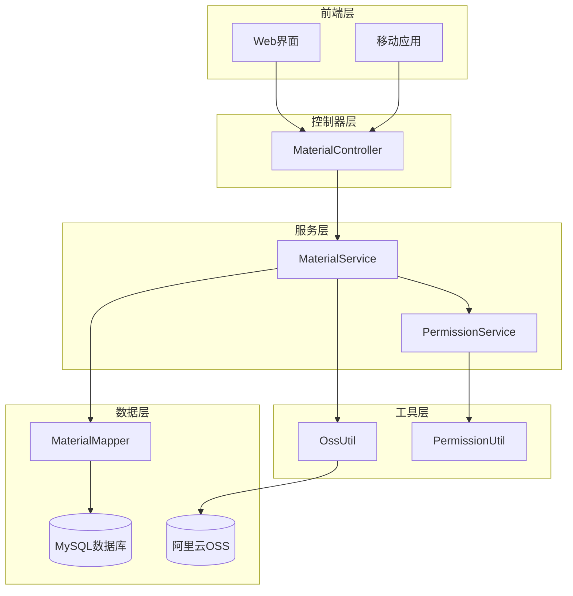
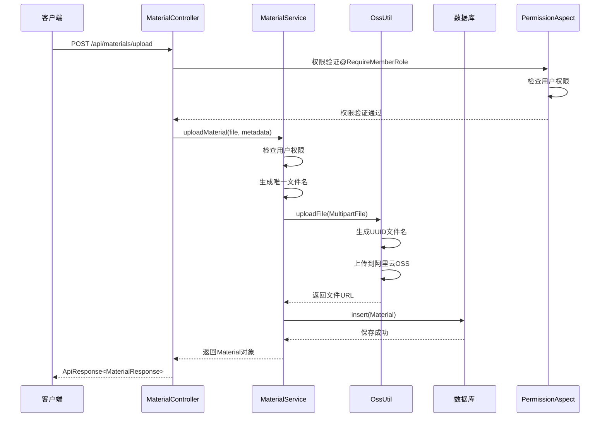
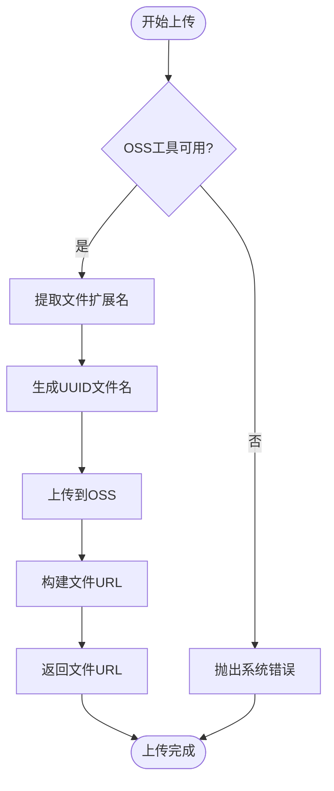
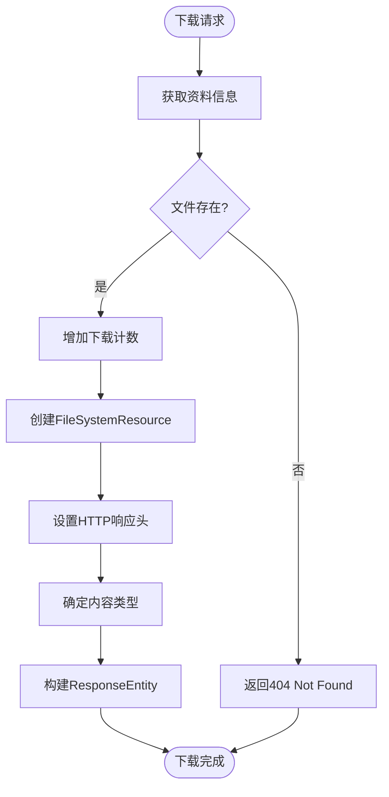
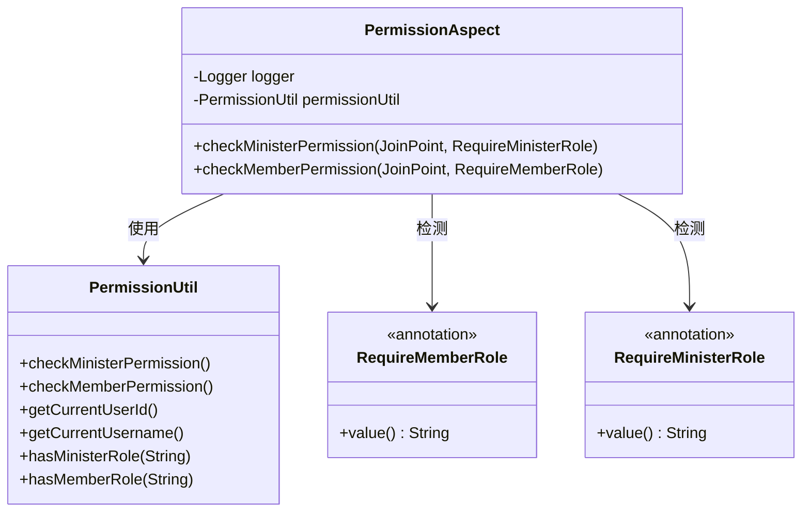
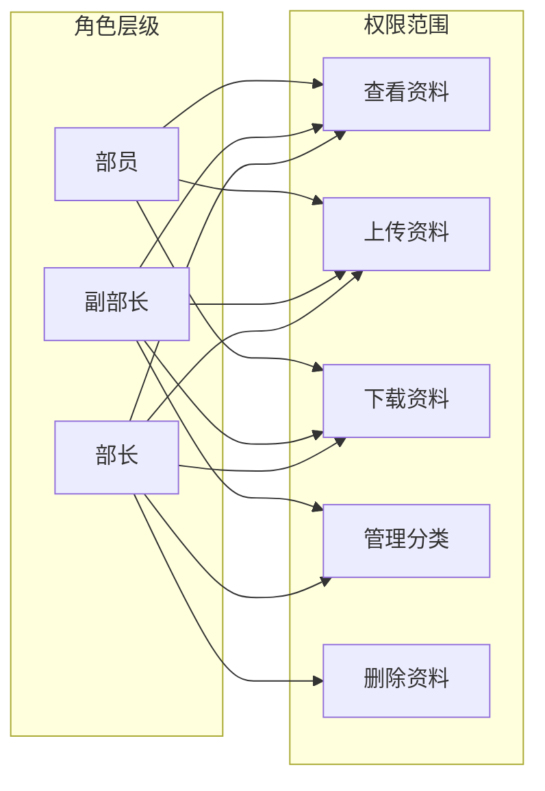
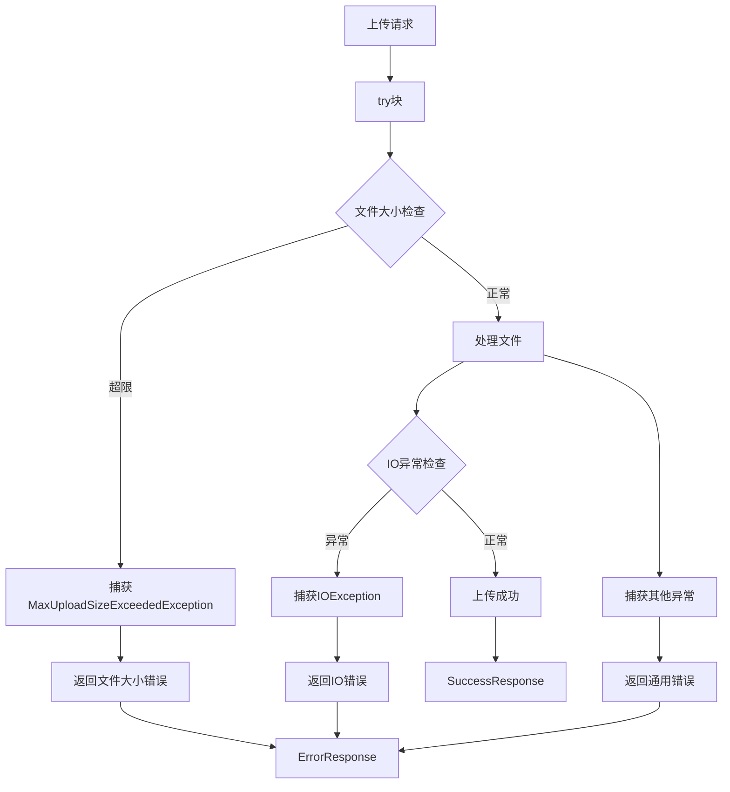

# 资料上传下载流程

<cite>
**本文档引用的文件**
- [MaterialController.java](file://src/main/java/com/redmoon2333/controller/MaterialController.java)
- [MaterialService.java](file://src/main/java/com/redmoon2333/service/MaterialService.java)
- [OssUtil.java](file://src/main/java/com/redmoon2333/util/OssUtil.java)
- [application.yml](file://src/main/resources/application.yml)
- [Material.java](file://src/main/java/com/redmoon2333/entity/Material.java)
- [RequireMemberRole.java](file://src/main/java/com/redmoon2333/annotation/RequireMemberRole.java)
- [PermissionAspect.java](file://src/main/java/com/redmoon2333/aspect/PermissionAspect.java)
- [PermissionUtil.java](file://src/main/java/com/redmoon2333/util/PermissionUtil.java)
</cite>

## 目录
1. [简介](#简介)
2. [项目架构概览](#项目架构概览)
3. [资料上传流程详解](#资料上传流程详解)
4. [资料下载流程详解](#资料下载流程详解)
5. [权限控制机制](#权限控制机制)
6. [文件存储架构](#文件存储架构)
7. [异常处理机制](#异常处理机制)
8. [性能优化考虑](#性能优化考虑)
9. [安全性和最佳实践](#安全性和最佳实践)
10. [总结](#总结)

## 简介

本系统是一个人力资源管理系统，其中资料上传下载功能是核心业务模块之一。该功能允许组织成员上传内部资料文件，包括文档、图片、表格等多种格式，并提供完整的权限控制和文件管理功能。

系统采用Spring Boot框架构建，使用阿里云OSS作为文件存储服务，结合MySQL数据库进行元数据管理，实现了高可靠性的文件上传下载服务。

## 项目架构概览



**图表来源**
- [MaterialController.java](file://src/main/java/com/redmoon2333/controller/MaterialController.java#L1-L328)
- [MaterialService.java](file://src/main/java/com/redmoon2333/service/MaterialService.java#L1-L459)

## 资料上传流程详解

### 上传接口定义

资料上传功能通过`MaterialController`中的`/api/materials/upload`端点提供服务，该端点使用`@PostMapping`注解定义为RESTful API。

```java
@PostMapping("/upload")
@RequireMemberRole("上传内部资料")
public ApiResponse<MaterialResponse> uploadMaterial(
        @RequestParam("file") MultipartFile file,
        @RequestParam("categoryId") Integer categoryId,
        @RequestParam("subcategoryId") Integer subcategoryId,
        @RequestParam("materialName") String materialName,
        @RequestParam(value = "description", required = false) String description)
```

### 上传流程序列图



**图表来源**
- [MaterialController.java](file://src/main/java/com/redmoon2333/controller/MaterialController.java#L35-L55)
- [MaterialService.java](file://src/main/java/com/redmoon2333/service/MaterialService.java#L45-L85)

### 事务性处理过程

`MaterialService.uploadMaterial`方法使用`@Transactional`注解确保操作的原子性：

1. **权限检查**：通过`PermissionUtil.checkMemberPermission()`验证用户具备部员及以上权限
2. **文件处理**：
   - 提取原始文件名和扩展名
   - 生成基于UUID的唯一文件名
   - 调用`OssUtil.uploadFile()`上传到阿里云OSS
3. **元数据持久化**：
   - 创建`Material`实体对象
   - 设置文件元信息（大小、类型、上传者ID、时间等）
   - 保存到数据库

### OSS文件上传机制



**图表来源**
- [OssUtil.java](file://src/main/java/com/redmoon2333/util/OssUtil.java#L65-L95)

**章节来源**
- [MaterialController.java](file://src/main/java/com/redmoon2333/controller/MaterialController.java#L35-L55)
- [MaterialService.java](file://src/main/java/com/redmoon2333/service/MaterialService.java#L45-L85)
- [OssUtil.java](file://src/main/java/com/redmoon2333/util/OssUtil.java#L65-L95)

## 资料下载流程详解

### 下载接口设计

资料下载功能通过`/api/materials/download/{materialId}`端点提供，支持直接访问OSS资源的隐式流程。

```java
@GetMapping("/download/{materialId}")
@RequireMemberRole("下载内部资料")
public ResponseEntity<Resource> downloadMaterial(@PathVariable Integer materialId)
```

### 下载流程分析



**图表来源**
- [MaterialController.java](file://src/main/java/com/redmoon2333/controller/MaterialController.java#L60-L105)

### 隐式下载流程

系统采用直接访问OSS资源的方式实现文件下载，这种方式的优势：

1. **性能优化**：绕过应用服务器直接访问OSS，减少服务器负载
2. **成本节约**：降低应用服务器带宽消耗
3. **简单实现**：无需复杂的文件流处理逻辑

### 下载安全性考虑

虽然采用隐式下载方式，但系统通过以下机制确保安全性：

1. **权限验证**：每个下载请求都经过`@RequireMemberRole`注解的权限检查
2. **文件存在性验证**：在下载前验证文件是否存在于数据库中
3. **私有Bucket策略**：建议配置OSS Bucket为私有模式，防止未授权访问

**章节来源**
- [MaterialController.java](file://src/main/java/com/redmoon2333/controller/MaterialController.java#L60-L105)

## 权限控制机制

### 注解驱动的权限控制

系统采用基于注解的权限控制机制，通过`@RequireMemberRole`和`@RequireMinisterRole`注解实现细粒度的权限管理。

```java
@Target(ElementType.METHOD)
@Retention(RetentionPolicy.RUNTIME)
public @interface RequireMemberRole {
    String value() default "需要部员及以上权限";
}
```

### 权限验证切面



**图表来源**
- [PermissionAspect.java](file://src/main/java/com/redmoon2333/aspect/PermissionAspect.java#L1-L57)
- [PermissionUtil.java](file://src/main/java/com/redmoon2333/util/PermissionUtil.java#L1-L163)

### 角色权限矩阵



**章节来源**
- [RequireMemberRole.java](file://src/main/java/com/redmoon2333/annotation/RequireMemberRole.java#L1-L19)
- [PermissionAspect.java](file://src/main/java/com/redmoon2333/aspect/PermissionAspect.java#L1-L57)
- [PermissionUtil.java](file://src/main/java/com/redmoon2333/util/PermissionUtil.java#L1-L163)

## 文件存储架构

### 存储策略设计

系统采用混合存储架构：

1. **元数据存储**：文件的基本信息（URL、大小、类型、上传时间等）存储在MySQL数据库中
2. **文件存储**：实际文件内容存储在阿里云OSS中
3. **本地缓存**：临时文件处理和缓存机制

### OSS配置参数

```yaml
spring:
  servlet:
    multipart:
      max-file-size: 100MB
      max-request-size: 100MB
aliyun:
  oss:
    endpoint: ${ALIYUN_OSS_ENDPOINT:}
    accessKeyId: ${ALIYUN_OSS_ACCESS_KEY_ID:}
    accessKeySecret: ${ALIYUN_OSS_ACCESS_KEY_SECRET:}
    bucketName: ${ALIYUN_OSS_BUCKET_NAME:}
    domain: ${ALIYUN_OSS_DOMAIN:}
```

### 文件命名策略

系统采用UUID命名策略确保文件名唯一性：

```java
// 生成唯一文件名
String uniqueFilename = UUID.randomUUID().toString() + extension;
```

这种策略的优势：
- 避免文件名冲突
- 防止敏感信息泄露
- 支持并发上传

**章节来源**
- [application.yml](file://src/main/resources/application.yml#L1-L62)
- [OssUtil.java](file://src/main/java/com/redmoon2333/util/OssUtil.java#L80-L85)

## 异常处理机制

### 文件大小限制

系统在`application.yml`中设置了文件大小限制：

```yaml
spring:
  servlet:
    multipart:
      max-file-size: 100MB
      max-request-size: 100MB
```

### 异常捕获与响应



**图表来源**
- [MaterialController.java](file://src/main/java/com/redmoon2333/controller/MaterialController.java#L45-L55)

### 异常类型映射

系统定义了详细的异常处理机制：

1. **MaxUploadSizeExceededException**：文件大小超过100MB限制
2. **IOException**：文件读写异常
3. **BusinessException**：业务逻辑异常
4. **RuntimeException**：运行时异常

**章节来源**
- [MaterialController.java](file://src/main/java/com/redmoon2333/controller/MaterialController.java#L45-L55)
- [application.yml](file://src/main/resources/application.yml#L10-L12)

## 性能优化考虑

### 并发处理能力

1. **异步处理**：文件上传和下载可以异步处理
2. **连接池管理**：合理配置OSS客户端连接池
3. **缓存策略**：利用Redis缓存频繁访问的元数据

### 存储优化

1. **CDN加速**：通过OSS自定义域名配置CDN加速
2. **压缩传输**：支持GZIP压缩减少传输时间
3. **分片上传**：对于大文件支持分片上传

### 数据库优化

```sql
-- 索引优化示例
CREATE INDEX idx_material_category ON material(category_id);
CREATE INDEX idx_material_subcategory ON material(subcategory_id);
CREATE INDEX idx_material_uploader ON material(uploader_id);
```

## 安全性和最佳实践

### 安全配置建议

1. **OSS Bucket策略**：
   ```json
   {
     "Version": "1",
     "Statement": [
       {
         "Effect": "Deny",
         "Principal": "*",
         "Action": "oss:GetObject",
         "Resource": "acs:oss:*:*:your-bucket/*",
         "Condition": {
           "Bool": {
             "oss:SecureTransport": "false"
           }
         }
       }
     ]
   }
   ```

2. **HTTPS强制**：确保所有通信使用HTTPS加密

3. **访问日志**：启用OSS访问日志记录

### 最佳实践

1. **文件类型验证**：在上传前验证文件类型
2. **病毒扫描**：集成病毒扫描服务
3. **定期清理**：实现过期文件的自动清理机制
4. **监控告警**：建立完善的监控和告警机制

### 权限分离原则

系统遵循最小权限原则：
- 部员只能查看和下载资料
- 副部长可以管理分类
- 部长拥有完全管理权限

## 总结

本系统的资料上传下载功能通过精心设计的架构实现了高性能、高可靠性的文件管理服务。主要特点包括：

1. **完整的权限控制**：基于注解的权限验证机制，确保只有授权用户才能访问特定功能
2. **高效的存储架构**：结合MySQL数据库和阿里云OSS，实现元数据和文件内容的分离存储
3. **可靠的异常处理**：多层次的异常捕获和处理机制，确保系统稳定性
4. **良好的扩展性**：模块化设计便于功能扩展和维护

该系统为人力资源管理提供了强大的文件管理能力，支持组织内部的知识共享和文档管理需求。通过合理的架构设计和技术选型，系统能够满足大规模并发访问的需求，同时保证数据的安全性和完整性。