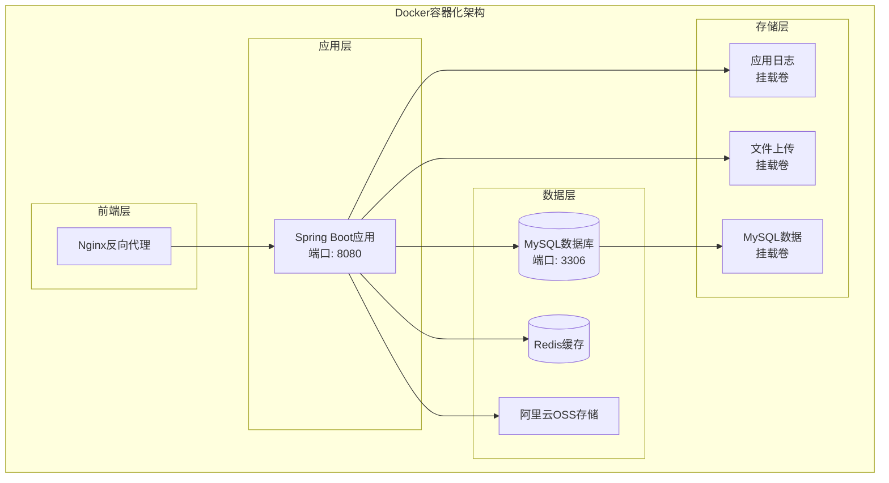
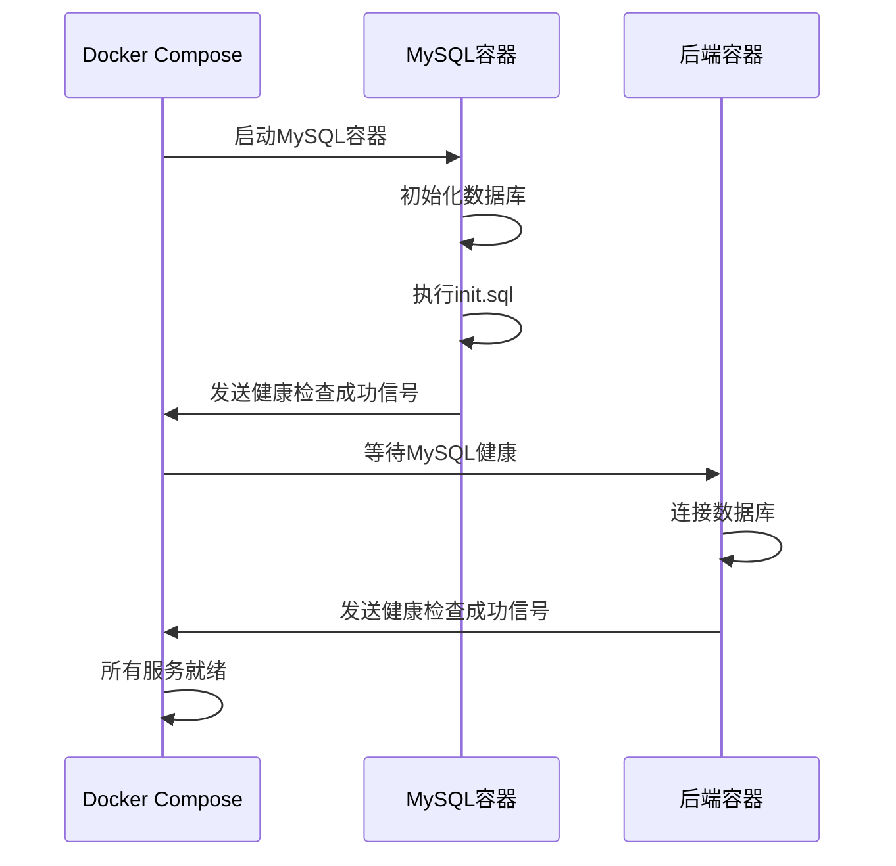
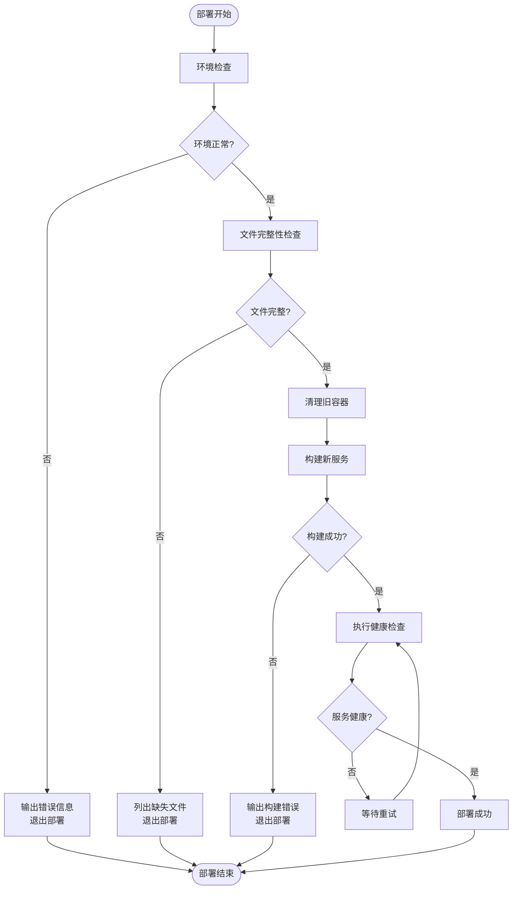
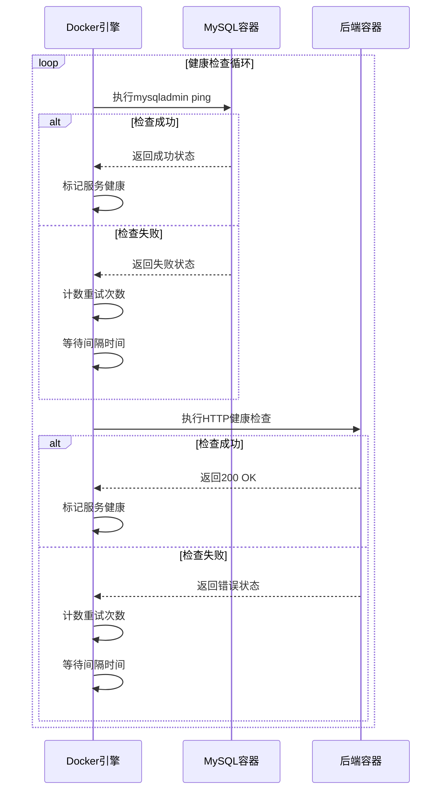
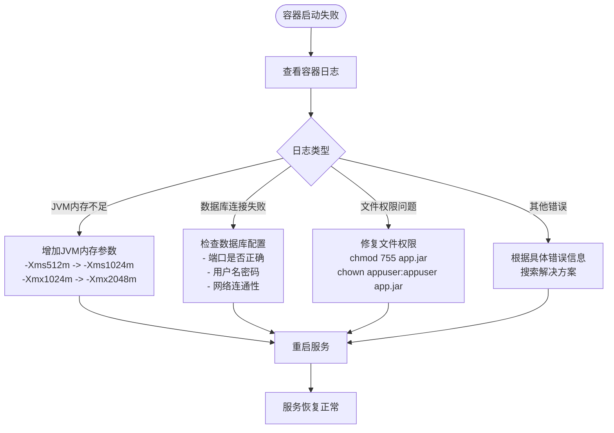

# Docker容器化部署指南

<cite>
**本文档引用的文件**
- [Dockerfile](file://Dockerfile)
- [docker-compose.yml](file://docker-compose.yml)
- [hrofficial-deploy/Dockerfile](file://hrofficial-deploy/Dockerfile)
- [hrofficial-deploy/docker-compose.yml](file://hrofficial-deploy/docker-compose.yml)
- [hrofficial-deploy/deploy.sh](file://hrofficial-deploy/deploy.sh)
- [hrofficial-deploy/init.sql](file://hrofficial-deploy/init.sql)
- [src/main/resources/application.yml](file://src/main/resources/application.yml)
</cite>

## 目录
1. [简介](#简介)
2. [项目架构概览](#项目架构概览)
3. [Dockerfile详细分析](#dockerfile详细分析)
4. [docker-compose.yml配置详解](#docker-composeyml配置详解)
5. [部署脚本功能解析](#部署脚本功能解析)
6. [环境变量配置](#环境变量配置)
7. [数据卷和持久化配置](#数据卷和持久化配置)
8. [健康检查机制](#健康检查机制)
9. [部署流程详解](#部署流程详解)
10. [生产环境优化建议](#生产环境优化建议)
11. [故障排除指南](#故障排除指南)
12. [总结](#总结)

## 简介

本项目采用现代化的Docker容器化部署方案，为人力资源管理系统提供了完整的容器化解决方案。该部署方案基于Spring Boot应用程序，集成了MySQL数据库、Redis缓存和阿里云OSS存储服务，通过Docker Compose实现多容器编排部署。

系统采用前后端分离架构，后端使用Java Spring Boot框架开发，前端通过静态文件服务提供Web界面。整个部署方案具有高度可扩展性和可维护性，支持多种部署场景和环境配置。

## 项目架构概览



**图表来源**
- [docker-compose.yml](file://docker-compose.yml#L1-L71)
- [Dockerfile](file://Dockerfile#L1-L33)

## Dockerfile详细分析

### 多阶段构建优化

项目采用了精简的单阶段Dockerfile设计，基于openjdk:17-jdk-slim基础镜像，实现了高效的容器构建：

```dockerfile
# 生产环境Dockerfile
FROM openjdk:17-jdk-slim

# 设置工作目录
WORKDIR /app

# 设置时区
ENV TZ=Asia/Shanghai

# 创建非root用户
RUN groupadd -r appuser && useradd -r -g appuser appuser

# 复制jar包
COPY target/HumanResourceOfficial-1.0-SNAPSHOT.jar app.jar

# 更改文件所有者
RUN chown appuser:appuser app.jar

# 切换到非root用户
USER appuser

# 暴露端口
EXPOSE 8080

# 设置JVM参数
ENV JAVA_OPTS="-Xms512m -Xmx1024m -Dfile.encoding=UTF-8 -Duser.timezone=Asia/Shanghai"

# 健康检查
HEALTHCHECK --interval=30s --timeout=3s --start-period=60s --retries=3 \
  CMD curl -f http://localhost:8080/actuator/health || exit 1

# 启动应用，使用生产环境配置
ENTRYPOINT ["sh", "-c", "java $JAVA_OPTS -Dspring.profiles.active=prod -jar app.jar"]
```

### 安全实践分析

1. **非root用户运行**：通过创建专门的应用用户（appuser），避免以root权限运行应用程序，提高安全性
2. **最小化攻击面**：使用openjdk:17-jdk-slim基础镜像，减少不必要的软件包安装
3. **文件权限控制**：明确设置文件所有权和权限，防止权限提升攻击

### JVM参数优化

```bash
-Xms512m -Xmx1024m     # 内存分配策略
-Dfile.encoding=UTF-8   # 字符编码统一
-Duser.timezone=Asia/Shanghai  # 时区设置
```

这些JVM参数经过优化，适用于生产环境：
- **内存配置**：初始堆内存512MB，最大堆内存1024MB，适合中小型应用
- **字符编码**：UTF-8确保国际化支持
- **时区同步**：与系统时区保持一致，避免时间相关问题

**章节来源**
- [Dockerfile](file://Dockerfile#L1-L33)

## docker-compose.yml配置详解

### MySQL服务配置

```yaml
mysql:
  image: mysql:8.0
  container_name: hrofficial-mysql
  restart: unless-stopped
  environment:
    MYSQL_ROOT_PASSWORD: ${MYSQL_ROOT_PASSWORD}
    MYSQL_DATABASE: ${MYSQL_DATABASE}
    MYSQL_USER: ${MYSQL_USER}
    MYSQL_PASSWORD: ${MYSQL_PASSWORD}
    TZ: Asia/Shanghai
  ports:
    - "3306:3306"
  volumes:
    - mysql_data:/var/lib/mysql
    - ./init.sql:/docker-entrypoint-initdb.d/init.sql:ro
    - ./docker/mysql/conf:/etc/mysql/conf.d
  command: >
    --default-authentication-plugin=mysql_native_password
    --character-set-server=utf8mb4
    --collation-server=utf8mb4_unicode_ci
    --max_connections=1000
    --innodb_buffer_pool_size=1G
  healthcheck:
    test: ["CMD", "mysqladmin", "ping", "-h", "localhost", "-u", "root", "-p${MYSQL_ROOT_PASSWORD}"]
    timeout: 30s
    retries: 15
    interval: 10s
```

### 关键配置解析

1. **环境变量管理**：通过环境变量注入敏感配置，支持动态配置修改
2. **数据持久化**：使用命名卷mysql_data确保数据持久化
3. **初始化脚本**：自动执行init.sql进行数据库表结构初始化
4. **性能优化**：
   - `max_connections=1000`：支持高并发连接
   - `innodb_buffer_pool_size=1G`：优化InnoDB性能
   - `utf8mb4`字符集：支持完整的Unicode字符集

### 后端服务配置

```yaml
backend:
  build: .
  container_name: hrofficial-backend
  restart: unless-stopped
  depends_on:
    mysql:
      condition: service_healthy
  environment:
    SPRING_PROFILES_ACTIVE: prod
    MYSQL_ROOT_PASSWORD: ${MYSQL_ROOT_PASSWORD}
    MYSQL_DATABASE: ${MYSQL_DATABASE}
    MYSQL_USER: ${MYSQL_USER}
    MYSQL_PASSWORD: ${MYSQL_PASSWORD}
    JWT_SECRET: ${JWT_SECRET}
    JWT_EXPIRATION: ${JWT_EXPIRATION:-7200000}
    ALIYUN_OSS_ENDPOINT: ${ALIYUN_OSS_ENDPOINT:-}
    ALIYUN_OSS_ACCESS_KEY_ID: ${ALIYUN_OSS_ACCESS_KEY_ID:-}
    ALIYUN_OSS_ACCESS_KEY_SECRET: ${ALIYUN_OSS_ACCESS_KEY_SECRET:-}
    ALIYUN_OSS_BUCKET_NAME: ${ALIYUN_OSS_BUCKET_NAME:-}
    ALIYUN_OSS_DOMAIN: ${ALIYUN_OSS_DOMAIN:-}
    TZ: Asia/Shanghai
  ports:
    - "8080:8080"
  volumes:
    - app_logs:/app/logs
    - app_uploads:/app/uploads
  healthcheck:
    test: ["CMD", "curl", "-f", "http://localhost:8080/actuator/health"]
    interval: 30s
    timeout: 10s
    retries: 3
    start_period: 120s
```

### 容器间依赖关系



**图表来源**
- [docker-compose.yml](file://docker-compose.yml#L25-L35)

**章节来源**
- [docker-compose.yml](file://docker-compose.yml#L1-L71)

## 部署脚本功能解析

### 自动化部署流程

deploy.sh脚本实现了完整的自动化部署流程，包含以下关键步骤：

```bash
#!/bin/bash
# 1. 环境检查
# 2. 必要文件验证
# 3. 旧容器清理
# 4. 目录准备
# 5. JAR包验证
# 6. 服务构建与启动
# 7. 健康检查
# 8. 部署状态报告
```

### 核心功能模块

#### 环境检测模块
```bash
# 检查Docker是否安装
if ! command -v docker &> /dev/null; then
    echo "[错误] Docker未安装，请先安装Docker"
    exit 1
fi

# 检查docker-compose是否安装
if ! command -v docker-compose &> /dev/null; then
    echo "[错误] docker-compose未安装，请先安装docker-compose"
    exit 1
fi
```

#### 文件完整性检查
```bash
required_files=("app.jar" "Dockerfile" "docker-compose.yml" ".env" "init.sql")
missing_files=()

for file in "${required_files[@]}"; do
    if [ ! -f "$file" ]; then
        missing_files+=("$file")
    fi
done
```

#### 健康检查机制
```bash
# MySQL健康检查
for i in {1..10}; do
    if docker exec hrofficial-mysql mysqladmin ping -h localhost --silent; then
        echo "[信息] MySQL服务正常"
        break
    fi
    sleep 3
done

# 应用服务健康检查
for i in {1..15}; do
    if curl -f http://localhost:8080 >/dev/null 2>&1; then
        echo "[信息] 应用服务正常"
        break
    fi
    sleep 3
done
```

### 错误处理与重试机制



**图表来源**
- [hrofficial-deploy/deploy.sh](file://hrofficial-deploy/deploy.sh#L1-L133)

**章节来源**
- [hrofficial-deploy/deploy.sh](file://hrofficial-deploy/deploy.sh#L1-L133)

## 环境变量配置

### 数据库配置

```bash
# MySQL环境变量
MYSQL_ROOT_PASSWORD: ${MYSQL_ROOT_PASSWORD}    # Root密码
MYSQL_DATABASE: ${MYSQL_DATABASE}              # 数据库名称
MYSQL_USER: ${MYSQL_USER}                      # 应用用户
MYSQL_PASSWORD: ${MYSQL_PASSWORD}              # 用户密码
```

### 应用配置

```bash
# Spring Boot配置
SPRING_PROFILES_ACTIVE: prod                   # 生产环境配置
JWT_SECRET: ${JWT_SECRET}                      # JWT密钥
JWT_EXPIRATION: ${JWT_EXPIRATION:-7200000}     # JWT过期时间（默认2小时）

# 阿里云OSS配置（可选）
ALIYUN_OSS_ENDPOINT: ${ALIYUN_OSS_ENDPOINT:-}         # OSS Endpoint
ALIYUN_OSS_ACCESS_KEY_ID: ${ALIYUN_OSS_ACCESS_KEY_ID:-}  # Access Key ID
ALIYUN_OSS_ACCESS_KEY_SECRET: ${ALIYUN_OSS_ACCESS_KEY_SECRET:-}  # Access Key Secret
ALIYUN_OSS_BUCKET_NAME: ${ALIYUN_OSS_BUCKET_NAME:-}   # Bucket名称
ALIYUN_OSS_DOMAIN: ${ALIYUN_OSS_DOMAIN:-}             # 自定义域名
```

### 时区配置

```bash
TZ: Asia/Shanghai                              # 统一时区设置
```

**章节来源**
- [docker-compose.yml](file://docker-compose.yml#L15-L35)

## 数据卷和持久化配置

### 卷类型分析

```yaml
volumes:
  mysql_data:                                    # MySQL数据卷
    driver: local                                # 本地驱动
  app_logs:                                      # 应用日志卷
    driver: local                                # 本地驱动
  app_uploads:                                   # 文件上传卷
    driver: local                                # 本地驱动
```

### 挂载点映射

```mermaid
graph LR
subgraph "宿主机路径"
HostLogs[./logs]
HostUploads[./uploads]
HostMysqlData[./data/mysql]
end
subgraph "容器内路径"
ContainerLogs[/app/logs]
ContainerUploads[/app/uploads]
ContainerMysqlData[/var/lib/mysql]
end
HostLogs --> ContainerLogs
HostUploads --> ContainerUploads
HostMysqlData --> ContainerMysqlData
```

**图表来源**
- [docker-compose.yml](file://docker-compose.yml#L65-L71)

### 数据持久化策略

1. **MySQL数据持久化**：通过mysql_data卷确保数据库数据不丢失
2. **应用日志持久化**：保存应用运行日志，便于问题排查
3. **文件上传持久化**：保存用户上传的文件，支持断点续传

**章节来源**
- [docker-compose.yml](file://docker-compose.yml#L65-L71)

## 健康检查机制

### MySQL健康检查

```yaml
healthcheck:
  test: ["CMD", "mysqladmin", "ping", "-h", "localhost", "-u", "root", "-p${MYSQL_ROOT_PASSWORD}"]
  timeout: 30s
  retries: 15
  interval: 10s
```

### 后端应用健康检查

```yaml
healthcheck:
  test: ["CMD", "curl", "-f", "http://localhost:8080/actuator/health"]
  interval: 30s
  timeout: 10s
  retries: 3
  start_period: 120s
```

### 健康检查流程



**图表来源**
- [docker-compose.yml](file://docker-compose.yml#L20-L25)
- [docker-compose.yml](file://docker-compose.yml#L55-L62)

**章节来源**
- [docker-compose.yml](file://docker-compose.yml#L20-L25)
- [docker-compose.yml](file://docker-compose.yml#L55-L62)

## 部署流程详解

### 部署前准备

1. **环境要求确认**
   ```bash
   # 检查Docker版本
   docker --version
   
   # 检查Docker Compose版本
   docker-compose --version
   ```

2. **必要文件准备**
   ```
   app.jar                    # Spring Boot应用JAR包
   Dockerfile                 # 容器构建文件
   docker-compose.yml         # 服务编排配置
   .env                       # 环境变量配置
   init.sql                   # 数据库初始化脚本
   ```

### 部署执行步骤

#### 第一步：环境检查
```bash
# 自动检测Docker和Docker Compose
echo "[信息] Docker环境检查通过"
```

#### 第二步：文件完整性验证
```bash
# 检查必需文件是否存在
required_files=("app.jar" "Dockerfile" "docker-compose.yml" ".env" "init.sql")
```

#### 第三步：清理旧环境
```bash
# 停止并删除旧容器
docker-compose down -v
```

#### 第四步：目录准备
```bash
# 创建必要的目录结构
mkdir -p data logs mysql-init

# 复制初始化脚本
cp init.sql mysql-init/
```

#### 第五步：JAR包验证
```bash
# 验证JAR包文件
if [ ! -f "app.jar" ]; then
    echo "[错误] app.jar 文件不存在"
    exit 1
fi

# 显示JAR包大小
jar_size=$(du -h app.jar | cut -f1)
echo "[信息] JAR包大小: $jar_size"
```

#### 第六步：服务构建与启动
```bash
# 构建并启动服务
docker-compose up -d --build
```

#### 第七步：等待服务启动
```bash
# 等待应用启动
echo "正在等待应用启动，请稍候..."
sleep 30
```

#### 第八步：健康检查
```bash
# 执行MySQL健康检查
for i in {1..10}; do
    if docker exec hrofficial-mysql mysqladmin ping -h localhost --silent; then
        echo "[信息] MySQL服务正常"
        break
    fi
    sleep 3
done

# 执行应用健康检查
for i in {1..15}; do
    if curl -f http://localhost:8080 >/dev/null 2>&1; then
        echo "[信息] 应用服务正常"
        break
    fi
    sleep 3
done
```

### 部署后操作

#### 查看服务状态
```bash
# 查看所有容器状态
docker-compose ps

# 查看特定服务日志
docker-compose logs -f backend
```

#### 常用管理命令
```bash
# 停止服务
docker-compose down

# 重启服务
docker-compose restart

# 查看服务详情
docker-compose config

# 更新服务（重新拉取镜像）
docker-compose pull
docker-compose up -d
```

**章节来源**
- [hrofficial-deploy/deploy.sh](file://hrofficial-deploy/deploy.sh#L1-L133)

## 生产环境优化建议

### 资源配置优化

#### JVM参数调优
```bash
# 生产环境推荐JVM参数
-Xms1024m -Xmx2048m           # 根据服务器内存调整
-XX:+UseG1GC                  # 使用G1垃圾回收器
-XX:MaxGCPauseMillis=200      # 最大GC暂停时间
-XX:+HeapDumpOnOutOfMemoryError # 内存溢出时生成堆转储
```

#### 容器资源配置
```yaml
backend:
  deploy:
    resources:
      limits:
        memory: 2G               # 内存限制
        cpus: '1.0'              # CPU限制
      reservations:
        memory: 1G               # 内存预留
        cpus: '0.5'              # CPU预留
```

### 安全加固措施

#### 网络安全
```yaml
networks:
  default:
    driver: bridge
    ipam:
      config:
        - subnet: 172.20.0.0/16     # 使用私有网络
```

#### 权限控制
```yaml
backend:
  user: "1000:1000"                # 使用指定用户ID
  read_only: true                  # 只读文件系统
  cap_drop:                        # 移除危险能力
    - ALL
  cap_add:                         # 添加必要能力
    - NET_BIND_SERVICE
```

### 监控和日志配置

#### 日志轮转
```yaml
backend:
  logging:
    driver: "json-file"
    options:
      max-size: "10m"              # 单个日志文件最大10MB
      max-file: "3"                # 最多保留3个日志文件
```

#### 监控指标
```yaml
backend:
  labels:
    - "prometheus.io/scrape=true"
    - "prometheus.io/port=8080"
    - "prometheus.io/path=/actuator/prometheus"
```

### 高可用配置

#### 服务副本
```yaml
backend:
  deploy:
    replicas: 2                     # 启动两个副本
    update_config:
      parallelism: 1                # 并行更新数量
      delay: 10s                    # 更新延迟
    restart_policy:
      condition: on-failure
      delay: 5s
      max_attempts: 3
```

#### 负载均衡
```yaml
frontend:
  image: nginx:alpine
  ports:
    - "80:80"
    - "443:443"
  depends_on:
    - backend
```

## 故障排除指南

### 常见问题及解决方案

#### 1. Docker Compose命令兼容性问题

**问题描述**：在某些环境中，docker-compose命令可能不可用

**解决方案**：
```bash
# 检查命令是否存在
command -v docker-compose || echo "Docker Compose未安装"

# 使用docker compose（Docker Desktop内置）
docker compose up -d

# 或者使用compose插件
docker plugin install docker/compose:latest
```

#### 2. 端口冲突问题

**问题描述**：端口被其他进程占用

**诊断命令**：
```bash
# 检查端口占用
netstat -tulpn | grep :8080
lsof -i :8080

# 查看Docker容器端口映射
docker ps --format "table {{.Names}}\t{{.Ports}}"
```

**解决方案**：
```bash
# 修改docker-compose.yml中的端口映射
ports:
  - "8081:8080"  # 将外部端口改为8081

# 或者停止占用端口的进程
sudo kill $(sudo lsof -t -i:8080)
```

#### 3. 容器启动失败

**诊断步骤**：
```bash
# 查看容器日志
docker-compose logs backend
docker-compose logs mysql

# 检查容器状态
docker-compose ps

# 进入容器内部
docker-compose exec backend bash
docker-compose exec mysql bash
```

**常见原因及解决**：


**图表来源**
- [hrofficial-deploy/deploy.sh](file://hrofficial-deploy/deploy.sh#L60-L80)

#### 4. 数据库初始化失败

**问题症状**：容器启动后数据库表结构不完整

**排查步骤**：
```bash
# 检查初始化脚本是否正确挂载
docker-compose exec mysql ls -la /docker-entrypoint-initdb.d/

# 查看MySQL启动日志
docker-compose logs mysql | grep -i error

# 手动执行初始化脚本
docker-compose exec mysql mysql -uroot -p${MYSQL_ROOT_PASSWORD} ${MYSQL_DATABASE} < init.sql
```

#### 5. 应用服务无法访问

**健康检查失败排查**：
```bash
# 检查应用端口是否监听
docker-compose exec backend netstat -tulpn | grep :8080

# 测试应用健康端点
curl -f http://localhost:8080/actuator/health

# 检查应用配置文件
docker-compose exec backend cat /app/application.yml
```

### 日志分析技巧

#### 应用日志分析
```bash
# 实时查看应用日志
docker-compose logs -f backend

# 查看最近的错误日志
docker-compose logs backend | grep ERROR

# 导出日志到文件
docker-compose logs backend > app.log 2>&1
```

#### 数据库日志分析
```bash
# 查看MySQL慢查询日志
docker-compose exec mysql tail -f /var/log/mysql/slow.log

# 查看MySQL错误日志
docker-compose exec mysql tail -f /var/log/mysql/error.log
```

### 性能监控

#### 容器资源监控
```bash
# 查看容器资源使用情况
docker stats

# 查看容器CPU和内存使用
docker inspect hrofficial-backend | jq '.State.Metrics.CPU | .usage_total'
```

#### 应用性能监控
```bash
# 查看应用Actuator指标
curl http://localhost:8080/actuator/metrics

# 查看JVM内存使用情况
curl http://localhost:8080/actuator/memory

# 查看线程池状态
curl http://localhost:8080/actuator/threaddump
```

**章节来源**
- [hrofficial-deploy/deploy.sh](file://hrofficial-deploy/deploy.sh#L60-L80)

## 总结

本Docker容器化部署方案为人力资源管理系统提供了完整、可靠的容器化解决方案。通过精心设计的Dockerfile、docker-compose.yml配置和自动化部署脚本，实现了以下核心优势：

### 技术优势

1. **安全性**：采用非root用户运行、最小化基础镜像、严格的权限控制
2. **可靠性**：完善的健康检查机制、容器重启策略、故障自动恢复
3. **可维护性**：清晰的配置分离、环境变量管理、模块化的服务编排
4. **可扩展性**：支持水平扩展、负载均衡、高可用配置

### 部署优势

1. **自动化程度高**：完整的自动化部署脚本，减少人工干预
2. **环境一致性**：容器化确保开发、测试、生产环境的一致性
3. **快速部署**：标准化的部署流程，支持一键部署
4. **易于维护**：清晰的日志记录、监控指标、故障排查工具

### 最佳实践总结

1. **配置管理**：使用环境变量管理敏感配置，支持动态配置
2. **数据持久化**：合理使用数据卷确保数据安全
3. **健康检查**：双重健康检查机制，确保服务可用性
4. **资源优化**：合理的JVM参数和容器资源配置
5. **安全加固**：最小权限原则、网络安全隔离

该部署方案不仅满足当前项目需求，也为未来的扩展和维护奠定了坚实的基础。通过遵循本指南的配置和最佳实践，可以确保系统的稳定运行和高效维护。