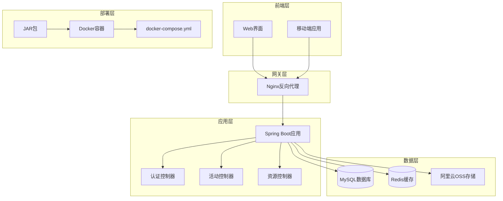
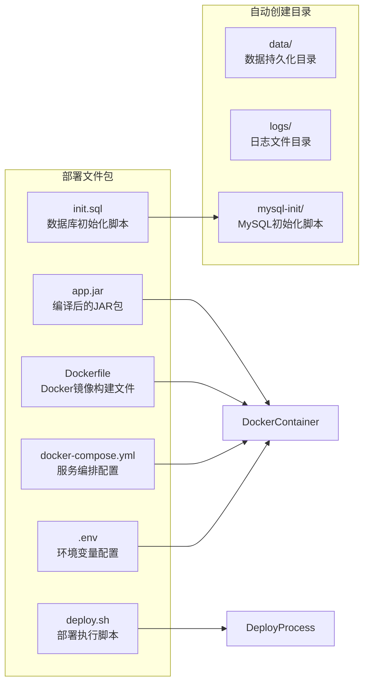
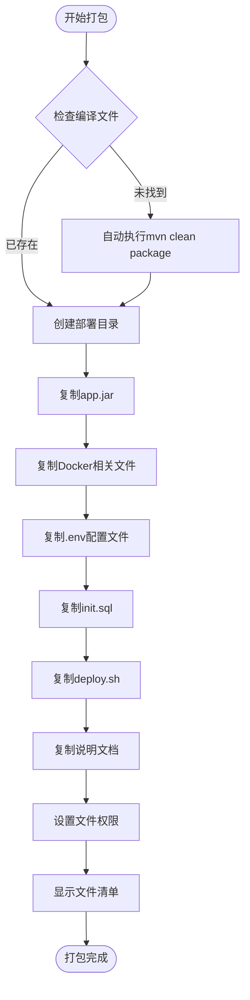
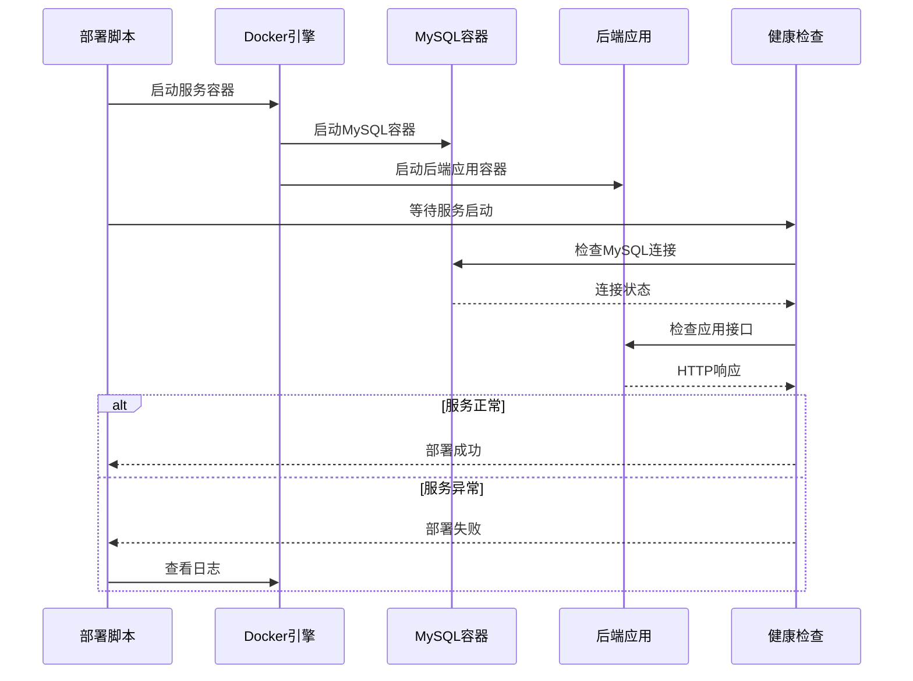
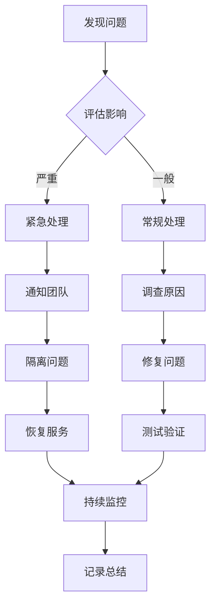

# JAR包传统部署指南

<cite>
**本文档中引用的文件**
- [create_deploy_package.bat](file://create_deploy_package.bat)
- [deploy.sh](file://hrofficial-deploy/deploy.sh)
- [Dockerfile](file://hrofficial-deploy/Dockerfile)
- [docker-compose.yml](file://hrofficial-deploy/docker-compose.yml)
- [.env](file://.env)
- [init.sql](file://init.sql)
- [application.yml](file://src/main/resources/application.yml)
- [pom.xml](file://pom.xml)
- [AuthController.java](file://src/main/java/com/redmoon2333/controller/AuthController.java)
</cite>

## 目录
1. [简介](#简介)
2. [项目架构概览](#项目架构概览)
3. [部署文件清单](#部署文件清单)
4. [本地编译准备](#本地编译准备)
5. [服务器部署流程](#服务器部署流程)
6. [环境配置详解](#环境配置详解)
7. [部署验证方法](#部署验证方法)
8. [更新部署流程](#更新部署流程)
9. [故障排除指南](#故障排除指南)
10. [最佳实践建议](#最佳实践建议)

## 简介

本指南详细介绍了人力资源管理系统的JAR包传统部署流程。该系统采用Spring Boot框架开发，支持通过Docker容器化部署，提供完整的用户认证、活动管理和资源管理功能。

传统的JAR包部署模式具有以下优势：
- **源码保护**：服务器上不存储源代码，降低代码泄露风险
- **部署简化**：文件数量少，上传快速，部署流程标准化
- **环境隔离**：开发环境与生产环境完全分离，避免依赖版本冲突
- **容器化运行**：利用Docker实现应用的容器化隔离运行

## 项目架构概览



**图表来源**
- [AuthController.java](file://src/main/java/com/redmoon2333/controller/AuthController.java#L1-L50)
- [docker-compose.yml](file://hrofficial-deploy/docker-compose.yml#L1-L44)

## 部署文件清单

### 必须上传的核心文件

部署过程中需要上传到服务器的所有必要文件：



**图表来源**
- [deploy.sh](file://hrofficial-deploy/deploy.sh#L25-L35)
- [docker-compose.yml](file://hrofficial-deploy/docker-compose.yml#L1-L44)

### 文件详细说明

| 文件名 | 用途 | 必需性 | 大小范围 |
|--------|------|--------|----------|
| `app.jar` | 主应用程序JAR包，包含编译后的Java代码 | 必需 | 50-100MB |
| `Dockerfile` | 定义Docker镜像构建过程 | 必需 | 1-5KB |
| `docker-compose.yml` | 定义多容器应用的服务编排 | 必需 | 1-10KB |
| `.env` | 环境变量配置文件，包含敏感信息 | 必需 | 1-5KB |
| `init.sql` | 数据库表结构和初始数据脚本 | 必需 | 10-50KB |
| `deploy.sh` | Linux部署执行脚本 | 必需 | 1-5KB |

**章节来源**
- [create_deploy_package.bat](file://create_deploy_package.bat#L1-L72)
- [deploy.sh](file://hrofficial-deploy/deploy.sh#L1-L133)

## 本地编译准备

### Maven编译环境要求

在开始编译之前，请确保本地开发环境满足以下要求：

- **JDK版本**：Java 17或更高版本
- **Maven版本**：3.6或更高版本
- **内存要求**：至少2GB可用内存
- **磁盘空间**：至少500MB可用空间

### 编译步骤详解

#### Windows平台编译

```bash
# 进入项目根目录
cd C:\Users\35183\IdeaProjects\HumanResourceOfficial

# 清理并编译项目
mvn clean package -DskipTests

# 复制编译后的JAR包
copy target\HumanResourceOfficial-1.0-SNAPSHOT.jar app.jar
```

#### Linux/Mac平台编译

```bash
# 进入项目根目录
cd ~/projects/HumanResourceOfficial

# 清理并编译项目
mvn clean package -DskipTests

# 复制编译后的JAR包
cp target/HumanResourceOfficial-1.0-SNAPSHOT.jar app.jar
```

### 自动化打包脚本

系统提供了自动化打包脚本`create_deploy_package.bat`，可一键完成以下操作：

1. **自动编译检查**：检测是否需要重新编译
2. **目录清理**：删除旧的部署目录
3. **文件复制**：自动复制所有必要文件
4. **权限设置**：为Linux环境设置执行权限
5. **文件清单**：显示最终的文件列表和大小



**图表来源**
- [create_deploy_package.bat](file://create_deploy_package.bat#L1-L47)

**章节来源**
- [create_deploy_package.bat](file://create_deploy_package.bat#L1-L72)
- [pom.xml](file://pom.xml#L1-L104)

## 服务器部署流程

### 服务器环境准备

#### 系统要求

- **操作系统**：Ubuntu 20.04 LTS或CentOS 8+
- **Docker版本**：20.10或更高版本
- **Docker Compose版本**：1.29或更高版本
- **内存要求**：至少2GB可用内存
- **磁盘空间**：至少1GB可用空间

#### 网络配置

```bash
# 检查防火墙状态
sudo ufw status

# 开放必要端口
sudo ufw allow 8080/tcp    # 应用服务端口
sudo ufw allow 3306/tcp    # MySQL端口
sudo ufw allow 6379/tcp    # Redis端口
```

### 文件上传方式

#### SCP上传（推荐）

```bash
# 压缩部署包
tar -czf hrofficial-deploy.tar.gz hrofficial-deploy/

# 上传到服务器
scp hrofficial-deploy.tar.gz root@your_server_ip:/opt/

# 在服务器解压
ssh root@your_server_ip
cd /opt
tar -xzf hrofficial-deploy.tar.gz
mv hrofficial-deploy hrofficial
cd hrofficial
```

#### SFTP工具上传

使用FileZilla、WinSCP等工具：
1. 连接服务器
2. 创建目录：`/opt/hrofficial`
3. 上传所有6个文件到该目录
4. 设置deploy.sh执行权限：`chmod +x deploy.sh`

#### 手动复制粘贴（小文件）

对于配置文件，可以直接复制内容：
```bash
# 在服务器上创建文件
nano /opt/hrofficial/.env
# 粘贴.env文件内容

nano /opt/hrofficial/init.sql
# 粘贴init.sql文件内容
```

### 部署执行过程

#### 第一步：环境检查

```bash
#!/bin/bash
echo "==========================================="
echo "人力资源管理系统 - JAR包部署脚本"
echo "==========================================="
echo

# 检查Docker是否安装
if ! command -v docker &> /dev/null; then
    echo "[错误] Docker未安装，请先安装Docker"
    exit 1
fi

# 检查docker-compose是否安装
if ! command -v docker-compose &> /dev/null; then
    echo "[错误] docker-compose未安装，请先安装docker-compose"
    exit 1
fi

echo "[信息] Docker环境检查通过"
echo
```

#### 第二步：文件完整性验证

```bash
# 检查必要文件是否存在
echo "[步骤1] 检查部署文件..."
required_files=("app.jar" "Dockerfile" "docker-compose.yml" ".env" "init.sql")
missing_files=()

for file in "${required_files[@]}"; do
    if [ ! -f "$file" ]; then
        missing_files+=("$file")
    fi
done

if [ ${#missing_files[@]} -ne 0 ]; then
    echo "[错误] 缺少以下必要文件:"
    printf ' - %s\n' "${missing_files[@]}"
    echo "请确保所有文件都已上传到服务器"
    exit 1
fi
```

#### 第三步：旧服务清理

```bash
# 停止并删除旧的容器
echo "[步骤2] 清理旧容器..."
docker-compose down -v
```

#### 第四步：目录结构创建

```bash
# 创建必要的目录
echo "[步骤3] 创建必要目录..."
mkdir -p data logs mysql-init

# 复制初始化脚本到mysql-init目录
if [ -f "init.sql" ]; then
    cp init.sql mysql-init/
    echo "[信息] 数据库初始化脚本已准备"
fi

# 设置目录权限
chmod 755 data logs mysql-init
```

#### 第五步：服务构建与启动

```bash
# 验证JAR包文件
echo "[步骤4] 验证JAR包..."
if [ ! -f "app.jar" ]; then
    echo "[错误] app.jar 文件不存在，请先上传编译好的JAR包"
    exit 1
fi

# 获取JAR包大小
jar_size=$(du -h app.jar | cut -f1)
echo "[信息] JAR包大小: $jar_size"

# 构建并启动服务
echo "[步骤5] 构建并启动服务..."
docker-compose up -d --build

if [ $? -ne 0 ]; then
    echo "[错误] 服务启动失败，请检查配置"
    echo "查看详细错误信息: docker-compose logs"
    exit 1
fi
```

#### 第六步：服务状态检查

```bash
# 等待服务启动
echo "[步骤6] 等待服务启动..."
echo "正在等待应用启动，请稍候..."
sleep 30

# 检查服务状态
echo "[步骤7] 检查服务状态..."
docker-compose ps

# 健康检查
echo "[步骤8] 执行健康检查..."

# 检查MySQL连接
echo "检查MySQL连接..."
for i in {1..10}; do
    if docker exec hrofficial-mysql mysqladmin ping -h localhost --silent; then
        echo "[信息] MySQL服务正常"
        break
    fi
    if [ $i -eq 10 ]; then
        echo "[警告] MySQL服务可能未完全启动"
    fi
    sleep 3
done

# 检查应用服务
echo "检查应用服务..."
for i in {1..15}; do
    if curl -f http://localhost:8080 >/dev/null 2>&1; then
        echo "[信息] 应用服务正常"
        break
    fi
    if [ $i -eq 15 ]; then
        echo "[警告] 应用服务可能未完全启动，请检查日志"
        echo "查看应用日志: docker-compose logs backend"
    fi
    sleep 3
done
```

**章节来源**
- [deploy.sh](file://hrofficial-deploy/deploy.sh#L1-L133)

## 环境配置详解

### .env文件配置

`.env`文件是部署过程中的核心配置文件，包含了所有生产环境的敏感信息和配置参数：

```bash
# 人力资源管理系统 - 环境变量配置文件
# 请根据实际部署环境修改以下配置

# ===========================================
# 数据库配置
# ===========================================
MYSQL_ROOT_PASSWORD=hr_root_2024!
MYSQL_DATABASE=hrofficial
MYSQL_USER=hrofficial
MYSQL_PASSWORD=hr_official_2024!

# ===========================================
# Redis配置
# ===========================================
REDIS_HOST=redis
REDIS_PORT=6379
REDIS_PASSWORD=
REDIS_DATABASE=0

# ===========================================
# JWT配置
# ===========================================
JWT_SECRET=hr-official-jwt-secret-key-2024-redmoon2333-human-resource-system-with-redis-enhanced
JWT_EXPIRATION=7200000

# ===========================================
# 阿里云OSS配置（可选）
# ===========================================
ALIYUN_OSS_ENDPOINT=
ALIYUN_OSS_ACCESS_KEY_ID=
ALIYUN_OSS_ACCESS_KEY_SECRET=
ALIYUN_OSS_BUCKET_NAME=
ALIYUN_OSS_DOMAIN=

# ===========================================
# 其他配置
# ===========================================
TZ=Asia/Shanghai
```

### application.yml配置解析

系统使用Spring Boot的配置文件进行应用级别的配置：

```yaml
spring:
  datasource:
    url: jdbc:mysql://localhost:3306/hrofficial?useUnicode=true&characterEncoding=utf8&useSSL=false&serverTimezone=GMT%2B8&allowPublicKeyRetrieval=true
    username: root
    password: root
    driver-class-name: com.mysql.cj.jdbc.Driver
  jackson:
    time-zone: GMT+8
    date-format: yyyy-MM-dd HH:mm:ss
  servlet:
    multipart:
      max-file-size: 100MB
      max-request-size: 100MB
  data:
    redis:
      host: localhost
      port: 6379
      password: 
      timeout: 10000ms
      database: 0
      lettuce:
        pool:
          max-active: 8
          max-wait: -1ms
          max-idle: 8
          min-idle: 0
server:
  port: 8080
```

### Docker Compose配置

```yaml
version: '3.8'

services:
  # MySQL数据库
  mysql:
    image: mysql:8.0
    container_name: hrofficial-mysql
    restart: unless-stopped
    environment:
      MYSQL_ROOT_PASSWORD: ${MYSQL_ROOT_PASSWORD}
      MYSQL_DATABASE: ${MYSQL_DATABASE}
      MYSQL_USER: ${MYSQL_USER}
      MYSQL_PASSWORD: ${MYSQL_PASSWORD}
      TZ: Asia/Shanghai
    ports:
      - "3306:3306"
    volumes:
      - mysql_data:/var/lib/mysql
      - ./init.sql:/docker-entrypoint-initdb.d/init.sql:ro
    command: --default-authentication-plugin=mysql_native_password --character-set-server=utf8mb4 --collation-server=utf8mb4_unicode_ci

  # 后端应用
  backend:
    build: .
    container_name: hrofficial-backend
    restart: unless-stopped
    depends_on:
      - mysql
    environment:
      SPRING_PROFILES_ACTIVE: prod
      SPRING_DATASOURCE_URL: jdbc:mysql://mysql:3306/${MYSQL_DATABASE}?useUnicode=true&characterEncoding=utf8mb4&useSSL=false&serverTimezone=Asia/Shanghai
      SPRING_DATASOURCE_USERNAME: ${MYSQL_USER}
      SPRING_DATASOURCE_PASSWORD: ${MYSQL_PASSWORD}
      JWT_SECRET: ${JWT_SECRET}
      ALIYUN_OSS_ENDPOINT: ${ALIYUN_OSS_ENDPOINT:-}
      ALIYUN_OSS_ACCESS_KEY_ID: ${ALIYUN_OSS_ACCESS_KEY_ID:-}
      ALIYUN_OSS_ACCESS_KEY_SECRET: ${ALIYUN_OSS_ACCESS_KEY_SECRET:-}
      ALIYUN_OSS_BUCKET_NAME: ${ALIYUN_OSS_BUCKET_NAME:-}
      ALIYUN_OSS_DOMAIN: ${ALIYUN_OSS_DOMAIN:-}
    ports:
      - "8080:8080"

volumes:
  mysql_data:
```

### 配置最佳实践

#### 1. 敏感信息保护

- **环境变量优先**：将数据库密码、JWT密钥等敏感信息放在`.env`文件中
- **配置文件分离**：避免在代码仓库中存储敏感配置
- **权限控制**：确保`.env`文件只有部署用户可读

#### 2. 数据库配置优化

```yaml
# 生产环境数据库配置
spring:
  datasource:
    url: jdbc:mysql://mysql:3306/${MYSQL_DATABASE}?useUnicode=true&characterEncoding=utf8mb4&useSSL=false&serverTimezone=Asia/Shanghai
    connection-timeout: 30000
    idle-timeout: 600000
    max-lifetime: 1800000
    minimum-idle: 5
    maximum-pool-size: 20
```

#### 3. Redis缓存配置

```yaml
spring:
  data:
    redis:
      host: redis
      port: 6379
      timeout: 10000ms
      lettuce:
        pool:
          max-active: 20
          max-wait: 1000ms
          max-idle: 10
          min-idle: 5
```

**章节来源**
- [.env](file://.env#L1-L38)
- [application.yml](file://src/main/resources/application.yml#L1-L62)
- [docker-compose.yml](file://hrofficial-deploy/docker-compose.yml#L1-L44)

## 部署验证方法

### 自动验证机制

部署脚本内置了完整的验证流程，确保服务正确启动：



**图表来源**
- [deploy.sh](file://hrofficial-deploy/deploy.sh#L75-L110)

### 手动验证命令

#### 1. 容器状态检查

```bash
# 查看所有容器状态
docker-compose ps

# 查看特定服务状态
docker-compose ps backend
docker-compose ps mysql
```

#### 2. 日志查看

```bash
# 查看所有服务日志
docker-compose logs -f

# 查看特定服务日志
docker-compose logs -f backend
docker-compose logs -f mysql

# 实时监控日志
docker-compose logs -f --tail=100 backend
```

#### 3. 应用接口测试

```bash
# 测试应用根路径
curl -I http://localhost:8080

# 测试健康检查端点
curl http://localhost:8080/actuator/health

# 测试认证接口
curl -X POST http://localhost:8080/api/auth/login \
  -H "Content-Type: application/json" \
  -d '{"username":"hucongyucpp2","password":"your_password"}'
```

#### 4. 数据库连接测试

```bash
# 进入MySQL容器
docker exec -it hrofficial-mysql mysql -u root -p

# 测试数据库连接
SHOW DATABASES;
USE hrofficial;
SHOW TABLES;

# 测试用户表
SELECT * FROM user LIMIT 1;
```

#### 5. 网络连通性测试

```bash
# 测试端口连通性
telnet localhost 8080
telnet localhost 3306
telnet localhost 6379

# 使用nc命令测试
nc -zv localhost 8080
nc -zv localhost 3306
nc -zv localhost 6379
```

### 部署成功标志

当部署完成后，应该看到以下成功标志：

```bash
===========================================
部署完成！
===========================================
应用访问地址: http://192.168.1.100:8080
数据库访问: 192.168.1.100:3306
默认管理员账号: hucongyucpp2

常用命令:
  查看所有日志: docker-compose logs -f
  查看应用日志: docker-compose logs -f backend
  查看数据库日志: docker-compose logs -f mysql
  停止服务: docker-compose down
  重启服务: docker-compose restart
  查看服务状态: docker-compose ps
===========================================
```

**章节来源**
- [deploy.sh](file://hrofficial-deploy/deploy.sh#L110-L133)

## 更新部署流程

### 版本更新策略

#### 1. 新版本准备

```bash
# 1. 下载新版本JAR包
wget https://your-domain.com/releases/app-new-version.jar -O app.jar

# 2. 备份现有配置
cp .env .env.backup
cp docker-compose.yml docker-compose.yml.backup

# 3. 更新init.sql（如有必要）
cp init.sql.new init.sql
```

#### 2. 无缝更新部署

```bash
#!/bin/bash
echo "开始无缝更新部署..."

# 1. 启动新的服务容器
docker-compose up -d --no-deps backend

# 2. 等待新服务启动
echo "等待新服务启动..."
sleep 30

# 3. 健康检查
if curl -f http://localhost:8080/actuator/health >/dev/null 2>&1; then
    echo "[信息] 新服务启动成功"
else
    echo "[错误] 新服务启动失败，回滚..."
    docker-compose down
    docker-compose up -d
    exit 1
fi

# 4. 停止旧服务
docker-compose down --remove-orphans

echo "无缝更新部署完成！"
```

#### 3. 回滚操作

```bash
#!/bin/bash
echo "开始回滚操作..."

# 1. 停止当前服务
docker-compose down

# 2. 恢复备份文件
cp .env.backup .env
cp docker-compose.yml.backup docker-compose.yml

# 3. 重新启动服务
docker-compose up -d

echo "回滚完成！"
```

### 数据库迁移

#### 1. 结构变更处理

```sql
-- 示例：添加新字段
ALTER TABLE user ADD COLUMN role_history TEXT NULL AFTER password;

-- 示例：索引优化
CREATE INDEX idx_user_username ON user(username);

-- 示例：视图创建
CREATE VIEW user_summary AS 
SELECT user_id, username, name, COUNT(*) as activity_count 
FROM user 
LEFT JOIN activity ON user.user_id = activity.user_id 
GROUP BY user_id;
```

#### 2. 数据迁移脚本

```bash
#!/bin/bash
# 数据迁移脚本

# 连接到数据库
docker exec -i hrofficial-mysql mysql -u root -p${MYSQL_ROOT_PASSWORD} hrofficial < migration.sql

# 验证数据迁移
docker exec -i hrofficial-mysql mysql -u root -p${MYSQL_ROOT_PASSWORD} hrofficial -e "
SELECT 
    '用户表记录数' as table_name,
    COUNT(*) as record_count 
FROM user 
WHERE username = 'hucongyucpp2';
"
```

### 配置更新

#### 1. 环境变量更新

```bash
# 更新JWT密钥（注意：这会导致所有现有令牌失效）
export JWT_SECRET=new_secure_jwt_secret_key

# 更新数据库密码
export MYSQL_PASSWORD=new_database_password

# 应用配置更新
docker-compose up -d --no-deps backend
```

#### 2. 配置热重载

```bash
# 重启特定服务以应用配置更改
docker-compose restart backend

# 或者优雅重启
docker-compose kill -s SIGUSR1 backend
docker-compose start backend
```

## 故障排除指南

### 常见问题及解决方案

#### 1. 文件缺失问题

**问题症状**：
```
[错误] 缺少以下必要文件:
 - app.jar
 - docker-compose.yml
```

**解决步骤**：
```bash
# 1. 检查文件列表
ls -la

# 2. 重新上传缺失文件
scp app.jar root@server:/opt/hrofficial/
scp docker-compose.yml root@server:/opt/hrofficial/

# 3. 验证文件权限
chmod 644 app.jar
chmod 755 deploy.sh
```

#### 2. 权限不足问题

**问题症状**：
```
bash: ./deploy.sh: Permission denied
```

**解决步骤**：
```bash
# 设置执行权限
chmod +x deploy.sh

# 或者使用完整路径执行
bash ./deploy.sh
```

#### 3. 端口占用问题

**问题症状**：
```
ERROR: for hrofficial-backend  Cannot start service backend: driver failed programming external connectivity on endpoint hrofficial-backend: Bind for 0.0.0.0:8080 failed: port is already allocated
```

**解决步骤**：
```bash
# 查找占用端口的进程
sudo netstat -tulpn | grep :8080

# 终止占用进程
sudo kill -9 PID

# 或者修改docker-compose.yml中的端口映射
sed -i 's/8080:8080/8081:8080/g' docker-compose.yml
```

#### 4. Docker环境问题

**问题症状**：
```
Cannot connect to the Docker daemon
```

**解决步骤**：
```bash
# 检查Docker服务状态
sudo systemctl status docker

# 启动Docker服务
sudo systemctl start docker

# 添加用户到docker组（可选）
sudo usermod -aG docker $USER
newgrp docker
```

#### 5. 内存不足问题

**问题症状**：
```
Out of memory: Kill process ... score ...
```

**解决步骤**：
```bash
# 检查系统内存
free -h

# 临时增加交换空间
sudo fallocate -l 2G /swapfile
sudo chmod 600 /swapfile
sudo mkswap /swapfile
sudo swapon /swapfile

# 修改JVM内存参数
export JAVA_OPTS="-Xms256m -Xmx512m"
```

#### 6. 数据库连接问题

**问题症状**：
```
Communications link failure
```

**解决步骤**：
```bash
# 检查MySQL容器状态
docker-compose ps mysql

# 查看MySQL日志
docker-compose logs mysql

# 重新初始化数据库
docker-compose down
rm -rf data/
docker-compose up -d
```

### 日志分析技巧

#### 1. 关键日志位置

```bash
# 应用日志
docker-compose logs backend | tail -100

# 数据库日志
docker-compose logs mysql | tail -100

# 系统日志
sudo journalctl -u docker.service
```

#### 2. 错误模式识别

```bash
# 查找错误信息
docker-compose logs backend | grep -i error

# 查找异常堆栈
docker-compose logs backend | grep -A 5 -B 5 "Exception"

# 查找性能问题
docker-compose logs backend | grep -i "slow query"
```

#### 3. 实时监控

```bash
# 实时查看所有日志
docker-compose logs -f

# 实时查看应用日志
docker-compose logs -f --tail=0 backend

# 监控系统资源
watch -n 1 'docker stats --no-stream'
```

### 性能优化建议

#### 1. JVM参数调优

```bash
# 生产环境推荐的JVM参数
export JAVA_OPTS="-Xms512m -Xmx1024m -XX:+UseG1GC -XX:MaxGCPauseMillis=200 -Dfile.encoding=UTF-8 -Duser.timezone=Asia/Shanghai"
```

#### 2. 数据库性能优化

```sql
-- 优化查询性能
CREATE INDEX idx_activity_create_time ON activity(create_time);
CREATE INDEX idx_material_upload_time ON material(upload_time);

-- 优化连接池配置
SET GLOBAL innodb_buffer_pool_size = 1073741824;
SET GLOBAL max_connections = 200;
```

#### 3. 网络优化

```bash
# 优化TCP参数
echo 'net.core.somaxconn = 1024' >> /etc/sysctl.conf
echo 'net.ipv4.tcp_max_syn_backlog = 1024' >> /etc/sysctl.conf
sysctl -p
```

**章节来源**
- [deploy.sh](file://hrofficial-deploy/deploy.sh#L25-L50)

## 最佳实践建议

### 1. 安全加固

#### 1.1 网络安全

```bash
# 配置防火墙规则
sudo ufw default deny incoming
sudo ufw default allow outgoing
sudo ufw allow ssh
sudo ufw allow 8080/tcp
sudo ufw enable

# 使用SSL/TLS加密通信
# 在nginx.conf中配置SSL证书
```

#### 1.2 访问控制

```bash
# 限制数据库访问
# 在init.sql中设置更严格的权限
GRANT SELECT, INSERT, UPDATE, DELETE ON hrofficial.* TO 'hrofficial'@'%' IDENTIFIED BY 'password';

# 配置应用安全策略
# 在application.yml中启用安全配置
spring:
  security:
    enabled: true
```

#### 1.3 密码策略

```bash
# 使用强密码
openssl rand -base64 32

# 定期更换密码
# 使用密码管理工具定期更新.env中的密码
```

### 2. 监控告警

#### 2.1 健康检查

```bash
# 创建健康检查脚本
cat > health-check.sh << EOF
#!/bin/bash
# 应用健康检查

# 检查应用服务
if ! curl -f http://localhost:8080/actuator/health >/dev/null 2>&1; then
    echo "应用服务异常"
    exit 1
fi

# 检查数据库连接
if ! docker exec hrofficial-mysql mysqladmin ping -h localhost --silent; then
    echo "数据库服务异常"
    exit 1
fi

# 检查磁盘空间
disk_usage=\$(df / | awk 'NR==2 {print \$5}' | sed 's/%//')
if [ \$disk_usage -gt 80 ]; then
    echo "磁盘空间不足: ${disk_usage}%"
    exit 1
fi

echo "健康检查通过"
EOF
```

#### 2.2 日志监控

```bash
# 设置日志轮转
cat > /etc/logrotate.d/hrofficial << EOF
/opt/hrofficial/logs/*.log {
    daily
    rotate 30
    compress
    delaycompress
    missingok
    notifempty
    create 644 appuser appuser
}
EOF
```

### 3. 备份恢复

#### 3.1 数据备份

```bash
#!/bin/bash
# 数据库备份脚本

BACKUP_DIR="/backup/hrofficial"
DATE=$(date +%Y%m%d_%H%M%S)

# 创建备份目录
mkdir -p $BACKUP_DIR

# 备份数据库
docker exec hrofficial-mysql mysqldump -u root -p${MYSQL_ROOT_PASSWORD} hrofficial > $BACKUP_DIR/hrofficial_${DATE}.sql

# 压缩备份文件
gzip $BACKUP_DIR/hrofficial_${DATE}.sql

# 清理旧备份（保留30天）
find $BACKUP_DIR -name "*.gz" -mtime +30 -delete

echo "备份完成: hrofficial_${DATE}.sql.gz"
```

#### 3.2 应用备份

```bash
#!/bin/bash
# 应用备份脚本

BACKUP_DIR="/backup/hrofficial"
DATE=$(date +%Y%m%d_%H%M%S)

# 创建备份目录
mkdir -p $BACKUP_DIR

# 备份应用配置
tar -czf $BACKUP_DIR/config_${DATE}.tar.gz /opt/hrofficial/.env /opt/hrofficial/docker-compose.yml

# 备份应用数据
tar -czf $BACKUP_DIR/data_${DATE}.tar.gz /opt/hrofficial/data /opt/hrofficial/logs

echo "应用备份完成"
```

### 4. 自动化运维

#### 4.1 CI/CD集成

```bash
# Jenkins Pipeline示例
pipeline {
    agent any
    stages {
        stage('Build') {
            steps {
                sh 'mvn clean package -DskipTests'
            }
        }
        stage('Deploy') {
            steps {
                sh '''
                    scp target/HumanResourceOfficial-1.0-SNAPSHOT.jar root@server:/opt/hrofficial/app.jar
                    ssh root@server '/opt/hrofficial/deploy.sh'
                '''
            }
        }
    }
}
```

#### 4.2 自动化监控

```bash
#!/bin/bash
# 监控告警脚本

# 检查服务状态
check_service() {
    local service=$1
    local port=$2
    
    if ! curl -f http://localhost:$port >/dev/null 2>&1; then
        echo "警告: $service 服务异常" | mail -s "服务告警" admin@example.com
        return 1
    fi
    return 0
}

# 定期检查
while true; do
    check_service "人力资源管理系统" 8080
    sleep 300
done
```

### 5. 文档维护

#### 5.1 部署手册更新

```markdown
# 部署手册

## 版本: v1.2.0

## 部署时间: 2024-01-15

## 变更记录
- 升级Spring Boot版本至3.1.4
- 优化JVM内存配置
- 增加健康检查端点
```

#### 5.2 故障处理流程



通过遵循这些最佳实践，可以确保人力资源管理系统的稳定运行和长期维护。定期回顾和更新这些实践，以适应不断变化的技术需求和业务发展。