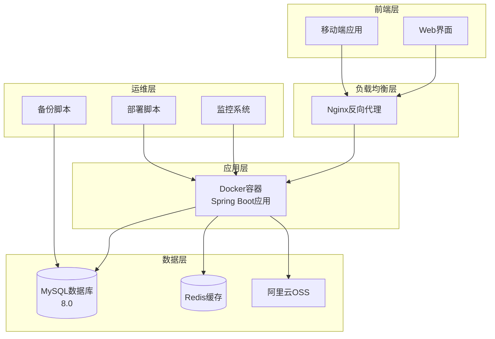
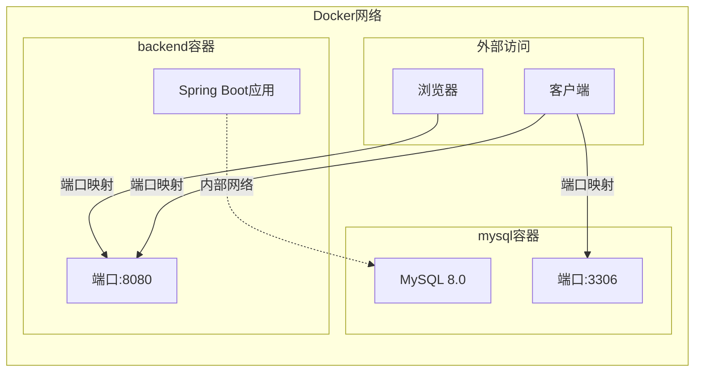
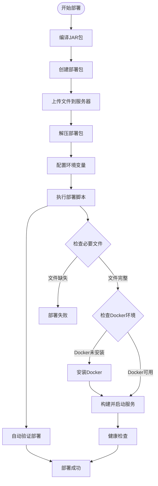
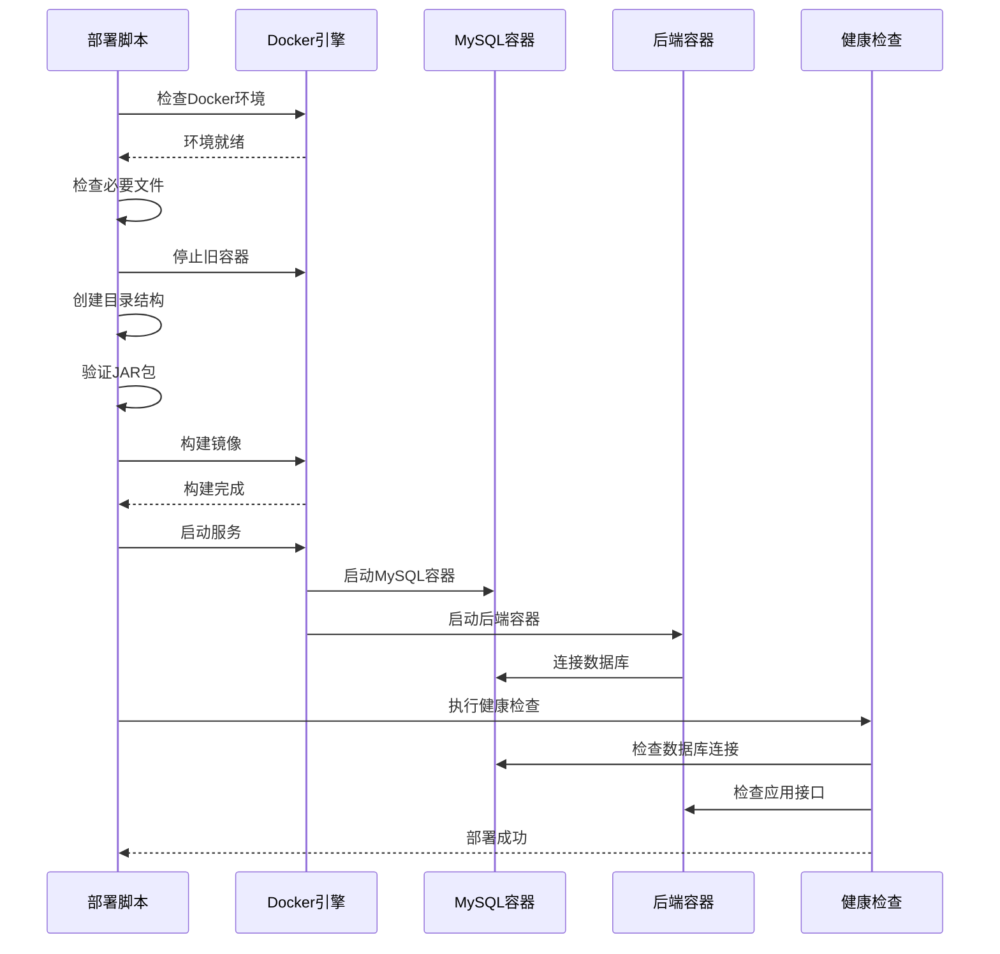

# 部署与配置指南

<cite>
**本文档中引用的文件**
- [hrofficial-deploy/Dockerfile](file://hrofficial-deploy/Dockerfile)
- [hrofficial-deploy/docker-compose.yml](file://hrofficial-deploy/docker-compose.yml)
- [hrofficial-deploy/deploy.sh](file://hrofficial-deploy/deploy.sh)
- [JAR包部署指南.md](file://JAR包部署指南.md)
- [src/main/resources/application.yml](file://src/main/resources/application.yml)
- [nginx.conf](file://nginx.conf)
- [backup.sh](file://backup.sh)
- [fix_docker_compose.sh](file://fix_docker_compose.sh)
- [deploy.bat](file://deploy.bat)
- [create_deploy_package.bat](file://create_deploy_package.bat)
</cite>

## 目录
1. [简介](#简介)
2. [项目架构概览](#项目架构概览)
3. [Docker容器化部署](#docker容器化部署)
4. [传统JAR包部署](#传统jar包部署)
5. [环境配置详解](#环境配置详解)
6. [部署脚本分析](#部署脚本分析)
7. [监控与维护](#监控与维护)
8. [故障排除指南](#故障排除指南)
9. [性能优化建议](#性能优化建议)
10. [总结](#总结)

## 简介

本项目是一个基于Spring Boot的人力资源管理系统，提供了两种主要的部署方式：Docker容器化部署和传统的JAR包部署。这两种部署方式各有优势，适用于不同的应用场景和需求。

系统采用微服务架构设计，包含后端应用服务、MySQL数据库、Redis缓存以及可选的阿里云OSS对象存储服务。通过合理的配置和部署策略，确保系统在生产环境中的稳定性、安全性和可扩展性。

## 项目架构概览



**图表来源**
- [hrofficial-deploy/docker-compose.yml](file://hrofficial-deploy/docker-compose.yml#L1-L44)
- [nginx.conf](file://nginx.conf#L1-L37)

**章节来源**
- [hrofficial-deploy/docker-compose.yml](file://hrofficial-deploy/docker-compose.yml#L1-L44)
- [src/main/resources/application.yml](file://src/main/resources/application.yml#L1-L62)

## Docker容器化部署

### Docker镜像构建

Docker容器化部署是推荐的生产环境部署方式，具有环境隔离、快速部署和易于扩展的优势。

#### Dockerfile配置分析

```dockerfile
# 基础镜像选择
FROM openjdk:17-jdk-slim

# 设置工作目录
WORKDIR /app

# 设置时区
ENV TZ=Asia/Shanghai

# 复制JAR包
COPY app.jar /app/app.jar

# 暴露端口
EXPOSE 8080

# 启动应用
CMD ["java", "-jar", "app.jar"]
```

**关键配置说明：**
- **基础镜像**：使用OpenJDK 17 Slim版本，平衡功能完整性和镜像大小
- **时区设置**：统一设置为Asia/Shanghai，避免时区问题
- **端口暴露**：8080端口用于应用服务访问
- **启动参数**：直接运行JAR包，支持环境变量覆盖配置

#### Docker Compose编排配置

```yaml
version: '3.8'

services:
  # MySQL数据库服务
  mysql:
    image: mysql:8.0
    container_name: hrofficial-mysql
    restart: unless-stopped
    environment:
      MYSQL_ROOT_PASSWORD: ${MYSQL_ROOT_PASSWORD}
      MYSQL_DATABASE: ${MYSQL_DATABASE}
      MYSQL_USER: ${MYSQL_USER}
      MYSQL_PASSWORD: ${MYSQL_PASSWORD}
      TZ: Asia/Shanghai
    ports:
      - "3306:3306"
    volumes:
      - mysql_data:/var/lib/mysql
      - ./init.sql:/docker-entrypoint-initdb.d/init.sql:ro
    command: --default-authentication-plugin=mysql_native_password --character-set-server=utf8mb4 --collation-server=utf8mb4_unicode_ci

  # 后端应用服务
  backend:
    build: .
    container_name: hrofficial-backend
    restart: unless-stopped
    depends_on:
      - mysql
    environment:
      SPRING_PROFILES_ACTIVE: prod
      SPRING_DATASOURCE_URL: jdbc:mysql://mysql:3306/${MYSQL_DATABASE}?useUnicode=true&characterEncoding=utf8mb4&useSSL=false&serverTimezone=Asia/Shanghai
      SPRING_DATASOURCE_USERNAME: ${MYSQL_USER}
      SPRING_DATASOURCE_PASSWORD: ${MYSQL_PASSWORD}
      JWT_SECRET: ${JWT_SECRET}
      ALIYUN_OSS_ENDPOINT: ${ALIYUN_OSS_ENDPOINT:-}
      ALIYUN_OSS_ACCESS_KEY_ID: ${ALIYUN_OSS_ACCESS_KEY_ID:-}
      ALIYUN_OSS_ACCESS_KEY_SECRET: ${ALIYUN_OSS_ACCESS_KEY_SECRET:-}
      ALIYUN_OSS_BUCKET_NAME: ${ALIYUN_OSS_BUCKET_NAME:-}
      ALIYUN_OSS_DOMAIN: ${ALIYUN_OSS_DOMAIN:-}
    ports:
      - "8080:8080"
```

**核心配置要点：**
- **服务依赖**：后端服务依赖MySQL服务，确保启动顺序
- **环境变量**：使用环境变量进行配置管理，提高安全性
- **数据持久化**：MySQL数据存储在独立的Docker卷中
- **网络配置**：容器间通过内部网络通信，外部通过端口映射访问

### 容器网络配置



**图表来源**
- [hrofficial-deploy/docker-compose.yml](file://hrofficial-deploy/docker-compose.yml#L1-L44)

**章节来源**
- [hrofficial-deploy/Dockerfile](file://hrofficial-deploy/Dockerfile#L1-L17)
- [hrofficial-deploy/docker-compose.yml](file://hrofficial-deploy/docker-compose.yml#L1-L44)

## 传统JAR包部署

### 部署文件清单

传统JAR包部署方式适用于需要直接控制应用运行环境的场景，或者对容器化有特殊要求的环境。

#### 必要文件列表

```
/opt/hrofficial/
├── app.jar                 # 编译后的JAR包（主程序）
├── Dockerfile              # Docker镜像构建文件
├── docker-compose.yml      # Docker服务编排文件
├── .env                    # 环境变量配置文件
├── init.sql                # 数据库初始化脚本
└── deploy.sh               # Linux部署脚本
```

#### 自动创建的目录结构

```bash
├── data/                   # 数据持久化目录
├── logs/                   # 日志文件目录  
└── mysql-init/             # MySQL初始化脚本目录
```

### 部署流程详解



**图表来源**
- [hrofficial-deploy/deploy.sh](file://hrofficial-deploy/deploy.sh#L1-L133)
- [JAR包部署指南.md](file://JAR包部署指南.md#L1-L218)

### 编译与打包流程

#### Windows环境编译

```bash
# Maven编译项目
mvn clean package -DskipTests

# 复制编译结果到部署目录
copy target\HumanResourceOfficial-1.0-SNAPSHOT.jar app.jar
```

#### Linux/Mac环境编译

```bash
# Maven编译项目
mvn clean package -DskipTests

# 复制编译结果到部署目录
cp target/HumanResourceOfficial-1.0-SNAPSHOT.jar app.jar
```

#### 创建部署包

```bash
# 创建部署目录
mkdir hrofficial-deploy
cd hrofficial-deploy

# 复制必要文件
cp ../app.jar .
cp ../Dockerfile .
cp ../docker-compose.yml .
cp ../.env .
cp ../init.sql .
cp ../deploy.sh .

# 设置脚本执行权限（Linux环境）
chmod +x deploy.sh
```

**章节来源**
- [JAR包部署指南.md](file://JAR包部署指南.md#L1-L218)
- [create_deploy_package.bat](file://create_deploy_package.bat#L1-L47)

## 环境配置详解

### 生产环境配置最佳实践

#### application.yml配置分析

```yaml
spring:
  datasource:
    url: jdbc:mysql://localhost:3306/hrofficial?useUnicode=true&characterEncoding=utf8&useSSL=false&serverTimezone=GMT%2B8&allowPublicKeyRetrieval=true
    username: root
    password: root
    driver-class-name: com.mysql.cj.jdbc.Driver
  jackson:
    time-zone: GMT+8
    date-format: yyyy-MM-dd HH:mm:ss
  servlet:
    multipart:
      max-file-size: 100MB
      max-request-size: 100MB
  data:
    redis:
      host: localhost
      port: 6379
      password: # 如果没有密码则留空
      timeout: 10000ms
      database: 0
      lettuce:
        pool:
          max-active: 8
          max-wait: -1ms
          max-idle: 8
          min-idle: 0
server:
  port: 8080
```

**关键配置说明：**
- **数据库连接**：使用UTF-8字符集，禁用SSL，设置时区为GMT+8
- **文件上传限制**：最大100MB，防止内存溢出
- **Redis配置**：连接池配置，支持高并发访问
- **服务器端口**：8080端口作为应用服务端口

#### 环境变量配置

```bash
# MySQL数据库配置
MYSQL_ROOT_PASSWORD=your_root_password
MYSQL_DATABASE=hrofficial
MYSQL_USER=hruser
MYSQL_PASSWORD=your_user_password

# JWT认证配置
JWT_SECRET=your_jwt_secret_key

# 阿里云OSS配置（可选）
ALIYUN_OSS_ENDPOINT=https://oss-cn-hangzhou.aliyuncs.com
ALIYUN_OSS_ACCESS_KEY_ID=your_access_key_id
ALIYUN_OSS_ACCESS_KEY_SECRET=your_access_key_secret
ALIYUN_OSS_BUCKET_NAME=your_bucket_name
ALIYUN_OSS_DOMAIN=your_domain
```

### 安全配置要点

#### 数据库安全配置

```sql
-- 数据库初始化脚本示例
CREATE DATABASE IF NOT EXISTS hrofficial CHARACTER SET utf8mb4 COLLATE utf8mb4_unicode_ci;

-- 创建专用用户
CREATE USER 'hruser'@'%' IDENTIFIED BY 'secure_password';
GRANT SELECT, INSERT, UPDATE, DELETE ON hrofficial.* TO 'hruser'@'%';

-- 设置时区
SET GLOBAL time_zone = '+8:00';
```

#### 网络安全配置

```nginx
server {
    listen 443 ssl http2;
    server_name your_domain.com;

    # SSL证书配置
    ssl_certificate /path/to/your/certificate.crt;
    ssl_certificate_key /path/to/your/private.key;

    # 反向代理配置
    location / {
        proxy_pass http://localhost:8080;
        proxy_set_header Host $host;
        proxy_set_header X-Real-IP $remote_addr;
        proxy_set_header X-Forwarded-For $proxy_add_x_forwarded_for;
        proxy_set_header X-Forwarded-Proto $scheme;
        
        # 超时配置
        proxy_connect_timeout 60s;
        proxy_send_timeout 60s;
        proxy_read_timeout 60s;
    }

    # 文件上传大小限制
    client_max_body_size 100M;
}
```

**章节来源**
- [src/main/resources/application.yml](file://src/main/resources/application.yml#L1-L62)
- [nginx.conf](file://nginx.conf#L1-L37)

## 部署脚本分析

### 自动化部署脚本功能

#### deploy.sh脚本核心功能

```bash
#!/bin/bash

# 1. 环境检查
check_docker
check_compose
check_files

# 2. 清理旧环境
cleanup_old_containers

# 3. 创建必要目录
create_directories

# 4. 验证JAR包
verify_jar

# 5. 构建并启动服务
build_and_start

# 6. 健康检查
health_check
```

#### 部署流程详细分析



**图表来源**
- [hrofficial-deploy/deploy.sh](file://hrofficial-deploy/deploy.sh#L1-L133)

### 错误处理机制

#### 自动错误恢复

```bash
# 设置错误处理
set -e
trap 'echo "[错误] 脚本执行失败，行号: $LINENO"' ERR

# Docker Compose兼容性检查
if command -v docker-compose &> /dev/null; then
    DOCKER_COMPOSE_CMD="docker-compose"
elif command -v docker compose &> /dev/null; then
    DOCKER_COMPOSE_CMD="docker compose"
else
    echo "[错误] Docker Compose不可用"
    exit 1
fi
```

#### 健康检查实现

```bash
# MySQL健康检查
for i in {1..10}; do
    if docker exec hrofficial-mysql mysqladmin ping -h localhost --silent; then
        echo "[信息] MySQL服务正常"
        break
    fi
    sleep 3
done

# 应用服务健康检查
for i in {1..15}; do
    if curl -f http://localhost:8080 >/dev/null 2>&1; then
        echo "[信息] 应用服务正常"
        break
    fi
    sleep 3
done
```

**章节来源**
- [hrofficial-deploy/deploy.sh](file://hrofficial-deploy/deploy.sh#L1-L133)
- [fix_docker_compose.sh](file://fix_docker_compose.sh#L1-L112)

## 监控与维护

### 监控系统配置

#### 日志监控配置

```bash
# 查看所有服务日志
docker-compose logs -f

# 查看特定服务日志
docker-compose logs -f backend
docker-compose logs -f mysql

# 实时监控应用指标
docker stats hrofficial-backend
```

#### 健康检查命令

```bash
# 检查服务状态
docker-compose ps

# 查看容器资源使用情况
docker stats

# 检查磁盘空间
df -h

# 检查内存使用
free -h
```

### 备份策略

#### 自动备份脚本

```bash
#!/bin/bash

# 备份目录配置
BACKUP_DIR="/opt/backups/hrofficial"
DATE=$(date +%Y%m%d_%H%M%S)
BACKUP_NAME="hrofficial_backup_$DATE"

# 创建备份目录
mkdir -p $BACKUP_DIR

# 备份数据库
docker exec hrofficial-mysql mysqldump -u root -p$MYSQL_ROOT_PASSWORD hrofficial > $BACKUP_DIR/${BACKUP_NAME}_database.sql

# 备份应用数据
tar -czf $BACKUP_DIR/${BACKUP_NAME}_files.tar.gz /opt/hrofficial --exclude=/opt/hrofficial/data/mysql

# 清理旧备份（保留7天）
find $BACKUP_DIR -name "hrofficial_backup_*" -mtime +7 -delete
```

### 维护任务

#### 定期维护计划

```bash
# 每日维护任务
#!/bin/bash
echo "=== 每日系统维护 ==="
echo "时间: $(date)"

# 1. 检查磁盘空间
echo "检查磁盘空间..."
df -h | grep -E "(\/|data)"

# 2. 检查内存使用
echo "检查内存使用..."
free -h

# 3. 清理Docker日志
echo "清理Docker日志..."
docker system prune -f

# 4. 备份重要数据
echo "执行数据备份..."
/opt/hrofficial/backup.sh

# 5. 检查服务状态
echo "检查服务状态..."
docker-compose ps

echo "=== 维护任务完成 ==="
```

**章节来源**
- [backup.sh](file://backup.sh#L1-L24)

## 故障排除指南

### 常见部署问题

#### 问题1：Docker环境问题

**症状**：Docker命令不可用或版本过旧

**解决方案**：
```bash
# 检查Docker版本
docker --version

# 检查Docker Compose版本
docker-compose --version

# 使用修复脚本
chmod +x fix_docker_compose.sh
./fix_docker_compose.sh
```

#### 问题2：端口冲突

**症状**：端口8080或3306被占用

**解决方案**：
```bash
# 检查端口占用
netstat -tulpn | grep :8080
netstat -tulpn | grep :3306

# 修改端口配置
sed -i 's/8080:8080/8081:8080/g' docker-compose.yml
sed -i 's/3306:3306/3307:3306/g' docker-compose.yml
```

#### 问题3：JAR包启动失败

**症状**：应用容器启动后立即退出

**排查步骤**：
```bash
# 查看容器日志
docker-compose logs backend

# 检查JAR包完整性
ls -lh app.jar

# 验证Java环境
docker exec hrofficial-backend java -version

# 检查内存限制
docker stats hrofficial-backend
```

### 性能问题诊断

#### 内存不足问题

```bash
# 检查容器内存使用
docker stats hrofficial-backend --no-stream

# 增加Docker内存限制
# 编辑 ~/.docker/daemon.json
{
  "default-runtime": "runc",
  "default-memory": "2g"
}

# 重启Docker服务
sudo systemctl restart docker
```

#### 数据库连接问题

```bash
# 检查MySQL容器状态
docker-compose ps | grep mysql

# 进入MySQL容器
docker exec -it hrofficial-mysql bash

# 登录MySQL
mysql -u root -p

# 检查数据库连接数
SHOW STATUS LIKE 'Threads_connected';
SHOW VARIABLES LIKE 'max_connections';
```

### 网络连接问题

#### 无法访问应用

```bash
# 检查容器网络
docker network ls
docker network inspect bridge

# 检查端口映射
docker port hrofficial-backend

# 测试本地连接
curl http://localhost:8080

# 检查防火墙设置
sudo ufw status
sudo iptables -L
```

## 性能优化建议

### JVM性能调优

#### Java启动参数优化

```bash
# 生产环境推荐的JVM参数
JAVA_OPTS="-Xms1024m -Xmx2048m -XX:+UseG1GC -XX:MaxGCPauseMillis=200 -XX:+PrintGCDetails -XX:+PrintGCTimeStamps"

# 添加到Dockerfile
ENV JAVA_OPTS="$JAVA_OPTS"
CMD ["java", "$JAVA_OPTS", "-jar", "app.jar"]
```

### 数据库性能优化

#### MySQL配置优化

```sql
-- my.cnf配置优化
[mysqld]
# 连接数配置
max_connections = 200
max_connect_errors = 6000

# 缓冲区配置
innodb_buffer_pool_size = 1G
innodb_log_file_size = 256M
innodb_flush_log_at_trx_commit = 2

# 查询缓存
query_cache_type = 1
query_cache_size = 128M

# 日志配置
log_bin = mysql-bin
expire_logs_days = 10
max_binlog_size = 100M
```

### 缓存优化

#### Redis配置优化

```yaml
spring:
  data:
    redis:
      host: redis-server
      port: 6379
      timeout: 10000ms
      database: 0
      lettuce:
        pool:
          max-active: 20
          max-wait: 5000ms
          max-idle: 10
          min-idle: 5
```

### 监控指标

#### 关键性能指标

```bash
# 系统监控指标
CPU使用率: top
内存使用: free -h
磁盘IO: iostat
网络IO: netstat

# 应用监控指标
JVM堆内存: jstat -gc <pid>
线程数: jstack <pid> | grep "nid=" | wc -l
数据库连接数: SHOW STATUS LIKE 'Threads_connected';
```

## 总结

本部署与配置指南详细介绍了人力资源管理系统项目的两种主要部署方式：Docker容器化部署和传统JAR包部署。每种方式都有其独特的优势和适用场景。

### Docker容器化部署优势

- **环境一致性**：容器化确保开发、测试和生产环境的一致性
- **快速部署**：一键启动，快速扩展
- **资源隔离**：良好的资源隔离和管理
- **版本控制**：镜像版本管理，便于回滚
- **自动扩缩容**：支持Kubernetes等容器编排平台

### JAR包部署优势

- **简单直接**：无需学习容器技术
- **资源占用少**：直接运行在宿主机上
- **调试方便**：可以直接访问宿主机资源
- **成本效益**：适合小型项目和低资源环境

### 最佳实践建议

1. **生产环境优先选择Docker部署**，确保环境一致性和可维护性
2. **定期备份**：建立完善的备份策略，包括数据库和应用文件
3. **监控告警**：配置完善的监控系统，及时发现和解决问题
4. **安全加固**：定期更新系统和应用，加强访问控制
5. **性能优化**：根据实际负载情况调整JVM和数据库参数

通过遵循本指南的建议和最佳实践，可以确保人力资源管理系统在生产环境中稳定、安全、高效地运行，为企业的人力资源管理提供可靠的技术支撑。