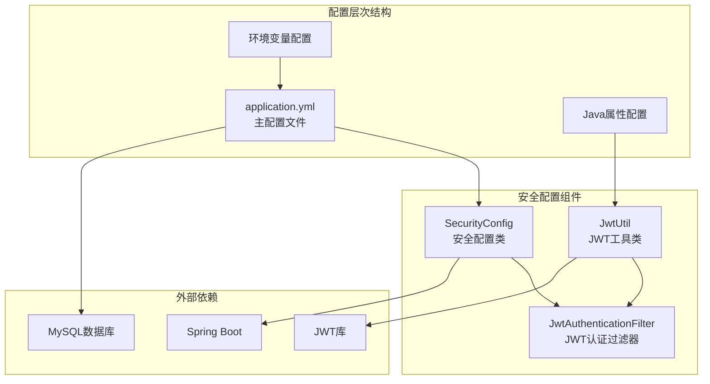
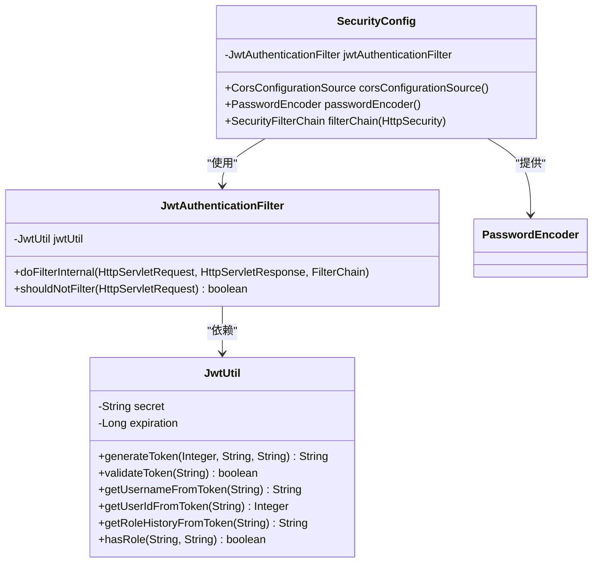

# 配置指南

<cite>
**本文档引用的文件**
- [application.yml](file://src/main/resources/application.yml)
- [SecurityConfig.java](file://src/main/java/com/redmoon2333/config/SecurityConfig.java)
- [JwtAuthenticationFilter.java](file://src/main/java/com/redmoon2333/config/JwtAuthenticationFilter.java)
- [JwtUtil.java](file://src/main/java/com/redmoon2333/util/JwtUtil.java)
- [pom.xml](file://pom.xml)
</cite>

## 目录
1. [简介](#简介)
2. [项目配置架构](#项目配置架构)
3. [核心配置文件详解](#核心配置文件详解)
4. [安全配置分析](#安全配置分析)
5. [环境配置最佳实践](#环境配置最佳实践)
6. [配置模板与示例](#配置模板与示例)
7. [常见配置问题排查](#常见配置问题排查)
8. [性能优化建议](#性能优化建议)
9. [总结](#总结)

## 简介

本配置指南详细介绍了Human Resource Official系统中的配置管理，重点关注application.yml文件的各项配置参数，以及与之协同工作的SecurityConfig安全配置。该系统采用Spring Boot框架，支持多环境部署，并实现了基于JWT的身份验证机制。

## 项目配置架构



**图表来源**
- [application.yml](file://src/main/resources/application.yml#L1-L30)
- [SecurityConfig.java](file://src/main/java/com/redmoon2333/config/SecurityConfig.java#L1-L112)

## 核心配置文件详解

### application.yml配置结构

application.yml是Spring Boot应用的主要配置文件，包含了系统运行所需的所有基础配置：

```yaml
spring:
  datasource:
    url: jdbc:mysql://localhost:3306/hrofficial?useUnicode=true&characterEncoding=utf8&useSSL=false&serverTimezone=GMT%2B8
    username: root
    password: root
    driver-class-name: com.mysql.cj.jdbc.Driver
  jackson:
    time-zone: GMT+8
    date-format: yyyy-MM-dd HH:mm:ss
server:
  port: 8080
mybatis:
  mapper-locations: classpath:mapper/*.xml
  type-aliases-package: com.redmoon2333.entity

# PageHelper分页配置
pagehelper:
  helper-dialect: mysql
  reasonable: true
  support-methods-arguments: true
  params: count=countSql

# JWT配置
jwt:
  secret: hr-official-jwt-secret-key-2024-redmoon2333-human-resource-system
  expiration: 7200000  # 2小时，单位毫秒

logging:
  level:
    com.redmoon2333.service.UserService: DEBUG
```

### 数据源配置详解

**数据库连接配置**
- `url`: MySQL连接字符串，包含时区设置和字符编码
- `username`: 数据库用户名，默认root
- `password`: 数据库密码，默认root
- `driver-class-name`: MySQL JDBC驱动类

**Jackson日期配置**
- `time-zone`: 应用程序使用的时区，设置为GMT+8
- `date-format`: 统一的日期时间格式

**服务器配置**
- `port`: 应用程序监听端口，默认8080

**MyBatis配置**
- `mapper-locations`: MyBatis映射文件位置
- `type-aliases-package`: 实体类包路径

**PageHelper分页配置**
- `helper-dialect`: 分页插件方言，支持MySQL
- `reasonable`: 启用合理化分页
- `support-methods-arguments`: 支持方法参数传递
- `params`: 自定义参数配置

**JWT配置**
- `secret`: JWT签名密钥，必须保持安全
- `expiration`: 令牌过期时间，单位毫秒（2小时）

**日志配置**
- 设置特定服务的日志级别为DEBUG模式

**章节来源**
- [application.yml](file://src/main/resources/application.yml#L1-L30)

## 安全配置分析

### SecurityConfig安全配置类

SecurityConfig类负责定义应用程序的安全策略，与application.yml中的JWT配置协同工作：



**图表来源**
- [SecurityConfig.java](file://src/main/java/com/redmoon2333/config/SecurityConfig.java#L20-L112)
- [JwtAuthenticationFilter.java](file://src/main/java/com/redmoon2333/config/JwtAuthenticationFilter.java#L20-L132)
- [JwtUtil.java](file://src/main/java/com/redmoon2333/util/JwtUtil.java#L15-L229)

### CORS配置详解

```java
// 设置允许的域名 - 使用allowedOriginPatterns而不是allowedOrigins
configuration.setAllowedOriginPatterns(Arrays.asList(
    "http://localhost:3000",
    "http://localhost:8081",
    "http://127.0.0.1:3000",
    "http://127.0.0.1:8081"
));

// 设置允许的HTTP方法
configuration.setAllowedMethods(Arrays.asList(
    "GET", "POST", "PUT", "DELETE", "OPTIONS", "HEAD"
));

// 设置允许的请求头
configuration.setAllowedHeaders(Arrays.asList("*"));

// 允许发送Cookie等凭据信息
configuration.setAllowCredentials(true);

// 设置预检请求的缓存时间
configuration.setMaxAge(3600L);
```

### 请求授权规则

```java
// 允许注册和登录接口访问
.requestMatchers("/api/auth/login", "/api/auth/register", "/api/auth/check-username").permitAll()
// 允许静态资源访问
.requestMatchers("/css/**", "/js/**", "/images/**", "/static/**").permitAll()
// 允许首页访问
.requestMatchers("/", "/index.html", "/favicon.ico").permitAll()
// 允许公开API访问
.requestMatchers("/api/public/**").permitAll()
// 允许活动查询接口（GET方法）公开访问
.requestMatchers(HttpMethod.GET, "/api/activities/**").permitAll()
// 允许用户相关公开接口访问
.requestMatchers(HttpMethod.GET, "/api/users/alumni").permitAll()
.requestMatchers(HttpMethod.GET, "/api/users/search/name/**").permitAll()
// 其他请求需要认证
.anyRequest().authenticated()
```

**章节来源**
- [SecurityConfig.java](file://src/main/java/com/redmoon2333/config/SecurityConfig.java#L27-L112)

## 环境配置最佳实践

### 开发环境配置

开发环境推荐配置：
```yaml
spring:
  profiles:
    active: dev
  datasource:
    url: jdbc:mysql://localhost:3306/hrofficial_dev?useUnicode=true&characterEncoding=utf8&useSSL=false&serverTimezone=GMT%2B8
    username: dev_user
    password: dev_password
  jackson:
    time-zone: GMT+8
    date-format: yyyy-MM-dd HH:mm:ss
server:
  port: 8080
logging:
  level:
    root: INFO
    com.redmoon2333: DEBUG
    com.redmoon2333.service.UserService: TRACE
```

### 测试环境配置

测试环境配置要点：
```yaml
spring:
  profiles:
    active: test
  datasource:
    url: jdbc:mysql://test-db:3306/hrofficial_test?useUnicode=true&characterEncoding=utf8&useSSL=false&serverTimezone=GMT%2B8
    username: test_user
    password: ${TEST_DB_PASSWORD}
  jackson:
    time-zone: GMT+8
    date-format: yyyy-MM-dd HH:mm:ss
server:
  port: 8081
logging:
  level:
    root: WARN
    com.redmoon2333: INFO
```

### 生产环境配置

生产环境安全配置：
```yaml
spring:
  profiles:
    active: prod
  datasource:
    url: jdbc:mysql://prod-db:3306/hrofficial_prod?useUnicode=true&characterEncoding=utf8&useSSL=true&serverTimezone=GMT%2B8
    username: ${DB_USERNAME}
    password: ${DB_PASSWORD}
    hikari:
      maximum-pool-size: 20
      minimum-idle: 5
      connection-timeout: 30000
      idle-timeout: 600000
      max-lifetime: 1800000
  jackson:
    time-zone: GMT+8
    date-format: yyyy-MM-dd HH:mm:ss
server:
  port: 8080
  tomcat:
    max-threads: 200
    min-spare-threads: 10
    connection-timeout: 20000
    keep-alive-timeout: 60000
    max-connections: 8192
logging:
  level:
    root: ERROR
    com.redmoon2333: WARN
    com.redmoon2333.service.UserService: INFO
```

### 环境变量替代方案

推荐使用环境变量来管理敏感配置：

```bash
# 开发环境
export DB_USERNAME=root
export DB_PASSWORD=root
export JWT_SECRET_KEY=development-jwt-secret-key

# 测试环境  
export TEST_DB_PASSWORD=test123
export JWT_SECRET_KEY=test-jwt-secret-key

# 生产环境
export DB_USERNAME=prod_user
export DB_PASSWORD=${PROD_DB_PASSWORD}
export JWT_SECRET_KEY=${PROD_JWT_SECRET}
```

## 配置模板与示例

### 完整配置模板

```yaml
# application.yml - 完整配置模板

# Spring Boot配置
spring:
  profiles:
    active: dev
  application:
    name: HumanResourceOfficial
  datasource:
    url: jdbc:mysql://${DB_HOST:localhost}:${DB_PORT:3306}/${DB_NAME:hrofficial}?useUnicode=true&characterEncoding=utf8&useSSL=${USE_SSL:false}&serverTimezone=GMT%2B8
    username: ${DB_USERNAME:root}
    password: ${DB_PASSWORD:root}
    driver-class-name: com.mysql.cj.jdbc.Driver
    hikari:
      maximum-pool-size: ${DB_POOL_MAX:10}
      minimum-idle: ${DB_POOL_MIN:5}
      connection-timeout: ${DB_TIMEOUT:30000}
      idle-timeout: ${DB_IDLE_TIMEOUT:600000}
      max-lifetime: ${DB_MAX_LIFETIME:1800000}
  jackson:
    time-zone: GMT+8
    date-format: yyyy-MM-dd HH:mm:ss
    serialization:
      indent-output: false
  mvc:
    pathmatch:
      matching-strategy: ant_path_matcher

# 服务器配置
server:
  port: ${SERVER_PORT:8080}
  servlet:
    context-path: /
  compression:
    enabled: true
    mime-types: text/html,text/xml,text/plain,text/css,application/javascript,application/json
    min-response-size: 1024
  tomcat:
    max-threads: ${TOMCAT_THREADS:200}
    min-spare-threads: ${TOMCAT_MIN_THREADS:10}
    connection-timeout: ${TOMCAT_TIMEOUT:20000}
    keep-alive-timeout: ${TOMCAT_KEEPALIVE:60000}
    max-connections: ${TOMCAT_MAX_CONNECTIONS:8192}

# MyBatis配置
mybatis:
  mapper-locations: classpath:mapper/*.xml
  type-aliases-package: com.redmoon2333.entity
  configuration:
    map-underscore-to-camel-case: true
    cache-enabled: true
    lazy-loading-enabled: false
    aggressive-lazy-loading: true
    multiple-result-sets-enabled: true
    use-column-label: true
    default-fetch-size: 100
    default-statement-timeout: 30

# PageHelper分页配置
pagehelper:
  helper-dialect: mysql
  reasonable: true
  support-methods-arguments: true
  params: count=countSql
  page-size-zero: true

# JWT配置
jwt:
  secret: ${JWT_SECRET_KEY:hr-official-default-secret-key}
  expiration: ${JWT_EXPIRATION:7200000}  # 2小时，单位毫秒
  refresh-expiration: ${JWT_REFRESH_EXPIRATION:604800000}  # 7天，单位毫秒

# 日志配置
logging:
  level:
    root: ${LOG_LEVEL:INFO}
    com.redmoon2333: ${SERVICE_LOG_LEVEL:INFO}
    com.redmoon2333.service.UserService: ${USER_SERVICE_LOG_LEVEL:DEBUG}
    com.redmoon2333.controller: ${CONTROLLER_LOG_LEVEL:INFO}
    org.springframework.security: ${SECURITY_LOG_LEVEL:WARN}
    org.springframework.web: ${WEB_LOG_LEVEL:INFO}
  pattern:
    console: "%d{yyyy-MM-dd HH:mm:ss.SSS} [%thread] %-5level %logger{36} - %msg%n"
    file: "%d{yyyy-MM-dd HH:mm:ss.SSS} [%thread] %-5level %logger{36} - %msg%n"
  file:
    name: logs/app.log
    max-size: 100MB
    max-history: 30
    total-size-cap: 1GB

# Actuator监控配置
management:
  endpoints:
    web:
      exposure:
        include: health,info,metrics,prometheus
  endpoint:
    health:
      show-details: always
  metrics:
    export:
      prometheus:
        enabled: true
```

### 配置文件目录结构

```
src/main/resources/
├── application.yml                    # 主配置文件
├── application-dev.yml               # 开发环境配置
├── application-test.yml              # 测试环境配置  
├── application-prod.yml              # 生产环境配置
├── logback-spring.xml                # 日志配置文件
└── mapper/                           # MyBatis映射文件
    ├── UserMapper.xml
    ├── ActivityMapper.xml
    └── MaterialMapper.xml
```

## 常见配置问题排查

### 数据库连接问题

**问题症状**: 应用启动时出现数据库连接异常

**排查步骤**:
1. 检查数据库服务是否正常运行
2. 验证连接URL格式是否正确
3. 确认用户名和密码是否正确
4. 检查防火墙设置是否阻止数据库连接

**解决方案**:
```yaml
spring:
  datasource:
    url: jdbc:mysql://localhost:3306/hrofficial?useUnicode=true&characterEncoding=utf8&useSSL=false&serverTimezone=GMT%2B8
    username: root
    password: root
    driver-class-name: com.mysql.cj.jdbc.Driver
    hikari:
      maximum-pool-size: 10
      minimum-idle: 5
      connection-timeout: 30000
      idle-timeout: 600000
      max-lifetime: 1800000
```

### JWT配置问题

**问题症状**: JWT令牌验证失败或过期

**排查步骤**:
1. 检查JWT密钥是否正确配置
2. 验证令牌过期时间设置
3. 确认客户端和服务端时间同步

**解决方案**:
```yaml
jwt:
  secret: ${JWT_SECRET_KEY:hr-official-jwt-secret-key-2024-redmoon2333-human-resource-system}
  expiration: ${JWT_EXPIRATION:7200000}  # 2小时
  refresh-expiration: ${JWT_REFRESH_EXPIRATION:604800000}  # 7天
```

### CORS跨域问题

**问题症状**: 前后端分离项目出现跨域访问限制

**排查步骤**:
1. 检查前端请求的域名和端口是否在CORS白名单中
2. 确认是否启用了凭证传输（credentials）
3. 验证预检请求的处理

**解决方案**:
```java
// 在SecurityConfig中确保CORS配置正确
@Bean
public CorsConfigurationSource corsConfigurationSource() {
    CorsConfiguration configuration = new CorsConfiguration();
    configuration.setAllowedOriginPatterns(Arrays.asList(
        "http://localhost:3000",
        "http://localhost:8081",
        "http://127.0.0.1:3000",
        "http://127.0.0.1:8081"
    ));
    configuration.setAllowCredentials(true);
    configuration.setMaxAge(3600L);
    // ... 其他配置
}
```

### 性能问题诊断

**问题症状**: 应用响应缓慢或内存溢出

**排查步骤**:
1. 检查数据库连接池配置
2. 监控JVM内存使用情况
3. 分析慢查询日志
4. 检查线程池配置

**解决方案**:
```yaml
# 数据库连接池优化
spring:
  datasource:
    hikari:
      maximum-pool-size: 20
      minimum-idle: 5
      connection-timeout: 30000
      idle-timeout: 600000
      max-lifetime: 1800000
      leak-detection-threshold: 60000

# JVM参数优化
server:
  tomcat:
    max-threads: 200
    min-spare-threads: 10
    connection-timeout: 20000
    keep-alive-timeout: 60000
    max-connections: 8192
```

## 性能优化建议

### 数据库连接池优化

```yaml
spring:
  datasource:
    hikari:
      # 连接池大小
      maximum-pool-size: 20
      minimum-idle: 5
      
      # 连接超时设置
      connection-timeout: 30000
      idle-timeout: 600000
      max-lifetime: 1800000
      
      # 连接泄漏检测
      leak-detection-threshold: 60000
      
      # 连接验证
      validation-timeout: 5000
      connection-test-query: SELECT 1
```

### 缓存配置优化

```yaml
# Redis缓存配置（如果使用）
spring:
  redis:
    host: localhost
    port: 6379
    timeout: 5000ms
    lettuce:
      pool:
        max-active: 20
        max-idle: 10
        min-idle: 5
        max-wait: 2000ms
```

### JVM参数调优

```bash
# 生产环境JVM参数
JAVA_OPTS="-Xms2g -Xmx4g -XX:+UseG1GC -XX:MaxGCPauseMillis=200 
           -XX:+HeapDumpOnOutOfMemoryError -XX:HeapDumpPath=/var/logs/heapdump.hprof
           -Djava.awt.headless=true -Dfile.encoding=UTF-8"
```

### 监控指标配置

```yaml
# Actuator监控配置
management:
  endpoints:
    web:
      exposure:
        include: health,info,metrics,prometheus,httptrace
  endpoint:
    health:
      show-details: always
      show-components: always
  metrics:
    export:
      prometheus:
        enabled: true
    distribution:
      percentiles-histogram:
        http.server.requests: true
      slo:
        http.server.requests: 0.1,0.2,0.5,1.0,5.0
```

## 总结

本配置指南详细介绍了Human Resource Official系统的配置管理，涵盖了从基础的application.yml配置到高级的安全配置和性能优化。通过合理的配置管理，可以确保系统在不同环境下稳定运行，并提供良好的用户体验。

关键要点包括：

1. **配置文件结构**: 明确了application.yml的各个配置模块及其作用
2. **安全配置**: 详细说明了JWT认证机制与Spring Security的集成
3. **环境适配**: 提供了开发、测试、生产环境的配置模板
4. **最佳实践**: 包含了环境变量使用、配置加密等安全建议
5. **问题排查**: 提供了常见配置问题的诊断和解决方法

建议开发者根据实际需求选择合适的配置方案，并定期审查和更新配置以适应业务发展和技术演进。