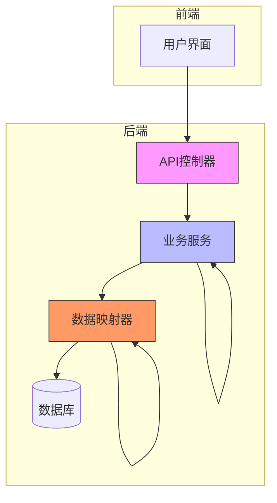
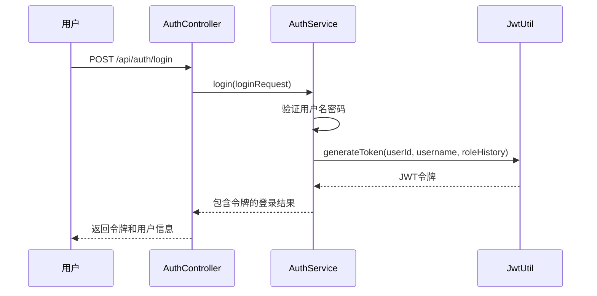
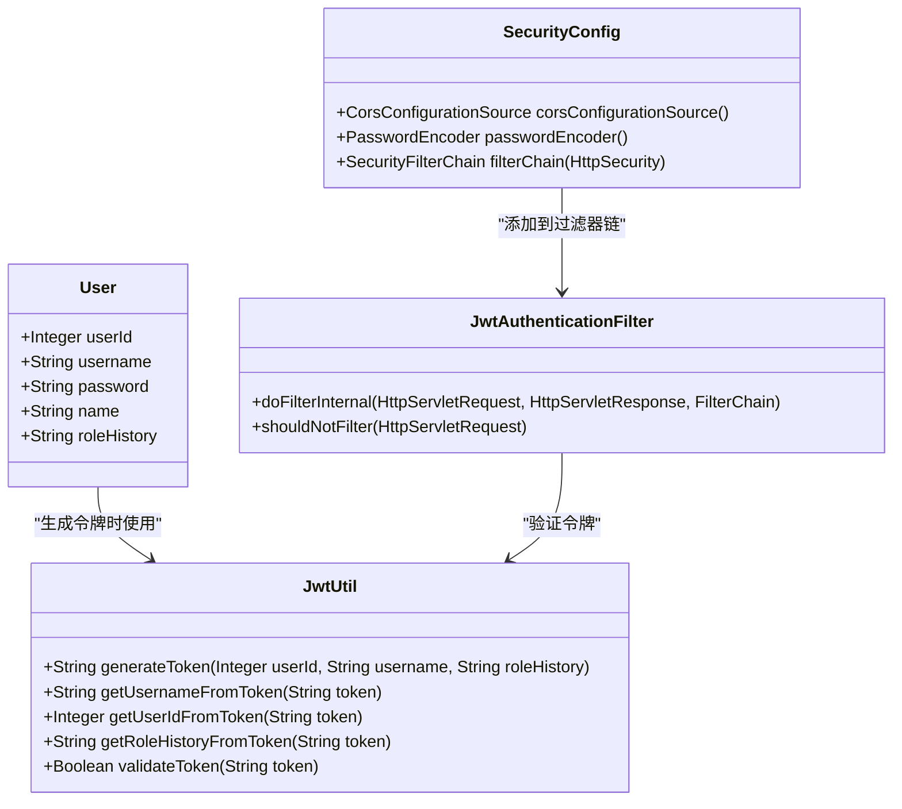
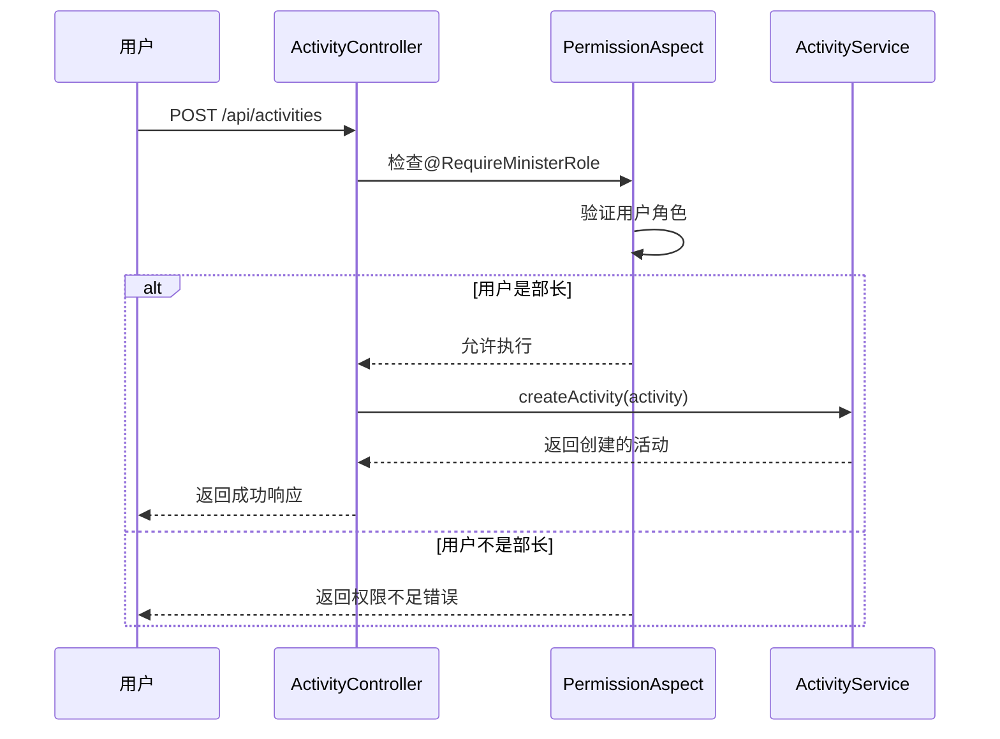
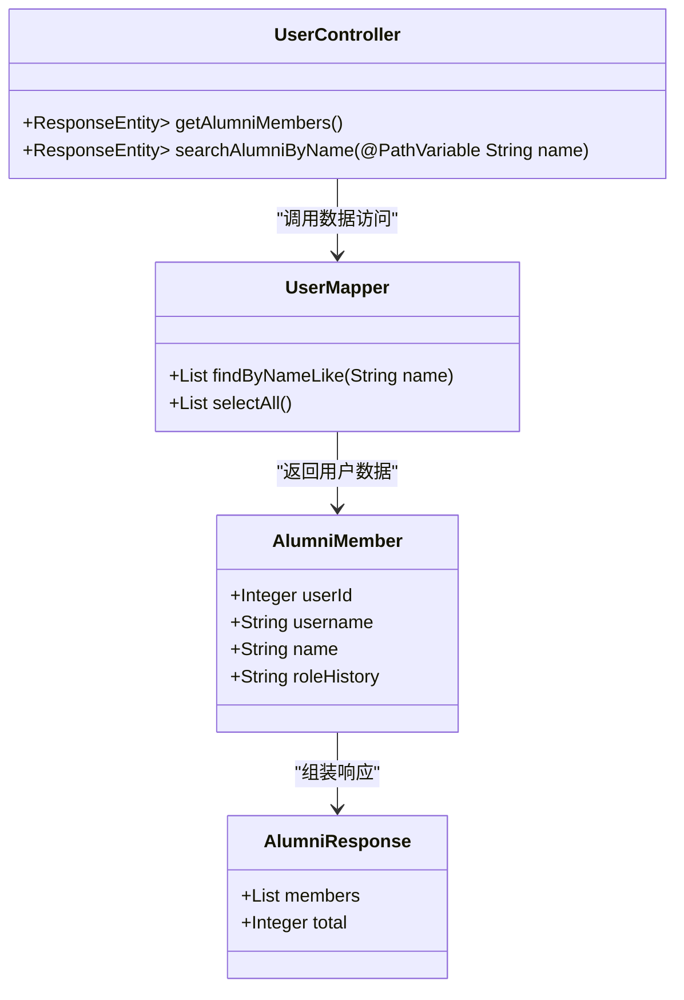

# 项目概述

<cite>
**本文档引用的文件**
- [Main.java](file://src/main/java/com/redmoon2333/Main.java)
- [SecurityConfig.java](file://src/main/java/com/redmoon2333/config/SecurityConfig.java)
- [JwtAuthenticationFilter.java](file://src/main/java/com/redmoon2333/config/JwtAuthenticationFilter.java)
- [JwtUtil.java](file://src/main/java/com/redmoon2333/util/JwtUtil.java)
- [AuthController.java](file://src/main/java/com/redmoon2333/controller/AuthController.java)
- [AuthService.java](file://src/main/java/com/redmoon2333/service/AuthService.java)
- [UserController.java](file://src/main/java/com/redmoon2333/controller/UserController.java)
- [ActivityController.java](file://src/main/java/com/redmoon2333/controller/ActivityController.java)
- [ActivityService.java](file://src/main/java/com/redmoon2333/service/ActivityService.java)
- [User.java](file://src/main/java/com/redmoon2333/entity/User.java)
- [ActivationCode.java](file://src/main/java/com/redmoon2333/entity/ActivationCode.java)
- [Activity.java](file://src/main/java/com/redmoon2333/entity/Activity.java)
- [UserMapper.java](file://src/main/java/com/redmoon2333/mapper/UserMapper.java)
- [ActivityMapper.java](file://src/main/java/com/redmoon2333/mapper/ActivityMapper.java)
- [application.yml](file://src/main/resources/application.yml)
- [pom.xml](file://pom.xml)
- [README.md](file://README.md)
</cite>

## 目录
1. [简介](#简介)
2. [项目结构](#项目结构)
3. [核心功能模块](#核心功能模块)
4. [系统架构设计](#系统架构设计)
5. [用户认证与权限管理](#用户认证与权限管理)
6. [活动管理模块](#活动管理模块)
7. [往届成员查询功能](#往届成员查询功能)
8. [典型用户工作流](#典型用户工作流)
9. [技术实现细节](#技术实现细节)
10. [配置与部署](#配置与部署)

## 简介

HumanResourceOfficial项目是一个基于Spring Boot框架的学生会人力资源管理系统后端服务。该项目旨在为学生会提供一个完整的数字化管理平台，支持用户认证、权限控制、活动管理和成员信息查询等核心功能。

系统采用现代化的Web技术栈，以Spring Boot作为核心框架，结合JWT（JSON Web Token）实现无状态认证机制，使用MyBatis作为持久层框架与MySQL数据库交互。项目设计遵循MVC（Model-View-Controller）架构模式，实现了清晰的分层结构和职责分离。

本系统不仅为学生会日常运营提供技术支持，还特别关注历史数据的保存与查询，允许查询往届成员信息和历史活动记录，这对于学生会的传承和发展具有重要意义。系统通过激活码机制控制用户注册，确保只有经过授权的成员才能加入，同时基于角色的历史记录实现灵活的权限管理体系。

**Section sources**
- [README.md](file://README.md#L1-L230)

## 项目结构

HumanResourceOfficial项目采用标准的Maven项目结构，遵循Spring Boot的最佳实践。项目的整体组织清晰，各组件职责明确，便于维护和扩展。

```
src/main/
├── java/com/redmoon2333/
│   ├── annotation/           # 自定义注解
│   ├── aspect/               # AOP切面
│   ├── config/               # 配置类
│   ├── controller/           # 控制器层
│   ├── dto/                  # 数据传输对象
│   ├── entity/               # 实体类
│   ├── enums/                # 枚举类型
│   ├── exception/            # 异常处理
│   ├── mapper/               # MyBatis映射器
│   ├── service/              # 服务层
│   ├── util/                 # 工具类
│   ├── validation/           # 验证相关
│   └── Main.java             # 应用启动类
└── resources/
    ├── mapper/               # MyBatis XML映射文件
    ├── static/               # 静态资源
    └── application.yml       # 应用配置文件
```

项目的核心代码位于`src/main/java/com/redmoon2333`包下，按照功能划分为多个子包。`controller`包包含所有REST API的入口点，`service`包实现业务逻辑，`mapper`包负责数据库操作，`entity`包定义数据模型。这种分层结构确保了代码的可维护性和可测试性。

**Diagram sources**
- [Main.java](file://src/main/java/com/redmoon2333/Main.java#L1-L13)

**Section sources**
- [Main.java](file://src/main/java/com/redmoon2333/Main.java#L1-L13)
- [pom.xml](file://pom.xml#L1-L88)

## 核心功能模块

HumanResourceOfficial项目围绕学生会管理的核心需求，设计了多个功能模块，主要包括用户认证、权限管理、活动管理和往届成员查询。

### 用户认证模块
用户认证模块是系统安全的基础，实现了基于JWT的无状态认证机制。用户通过用户名和密码登录后，服务器生成包含用户信息的JWT令牌并返回给客户端。后续请求通过在Authorization头中携带该令牌进行身份验证。系统还实现了基于激活码的注册机制，确保只有获得授权的用户才能注册账号。

### 权限管理模块
权限管理模块基于用户的角色历史实现细粒度的访问控制。系统通过自定义注解`@RequireMinisterRole`和AOP切面`PermissionAspect`来实现方法级别的权限验证。用户的身份信息（如"2024级部长"、"2023级部员"）被编码在JWT令牌中，系统可以根据这些信息动态判断用户是否具有执行特定操作的权限。

### 活动管理模块
活动管理模块支持学生会活动的全生命周期管理，包括活动的创建、查询、更新和删除。部长或副部长可以创建新的活动，上传活动图片，并对活动信息进行维护。所有活动信息对系统内用户公开，便于成员了解学生会的活动动态。

### 往届成员查询模块
往届成员查询模块允许用户根据姓名搜索历史成员信息。该功能对于学生会的传承至关重要，新成员可以通过此功能了解往届优秀成员的事迹和贡献，促进组织文化的延续。

**Section sources**
- [README.md](file://README.md#L25-L75)
- [AuthController.java](file://src/main/java/com/redmoon2333/controller/AuthController.java#L1-L153)
- [UserController.java](file://src/main/java/com/redmoon2333/controller/UserController.java#L1-L100)
- [ActivityController.java](file://src/main/java/com/redmoon2333/controller/ActivityController.java#L1-L319)

## 系统架构设计

HumanResourceOfficial项目采用典型的Spring Boot MVC架构，结合JWT认证和MyBatis持久层，构建了一个现代化的Web服务。



**Diagram sources**
- [Main.java](file://src/main/java/com/redmoon2333/Main.java#L1-L13)
- [AuthController.java](file://src/main/java/com/redmoon2333/controller/AuthController.java#L1-L153)
- [AuthService.java](file://src/main/java/com/redmoon2333/service/AuthService.java#L1-L199)
- [UserMapper.java](file://src/main/java/com/redmoon2333/mapper/UserMapper.java#L1-L78)

**Section sources**
- [Main.java](file://src/main/java/com/redmoon2333/Main.java#L1-L13)
- [AuthController.java](file://src/main/java/com/redmoon2333/controller/AuthController.java#L1-L153)
- [AuthService.java](file://src/main/java/com/redmoon2333/service/AuthService.java#L1-L199)

## 用户认证与权限管理

用户认证与权限管理是HumanResourceOfficial项目的核心安全机制，确保了系统的安全性和数据的完整性。

### JWT认证流程
系统采用JWT（JSON Web Token）实现无状态认证。认证流程如下：
1. 用户通过`/api/auth/login`接口提交用户名和密码
2. 服务器验证凭证，成功后生成包含用户ID、用户名和角色历史的JWT令牌
3. 客户端在后续请求的Authorization头中携带`Bearer <token>`进行身份验证
4. 服务器通过`JwtAuthenticationFilter`过滤器验证令牌的有效性，并将用户信息存入安全上下文



**Diagram sources**
- [AuthController.java](file://src/main/java/com/redmoon2333/controller/AuthController.java#L1-L153)
- [AuthService.java](file://src/main/java/com/redmoon2333/service/AuthService.java#L1-L199)
- [JwtUtil.java](file://src/main/java/com/redmoon2333/util/JwtUtil.java#L1-L229)

### 权限控制机制
系统的权限控制基于Spring Security和自定义注解实现。`SecurityConfig`配置类定义了全局的安全规则，如公开接口、需要认证的接口等。对于需要特定权限的操作，系统使用`@RequireMinisterRole`注解标记控制器方法。



**Diagram sources**
- [User.java](file://src/main/java/com/redmoon2333/entity/User.java#L1-L99)
- [JwtUtil.java](file://src/main/java/com/redmoon2333/util/JwtUtil.java#L1-L229)
- [JwtAuthenticationFilter.java](file://src/main/java/com/redmoon2333/config/JwtAuthenticationFilter.java#L1-L132)
- [SecurityConfig.java](file://src/main/java/com/redmoon2333/config/SecurityConfig.java#L1-L112)

**Section sources**
- [SecurityConfig.java](file://src/main/java/com/redmoon2333/config/SecurityConfig.java#L1-L112)
- [JwtAuthenticationFilter.java](file://src/main/java/com/redmoon2333/config/JwtAuthenticationFilter.java#L1-L132)
- [JwtUtil.java](file://src/main/java/com/redmoon2333/util/JwtUtil.java#L1-L229)

## 活动管理模块

活动管理模块是HumanResourceOfficial项目的核心功能之一，支持学生会活动的创建、维护和展示。

### 功能特性
- **活动创建**：部长或副部长可以创建新的活动，填写活动名称、描述、时间等信息
- **图片管理**：支持为活动上传多张图片，并可添加描述和排序
- **信息维护**：部长或副部长可以随时更新活动信息或删除活动
- **公开查询**：所有活动信息对系统内用户公开，支持按ID查询和获取列表

### 接口设计
活动管理模块提供了RESTful API接口，遵循标准的HTTP方法语义：

```mermaid
flowchart TD
A[POST /api/activities] --> B[创建活动]
C[GET /api/activities] --> D[获取所有活动]
E[GET /api/activities/{id}] --> F[获取活动详情]
G[PUT /api/activities/{id}] --> H[更新活动]
I[DELETE /api/activities/{id}] --> J[删除活动]
K[POST /api/activities/{id}/images] --> L[添加活动图片]
M[DELETE /api/activities/images/{id}] --> N[删除活动图片]
style A fill:#9f9,stroke:#333
style C fill:#9f9,stroke:#333
style E fill:#9f9,stroke:#333
style K fill:#9f9,stroke:#333
style B fill:#9f9,stroke:#333
style D fill:#9f9,stroke:#333
style F fill:#9f9,stroke:#333
style L fill:#9f9,stroke:#333
```

**Diagram sources**
- [ActivityController.java](file://src/main/java/com/redmoon2333/controller/ActivityController.java#L1-L319)
- [ActivityService.java](file://src/main/java/com/redmoon2333/service/ActivityService.java#L1-L100)
- [Activity.java](file://src/main/java/com/redmoon2333/entity/Activity.java#L1-L80)

### 权限控制
活动管理操作受到严格的权限控制，只有具有"部长"或"副部长"身份的用户才能执行创建、更新和删除操作。系统通过`@RequireMinisterRole`注解和AOP切面实现这一控制。



**Diagram sources**
- [ActivityController.java](file://src/main/java/com/redmoon2333/controller/ActivityController.java#L1-L319)
- [PermissionAspect.java](file://src/main/java/com/redmoon2333/aspect/PermissionAspect.java#L1-L50)
- [ActivityService.java](file://src/main/java/com/redmoon2333/service/ActivityService.java#L1-L100)

**Section sources**
- [ActivityController.java](file://src/main/java/com/redmoon2333/controller/ActivityController.java#L1-L319)
- [ActivityService.java](file://src/main/java/com/redmoon2333/service/ActivityService.java#L1-L100)

## 往届成员查询功能

往届成员查询功能是HumanResourceOfficial项目的重要特色，支持对学生会历史成员的搜索和查询。

### 功能实现
系统通过`UserController`提供了往届成员查询的API接口：
- `GET /api/users/alumni`：获取所有往届成员列表
- `GET /api/users/search/name/{name}`：根据姓名关键词搜索成员



**Diagram sources**
- [UserController.java](file://src/main/java/com/redmoon2333/controller/UserController.java#L1-L100)
- [UserMapper.java](file://src/main/java/com/redmoon2333/mapper/UserMapper.java#L1-L78)
- [AlumniMember.java](file://src/main/java/com/redmoon2333/dto/AlumniMember.java#L1-L30)
- [AlumniResponse.java](file://src/main/java/com/redmoon2333/dto/AlumniResponse.java#L1-L25)

该功能的实现考虑到了学生会组织的特点，通过保存成员的完整角色历史（如"2024级部长&2023级部员"），可以准确还原成员在学生会的成长轨迹。搜索功能支持模糊匹配，便于用户根据记忆中的姓名片段查找往届成员。

**Section sources**
- [UserController.java](file://src/main/java/com/redmoon2333/controller/UserController.java#L1-L100)
- [UserMapper.java](file://src/main/java/com/redmoon2333/mapper/UserMapper.java#L1-L78)

## 典型用户工作流

### 新用户注册流程
新用户注册是加入学生会人力资源管理系统的第一步，该流程确保了成员的合法性和系统的安全性。

```mermaid
flowchart TD
    A[用户访问注册页面] --> B[输入用户名、密码、确认密码]
    B --> C[输入激活码]
    C --> D[提交注册请求]
    D --> E{系统验证}
    E -->|验证成功| F[创建用户账户]
    E -->|验证失败| G[返回错误信息]
    F --> H[返回注册成功]
    G --> I[提示用户修正信息]
    
    subgraph "系统验证"
        E --> J[检查用户名是否已存在]
        J --> K[验证激活码有效性]
        K --> L[检查密码与确认密码是否匹配]
    end
    
    style A fill:#f9f,stroke:#333
    style B fill:#f9f,stroke