# HumanResourceOfficial学生会人力资源管理系统

<cite>
**本文档引用的文件**
- [README.md](file://README.md)
- [Main.java](file://src\main\java\com\redmoon2333\Main.java)
- [application.yml](file://src\main\resources\application.yml)
- [AuthController.java](file://src\main\java\com\redmoon2333\controller\AuthController.java)
- [AuthService.java](file://src\main\java\com\redmoon2333\service\AuthService.java)
- [ActivityController.java](file://src\main\java\com\redmoon2333\controller\ActivityController.java)
- [User.java](file://src\main\java\com\redmoon2333\entity\User.java)
- [Activity.java](file://src\main\java\com\redmoon2333\entity\Activity.java)
- [RequireMinisterRole.java](file://src\main\java\com\redmoon2333\annotation\RequireMinisterRole.java)
- [PermissionAspect.java](file://src\main\java\com\redmoon2333\aspect\PermissionAspect.java)
- [JwtUtil.java](file://src\main\java\com\redmoon2333\util\JwtUtil.java)
- [SecurityConfig.java](file://src\main\java\com\redmoon2333\config\SecurityConfig.java)
- [GlobalExceptionHandler.java](file://src\main\java\com\redmoon2333\exception\GlobalExceptionHandler.java)
</cite>

## 目录
1. [项目简介](#项目简介)
2. [系统架构](#系统架构)
3. [核心功能模块](#核心功能模块)
4. [技术栈详解](#技术栈详解)
5. [系统设计原理](#系统设计原理)
6. [权限控制系统](#权限控制系统)
7. [安全机制](#安全机制)
8. [数据模型](#数据模型)
9. [部署方案](#部署方案)
10. [性能优化](#性能优化)
11. [故障排除指南](#故障排除指南)
12. [总结](#总结)

## 项目简介

HumanResourceOfficial是一个基于Spring Boot 3.1.4构建的现代化学生会人力资源管理系统后端服务。该项目旨在为学生会提供完整的数字化管理平台，支持用户认证、基于角色的权限控制、活动管理、内部资料管理和往届成员查询等核心功能。

### 核心特性

- **JWT无状态认证**：基于JSON Web Token的安全认证机制，支持令牌刷新和黑名单管理
- **基于角色的权限控制**：细粒度的权限管理体系，支持部员和部长两个主要角色
- **活动全生命周期管理**：支持活动创建、更新、图片管理等功能
- **内部资料管理**：分类管理、文件上传、下载统计等完整功能
- **往届成员查询**：历史数据保存与查询功能
- **阿里云OSS集成**：文件存储与管理，支持多种文件格式
- **RESTful API设计**：标准化的API接口设计
- **分页查询支持**：高效的数据分页处理

## 系统架构

HumanResourceOfficial采用经典的三层架构设计，结合Spring Boot的现代化特性，构建了一个稳定可靠的企业级应用系统。

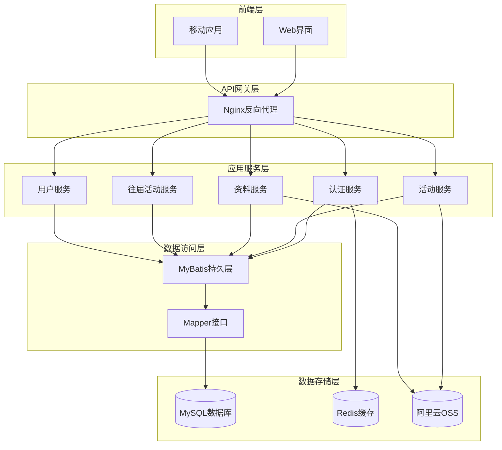

**图表来源**
- [Main.java](file://src\main\java\com\redmoon2333\Main.java#L1-L13)
- [SecurityConfig.java](file://src\main\java\com\redmoon2333\config\SecurityConfig.java#L1-L131)

### MVC架构设计

系统严格遵循MVC（Model-View-Controller）架构模式：

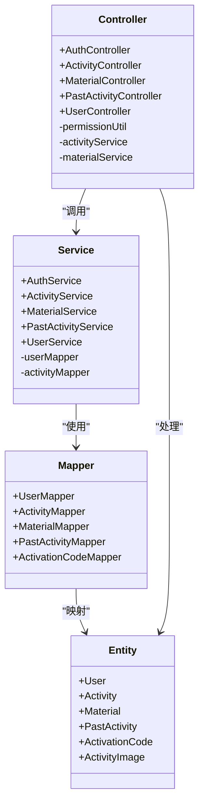

**图表来源**
- [AuthController.java](file://src\main\java\com\redmoon2333\controller\AuthController.java#L1-L153)
- [ActivityController.java](file://src\main\java\com\redmoon2333\controller\ActivityController.java#L1-L322)
- [User.java](file://src\main\java\com\redmoon2333\entity\User.java#L1-L99)
- [Activity.java](file://src\main\java\com\redmoon2333\entity\Activity.java#L1-L127)

**章节来源**
- [README.md](file://README.md#L1-L444)
- [Main.java](file://src\main\java\com\redmoon2333\Main.java#L1-L13)

## 核心功能模块

### 用户认证模块

用户认证模块是整个系统的核心，负责用户的身份验证、注册和令牌管理。

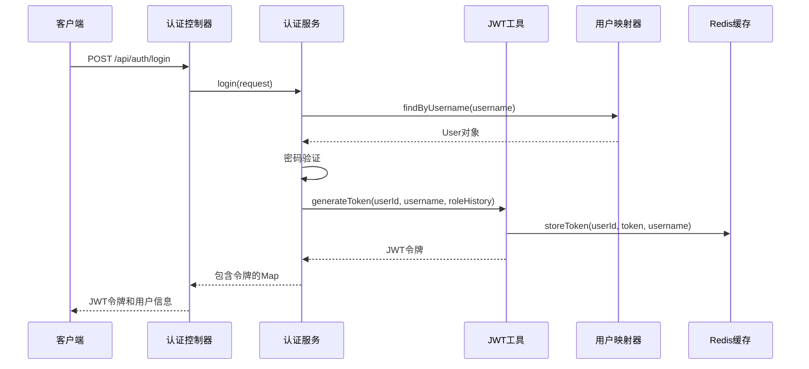

**图表来源**
- [AuthController.java](file://src\main\java\com\redmoon2333\controller\AuthController.java#L30-L50)
- [AuthService.java](file://src\main\java\com\redmoon2333\service\AuthService.java#L35-L55)
- [JwtUtil.java](file://src\main\java\com\redmoon2333\util\JwtUtil.java#L45-L65)

### 活动管理模块

活动管理模块提供了完整的活动生命周期管理功能，支持活动的创建、更新、删除以及图片管理。

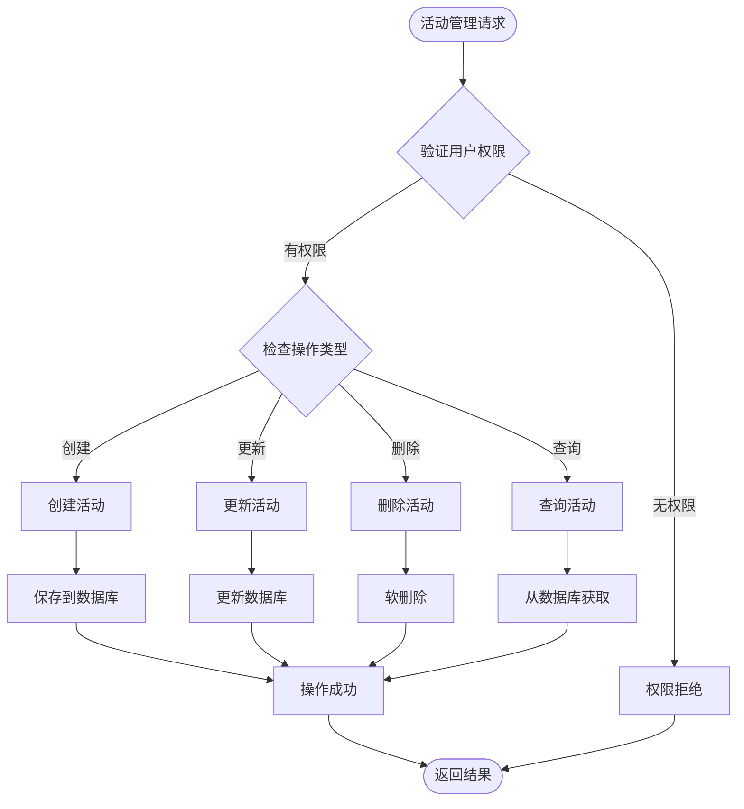

**图表来源**
- [ActivityController.java](file://src\main\java\com\redmoon2333\controller\ActivityController.java#L40-L80)
- [ActivityController.java](file://src\main\java\com\redmoon2333\controller\ActivityController.java#L120-L160)

### 权限控制模块

系统实现了基于角色的权限控制机制，通过自定义注解和AOP切面实现细粒度的权限管理。

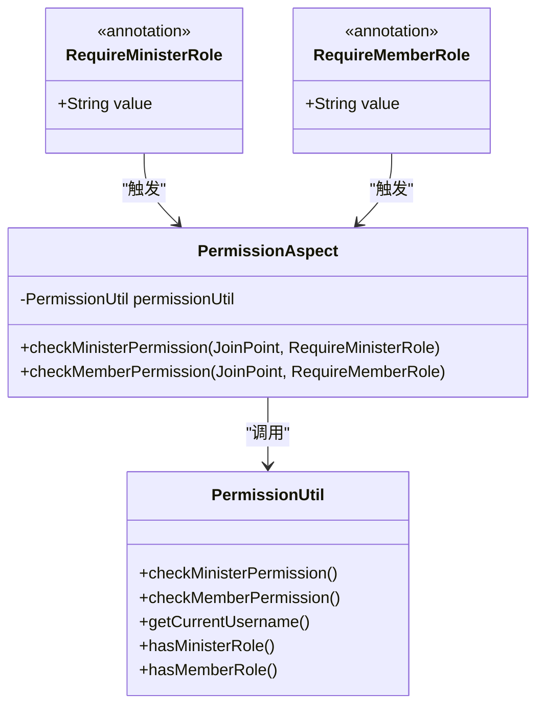

**图表来源**
- [RequireMinisterRole.java](file://src\main\java\com\redmoon2333\annotation\RequireMinisterRole.java#L1-L19)
- [PermissionAspect.java](file://src\main\java\com\redmoon2333\aspect\PermissionAspect.java#L1-L57)

**章节来源**
- [AuthController.java](file://src\main\java\com\redmoon2333\controller\AuthController.java#L1-L153)
- [ActivityController.java](file://src\main\java\com\redmoon2333\controller\ActivityController.java#L1-L322)
- [PermissionAspect.java](file://src\main\java\com\redmoon2333\aspect\PermissionAspect.java#L1-L57)

## 技术栈详解

### Spring Boot生态系统

HumanResourceOfficial基于Spring Boot 3.1.4构建，充分利用了Spring生态系统的强大功能：

- **Spring Boot 3.1.4**：提供自动配置、嵌入式服务器和生产就绪特性
- **Spring Security 3.1.4**：提供企业级安全解决方案
- **Spring Data JPA 3.1.4**：简化数据访问层开发
- **MyBatis 3.0.2**：灵活的ORM框架，支持复杂SQL查询

### 核心依赖关系

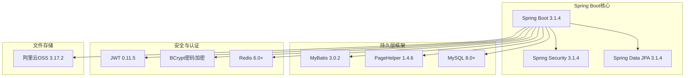

**图表来源**
- [pom.xml](file://pom.xml#L1-L50)
- [application.yml](file://src\main\resources\application.yml#L1-L62)

### 配置管理

系统采用YAML格式的配置文件，支持多环境配置和外部化配置：

```yaml
# 数据源配置
spring:
  datasource:
    url: jdbc:mysql://localhost:3306/hrofficial?useUnicode=true&characterEncoding=utf8&useSSL=false&serverTimezone=GMT%2B8
    username: root
    password: root
    driver-class-name: com.mysql.cj.jdbc.Driver

# JWT配置
jwt:
  secret: hr-official-jwt-secret-key-2024-redmoon2333-human-resource-system
  expiration: 7200000  # 2小时

# 阿里云OSS配置
aliyun:
  oss:
    endpoint: ${ALIYUN_OSS_ENDPOINT:}
    accessKeyId: ${ALIYUN_OSS_ACCESS_KEY_ID:}
    accessKeySecret: ${ALIYUN_OSS_ACCESS_KEY_SECRET:}
    bucketName: ${ALIYUN_OSS_BUCKET_NAME:}
    domain: ${ALIYUN_OSS_DOMAIN:}
```

**章节来源**
- [README.md](file://README.md#L20-L50)
- [application.yml](file://src\main\resources\application.yml#L1-L62)

## 系统设计原理

### 设计模式应用

系统广泛采用了多种设计模式来提高代码的可维护性和扩展性：

#### 1. 工厂模式
用于创建不同类型的用户对象：
```java
// 用户工厂方法
public User createUser(String username, String password, String name) {
    User user = new User();
    user.setUsername(username);
    user.setPassword(passwordEncoder.encode(password));
    user.setName(name);
    return user;
}
```

#### 2. 策略模式
用于不同的文件上传策略：
```java
// 文件上传策略接口
public interface FileUploadStrategy {
    String upload(MultipartFile file) throws IOException;
}

// OSS上传策略
public class OssFileUploadStrategy implements FileUploadStrategy {
    @Override
    public String upload(MultipartFile file) throws IOException {
        // OSS上传逻辑
    }
}
```

#### 3. 观察者模式
用于事件驱动的权限验证：
```java
// 权限变更事件监听器
@Component
public class PermissionEventListener {
    @EventListener
    public void handlePermissionChangedEvent(PermissionChangeEvent event) {
        // 处理权限变更逻辑
    }
}
```

### 分层架构设计

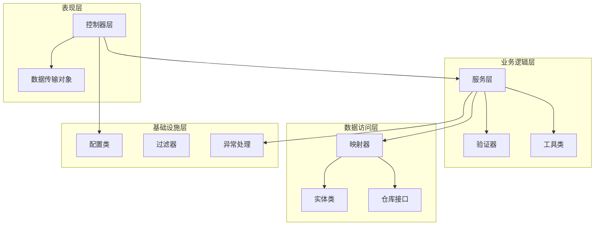

**图表来源**
- [AuthController.java](file://src\main\java\com\redmoon2333\controller\AuthController.java#L1-L153)
- [AuthService.java](file://src\main\java\com\redmoon2333\service\AuthService.java#L1-L199)

## 权限控制系统

### 角色体系设计

系统实现了清晰的角色体系，支持灵活的权限管理：

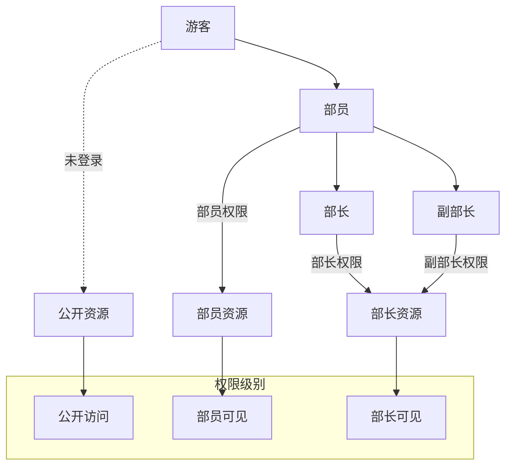

### 权限验证流程

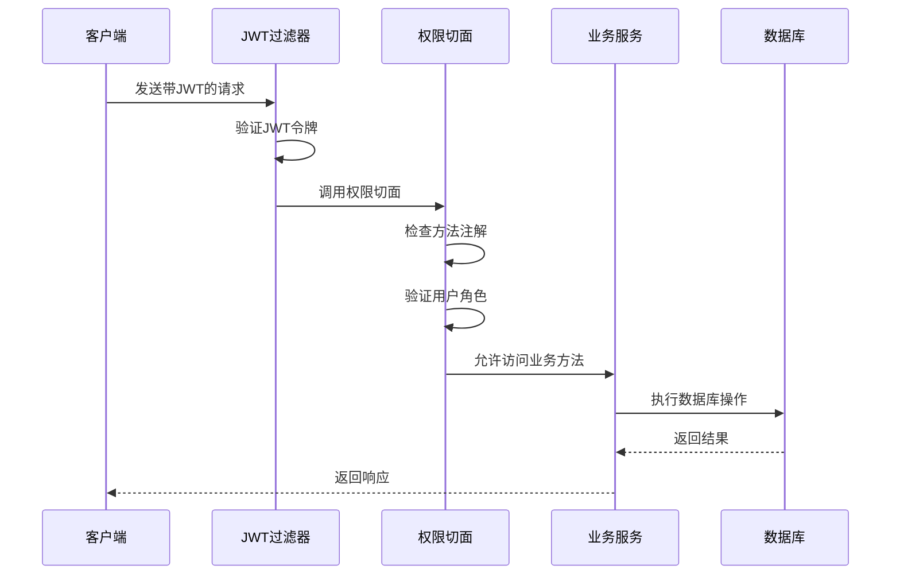

**图表来源**
- [JwtUtil.java](file://src\main\java\com\redmoon2333\util\JwtUtil.java#L150-L180)
- [PermissionAspect.java](file://src\main\java\com\redmoon2333\aspect\PermissionAspect.java#L20-L40)

### 权限注解机制

系统提供了两种权限注解来简化权限控制：

```java
// 部长权限注解
@RequireMinisterRole("创建活动")
@PostMapping("/activities")
public ResponseEntity<?> createActivity(@RequestBody ActivityRequest request) {
    // 只有部长或副部长才能访问
}

// 部员权限注解
@GetMapping("/materials")
public ResponseEntity<?> getMaterials() {
    // 部员及以上角色可访问
}
```

**章节来源**
- [RequireMinisterRole.java](file://src\main\java\com\redmoon2333\annotation\RequireMinisterRole.java#L1-L19)
- [PermissionAspect.java](file://src\main\java\com\redmoon2333\aspect\PermissionAspect.java#L1-L57)

## 安全机制

### JWT令牌安全

系统采用JWT（JSON Web Token）实现无状态认证，确保系统的安全性：

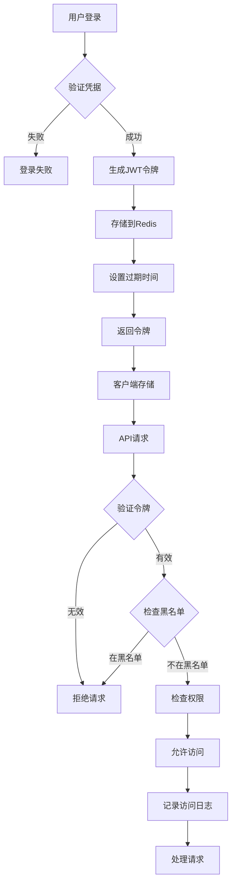

**图表来源**
- [JwtUtil.java](file://src\main\java\com\redmoon2333\util\JwtUtil.java#L45-L85)
- [SecurityConfig.java](file://src\main\java\com\redmoon2333\config\SecurityConfig.java#L70-L100)

### 安全配置

系统配置了全面的安全策略：

```java
@Configuration
@EnableWebSecurity
@EnableMethodSecurity(prePostEnabled = true)
public class SecurityConfig {
    
    @Bean
    public SecurityFilterChain filterChain(HttpSecurity http) throws Exception {
        http
            // 启用CORS配置
            .cors(cors -> cors.configurationSource(corsConfigurationSource()))
            
            // 禁用CSRF保护（使用JWT时不需要）
            .csrf(csrf -> csrf.disable())
            
            // 禁用session，使用无状态认证
            .sessionManagement(session -> session.sessionCreationPolicy(SessionCreationPolicy.STATELESS))
            
            // 配置请求授权
            .authorizeHttpRequests(auth -> auth
                // 允许注册和登录接口访问
                .requestMatchers("/api/auth/login", "/api/auth/register").permitAll()
                // 允许公开API访问
                .requestMatchers("/api/public/**").permitAll()
                // 其他请求需要认证
                .anyRequest().authenticated()
            )
            
            // 添加JWT过滤器
            .addFilterBefore(jwtAuthenticationFilter, UsernamePasswordAuthenticationFilter.class);
            
        return http.build();
    }
}
```

### 异常处理机制

系统实现了全局异常处理机制，统一处理各种异常情况：

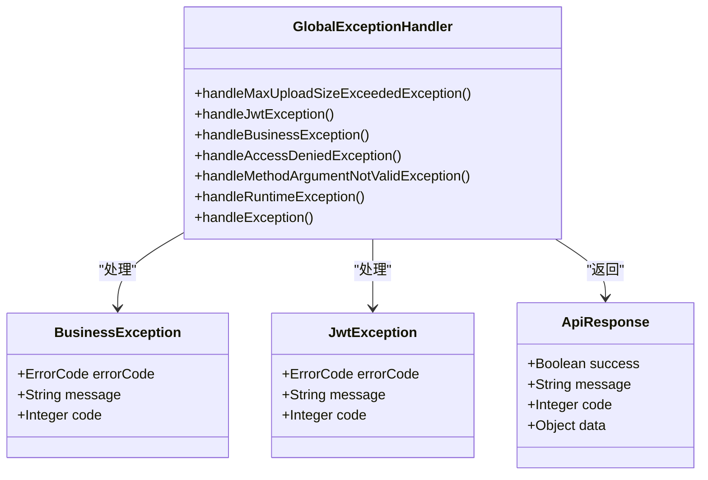

**图表来源**
- [GlobalExceptionHandler.java](file://src\main\java\com\redmoon2333\exception\GlobalExceptionHandler.java#L1-L133)

**章节来源**
- [JwtUtil.java](file://src\main\java\com\redmoon2333\util\JwtUtil.java#L1-L250)
- [SecurityConfig.java](file://src\main\java\com\redmoon2333\config\SecurityConfig.java#L1-L131)
- [GlobalExceptionHandler.java](file://src\main\java\com\redmoon2333\exception\GlobalExceptionHandler.java#L1-L133)

## 数据模型

### 核心实体设计

系统设计了清晰的数据模型来支持各项功能：

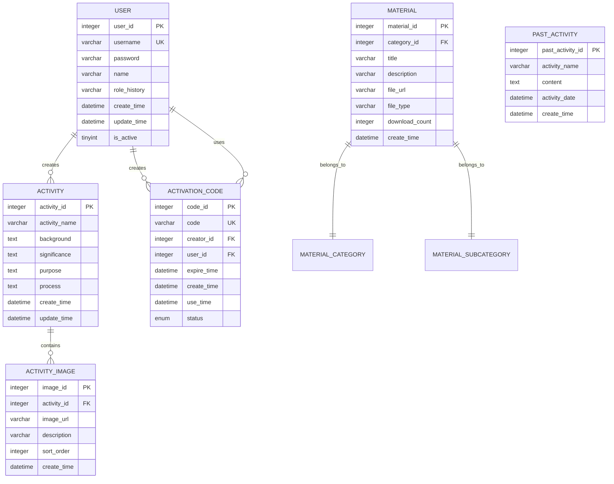

**图表来源**
- [User.java](file://src\main\java\com\redmoon2333\entity\User.java#L1-L99)
- [Activity.java](file://src\main\java\com\redmoon2333\entity\Activity.java#L1-L127)

### 数据库设计特点

1. **软删除支持**：通过`is_active`字段实现软删除
2. **时间戳记录**：每个表都包含创建时间和更新时间字段
3. **外键约束**：确保数据完整性
4. **索引优化**：对常用查询字段建立索引
5. **UTF-8编码**：支持中文字符存储

### 关系型数据设计

```java
// 用户实体类
@Entity
@Table(name = "user")
public class User {
    @Id
    @GeneratedValue(strategy = GenerationType.IDENTITY)
    private Integer userId;
    
    @NotBlank(message = "用户名不能为空")
    @Size(min = 3, max = 20, message = "用户名长度必须在3-20之间")
    private String username;
    
    @NotBlank(message = "密码不能为空")
    @Size(min = 6, message = "密码长度不能少于6位")
    private String password;
    
    @Size(max = 50, message = "姓名长度不能超过50个字符")
    private String name;
    
    private String roleHistory;
}
```

**章节来源**
- [User.java](file://src\main\java\com\redmoon2333\entity\User.java#L1-L99)
- [Activity.java](file://src\main\java\com\redmoon2333\entity\Activity.java#L1-L127)

## 部署方案

### Docker容器化部署

系统支持Docker容器化部署，提供快速部署和扩展能力：

```dockerfile
FROM openjdk:17-jdk-slim
COPY target/HumanResourceOfficial-1.0-SNAPSHOT.jar app.jar
EXPOSE 8080
ENTRYPOINT ["java","-jar","/app.jar"]
```

### 多环境配置

系统支持多环境配置，适应不同的部署场景：

```yaml
# 开发环境配置
spring:
  profiles:
    active: dev
  datasource:
    url: jdbc:mysql://localhost:3306/hrofficial_dev

# 生产环境配置
spring:
  profiles:
    active: prod
  datasource:
    url: jdbc:mysql://prod-db:3306/hrofficial_prod
    hikari:
      maximum-pool-size: 20
      minimum-idle: 5
```

### Nginx反向代理配置

```nginx
server {
    listen 80;
    server_name your-domain.com;
    
    location /api/ {
        proxy_pass http://backend:8080/;
        proxy_set_header Host $host;
        proxy_set_header X-Real-IP $remote_addr;
        proxy_set_header X-Forwarded-For $proxy_add_x_forwarded_for;
        proxy_set_header X-Forwarded-Proto $scheme;
    }
    
    location / {
        proxy_pass http://frontend:3000/;
        proxy_set_header Host $host;
        proxy_set_header X-Real-IP $remote_addr;
    }
}
```

**章节来源**
- [README.md](file://README.md#L300-L400)

## 性能优化

### 分页查询优化

系统使用PageHelper实现高效的分页查询：

```java
// 分页查询配置
pagehelper:
  helper-dialect: mysql
  reasonable: true
  support-methods-arguments: true
  params: count=countSql
```

### 连接池优化

使用HikariCP高性能连接池：

```yaml
spring:
  datasource:
    hikari:
      maximum-pool-size: 20
      minimum-idle: 5
      connection-timeout: 30000
      idle-timeout: 600000
      max-lifetime: 1800000
```

### 缓存策略

系统集成了Redis缓存，提升性能：

```java
// Redis缓存配置
@Bean
public RedisTemplate<String, Object> redisTemplate(RedisConnectionFactory connectionFactory) {
    RedisTemplate<String, Object> template = new RedisTemplate<>();
    template.setConnectionFactory(connectionFactory);
    template.setKeySerializer(new StringRedisSerializer());
    template.setValueSerializer(new GenericJackson2JsonRedisSerializer());
    return template;
}
```

### 异步处理

文件上传采用异步处理机制：

```java
@Async
public CompletableFuture<String> uploadFileAsync(MultipartFile file) {
    // 异步文件上传逻辑
}
```

## 故障排除指南

### 常见问题及解决方案

#### 1. JWT令牌验证失败

**问题现象**：用户登录后无法访问受保护的API

**可能原因**：
- JWT密钥配置错误
- 令牌过期
- Redis连接问题

**解决方案**：
```bash
# 检查JWT配置
grep -r "jwt.secret" src/

# 检查Redis连接
redis-cli ping

# 清除Redis中的令牌
redis-cli DEL jwt:*
```

#### 2. 文件上传失败

**问题现象**：文件上传时出现413错误

**解决方案**：
```yaml
# 增加文件上传大小限制
spring:
  servlet:
    multipart:
      max-file-size: 100MB
      max-request-size: 100MB
```

#### 3. 数据库连接问题

**问题现象**：应用启动时数据库连接失败

**解决方案**：
```bash
# 检查数据库连接
mysql -u root -p -h localhost

# 检查数据库配置
grep -r "spring.datasource.url" src/
```

### 日志分析

系统提供了详细的日志记录，便于问题诊断：

```yaml
logging:
  level:
    com.redmoon2333: DEBUG
    com.redmoon2333.service.UserService: DEBUG
    com.redmoon2333.controller: INFO
    root: INFO
  pattern:
    console: "%d{yyyy-MM-dd HH:mm:ss} [%thread] %-5level %logger{50} - %msg%n"
```

**章节来源**
- [GlobalExceptionHandler.java](file://src\main\java\com\redmoon2333\exception\GlobalExceptionHandler.java#L1-L133)

## 总结

HumanResourceOfficial学生会人力资源管理系统是一个功能完善、架构合理的企业级应用系统。通过采用Spring Boot、MyBatis、JWT等现代技术栈，系统实现了高度的模块化和可扩展性。

### 主要优势

1. **技术先进**：采用Spring Boot 3.1.4等最新技术版本
2. **架构清晰**：严格遵循MVC架构模式和分层设计
3. **安全可靠**：完善的JWT认证和基于角色的权限控制
4. **易于扩展**：模块化设计支持功能扩展
5. **部署灵活**：支持Docker容器化部署

### 应用价值

该系统为学生会提供了完整的数字化管理解决方案，大大提高了工作效率和管理水平。通过标准化的API接口，可以轻松与其他系统集成，为未来的功能扩展奠定了坚实基础。

### 发展方向

未来可以考虑以下改进方向：
- 添加Redis缓存支持以提升性能
- 实现消息通知功能
- 添加数据导出功能
- 支持批量操作
- 实现定时任务
- 添加监控指标

HumanResourceOfficial系统不仅是一个技术产品，更是学生会数字化转型的重要工具，为组织管理带来了革命性的变化。