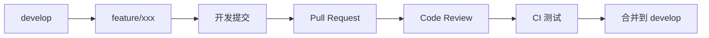
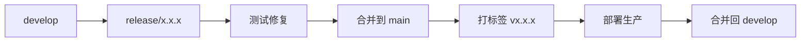
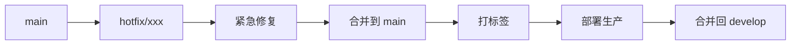

# GitFlow 工作流使用指南

## 📖 概述

本项目采用 GitFlow 工作流进行版本控制，提供了一套完整的分支管理策略，适用于持续开发和发布。

## 🌿 分支结构

```
main (生产分支)
├── develop (开发分支)
│   ├── feature/* (特性分支)
│   └── release/* (预发布分支)
└── hotfix/* (热修复分支)
```

### 分支说明

| 分支 | 说明 | 保护规则 |
|------|------|---------|
| `main` | 生产环境分支，只接受 release 和 hotfix 合并 | 强制 PR + 至少 1 人审核 |
| `develop` | 开发主分支，集成所有特性 | 强制 PR + CI 通过 |
| `feature/*` | 特性开发分支，从 develop 创建 | 无 |
| `release/*` | 预发布分支，从 develop 创建 | 强制 PR + 测试通过 |
| `hotfix/*` | 热修复分支，从 main 创建 | 强制 PR + 测试通过 |

## 🚀 常用操作

### 1. 创建特性分支

```bash
# 从 develop 创建新特性分支
git checkout develop
git pull origin develop
git checkout -b feature/特性名称

# 示例：添加用户导出功能
git checkout -b feature/user-export
```

**命名规范**: `feature/模块 - 功能描述`
- `feature/user-management` - 用户管理模块
- `feature/ai-chat-stream` - AI 对话流式输出
- `feature/rag-knowledge-base` - RAG 知识库

### 2. 开发并提交

```bash
# 添加文件
git add .

# 提交 (遵循提交规范)
git commit -m "feat: 添加用户导出 Excel 功能"

# 推送分支
git push -u origin feature/特性名称
```

**提交信息规范**:
- `feat:` 新功能
- `fix:` 修复 bug
- `docs:` 文档更新
- `style:` 代码格式调整
- `refactor:` 代码重构
- `test:` 测试相关
- `chore:` 构建/工具相关

### 3. 合并特性到 develop

```bash
# 在 GitHub 上创建 Pull Request
# 源分支：feature/特性名称
# 目标分支：develop

# 合并后删除特性分支
git checkout develop
git pull origin develop
git branch -d feature/特性名称
git push origin --delete feature/特性名称
```

### 4. 创建发布分支

```bash
# 从 develop 创建 release 分支
git checkout develop
git pull origin develop
git checkout -b release/1.0.0

# 进行版本号和文档更新
# 运行完整测试
# 修复最后的问题

# 合并到 main 和 develop
git checkout main
git merge --no-ff release/1.0.0
git tag -a v1.0.0 -m "Release version 1.0.0"
git push origin main --tags

git checkout develop
git merge --no-ff release/1.0.0
git push origin develop

# 删除 release 分支
git branch -d release/1.0.0
git push origin --delete release/1.0.0
```

### 5. 热修复

```bash
# 从 main 创建 hotfix 分支
git checkout main
git pull origin main
git checkout -b hotfix/修复描述

# 修复问题并提交
git add .
git commit -m "fix: 修复用户登录 JWT 过期问题"
git push -u origin hotfix/修复描述

# 合并到 main 和 develop
git checkout main
git merge --no-ff hotfix/修复描述
git tag -a v1.0.1 -m "Hotfix version 1.0.1"
git push origin main --tags

git checkout develop
git merge --no-ff hotfix/修复描述
git push origin develop

# 删除 hotfix 分支
git branch -d hotfix/修复描述
git push origin --delete hotfix/修复描述
```

## 🔄 工作流图解

### 特性开发流程



### 发布流程



### 热修复流程



## 🔧 GitHub 分支保护设置

### main 分支保护

1. 进入仓库 Settings -> Branches
2. 添加分支保护规则：`main`
3. 启用选项:
   - ✅ Require a pull request before merging
   - ✅ Require approvals (至少 1 人)
   - ✅ Require status checks to pass
   - ✅ Include administrators
   - ✅ Require branch to be up to date

### develop 分支保护

1. 添加分支保护规则：`develop`
2. 启用选项:
   - ✅ Require a pull request before merging
   - ✅ Require status checks to pass (CI 通过)
   - ✅ Require branch to be up to date

## 📋 最佳实践

### 1. 提交前检查

```bash
# 查看变更
git status
git diff

# 运行测试
mvn test

# 代码格式化
mvn spotless:apply
```

### 2. 保持分支更新

```bash
# 定期同步 develop
git checkout develop
git pull origin develop

# 合并到特性分支
git checkout feature/xxx
git merge develop
```

### 3. 解决冲突

```bash
# 拉取最新代码
git fetch origin

# 合并 develop
git merge origin/develop

# 解决冲突后
git add .
git commit -m "merge develop into feature/xxx"
git push
```

### 4. 标签管理

```bash
# 创建标签
git tag -a v1.0.0 -m "Release version 1.0.0"

# 推送标签
git push origin v1.0.0

# 删除标签
git tag -d v1.0.0
git push origin --delete v1.0.0
```

## 🚨 常见问题

### Q1: 推送被拒绝怎么办？

```bash
# 拉取最新代码
git pull origin develop --rebase

# 解决冲突后继续变基
git rebase --continue

# 强制推送 (谨慎使用)
git push --force-with-lease
```

### Q2: 如何撤销错误的提交？

```bash
# 撤销最后一次提交 (保留更改)
git reset --soft HEAD~1

# 撤销并丢弃更改
git reset --hard HEAD~1

# 创建修复提交
git commit -m "revert: 错误的提交"
```

### Q3: 本地分支与远程不同步？

```bash
# 删除本地分支
git branch -D 分支名

# 重新克隆远程分支
git fetch origin
git checkout -b 分支名 origin/分支名
```

## 📚 相关资源

- [GitFlow 工作流原文](https://nvie.com/posts/a-successful-git-branching-model/)
- [GitHub Flow](https://guides.github.com/introduction/flow/)
- [Conventional Commits](https://www.conventionalcommits.org/)

## 🔗 项目链接

- **GitHub**: https://github.com/Redmoon-2333/HumanResourceOfficial
- **Docker Hub**: https://hub.docker.com/r/redmoon-2333/humanresourceofficial
- **Issues**: https://github.com/Redmoon-2333/HumanResourceOfficial/issues