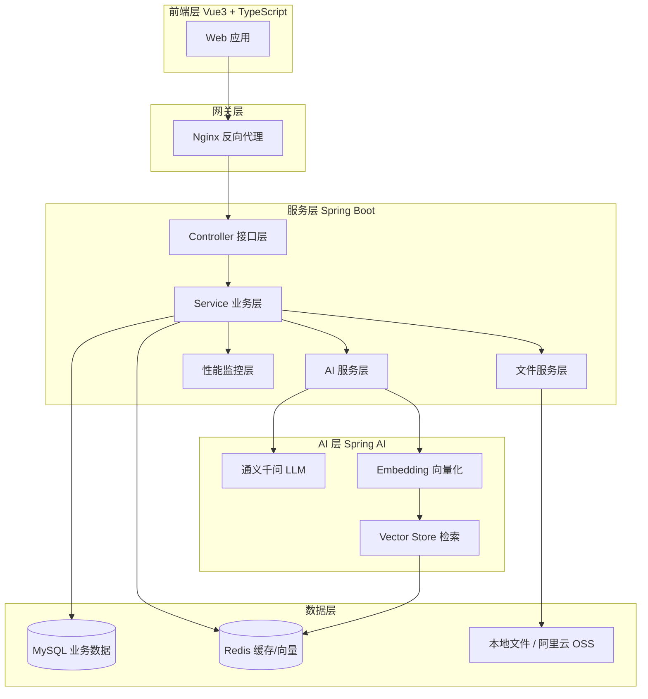
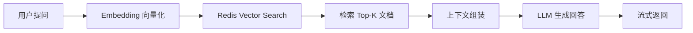

# 人力资源中心官网

<div align="center">

[](https://spring.io/projects/spring-boot)
[](https://vuejs.org/)
[](https://openjdk.org/)
[](https://www.typescriptlang.org/)
[](https://docs.spring.io/spring-ai/reference/)
[](https://sca.aliyun.com/)
[](https://www.mysql.com/)
[](https://redis.io/)
[](LICENSE)

**基于 Spring Boot + Vue3 + Spring AI 的智能化学生会人力资源管理系统**

集成 RAG 知识库问答、AI 智能助手、流式对话输出等先进功能

[快速开始](#快速开始) · [功能特性](#功能特性) · [技术架构](#技术架构) · [部署指南](#部署指南)

</div>

---

## 📖 项目概述

人力资源中心官网是一个面向学生会组织的数字化管理平台，采用前后端分离架构，深度融合 Spring AI 技术栈，提供智能化的成员管理、活动管理、资料管理和 AI 辅助决策能力。

### 核心能力

- 🤖 **AI 智能助手** - 基于通义千问大模型的流式对话，支持知识库问答
- 📚 **RAG 知识库** - 检索增强生成，智能回答组织相关问题
- 👥 **成员管理** - 多角色权限体系，支持往届成员追溯
- 📋 **活动管理** - 活动全生命周期管理，支持策划案 AI 生成
- 📁 **资料管理** - 三级分类体系，安全文件存储与分享
- 🏛️ **历史档案** - 往届活动和成员档案管理

---

## ✨ 功能特性

### 后端能力

| 功能模块 | 技术实现 | 说明 |
|---------|---------|------|
| **认证授权** | JWT + Spring Security | 无状态认证，细粒度权限控制 |
| **角色体系** | 注解 + AOP | 游客/部员/部长三级权限 |
| **AI 对话** | Spring AI Alibaba | 通义千问流式输出，支持上下文记忆 |
| **RAG 问答** | Redis Vector Store | 向量检索 + 语义增强回答 |
| **文件管理** | 本地存储 + 阿里云 OSS | 预签名 URL 安全下载 |
| **数据访问** | MyBatis + JPA | 灵活的数据持久化方案 |
| **性能监控** | 自定义监控服务 | 内存、向量索引、RAG 状态监控 |

### 前端能力

| 功能模块 | 技术实现 | 说明 |
|---------|---------|------|
| **UI 框架** | Element Plus + Vue3 | 现代化组件库 |
| **状态管理** | Pinia | 轻量级状态管理 |
| **类型安全** | TypeScript | 全链路类型支持 |
| **流式渲染** | SSE + markstream | AI 消息实时流式显示 |
| **构建工具** | Vite | 极速开发体验 |
| **Markdown 渲染** | markdown-it + DOMPurify | 安全的富文本显示 |

---

## 🏗️ 技术架构

### 系统架构图



### 技术栈版本

#### 后端技术栈

| 技术 | 版本 | 用途 |
|------|------|------|
| Spring Boot | 3.3.5 | 核心应用框架 |
| Spring AI | 1.1.2 | AI 能力抽象层 |
| Spring AI Alibaba | 1.1.2.0 | 通义千问集成 |
| Spring Security | 6.x | 安全认证授权 |
| MyBatis | 3.0.3 | ORM 框架 |
| MySQL | 8.0.33 | 关系型数据库 |
| Redis | 7.x | 缓存 + 向量存储 |
| JWT | 0.11.5 | 令牌认证 |
| Hutool | 5.8.22 | Java 工具库 |
| PageHelper | 1.4.6 | 分页插件 |
| 阿里云 OSS | 3.17.2 | 对象存储（可选） |
| Apache POI | 5.2.5 | Excel 处理 |
| PDFBox | 2.0.30 | PDF 处理 |

#### 前端技术栈

| 技术 | 版本 | 用途 |
|------|------|------|
| Vue | 3.5.22 | 渐进式框架 |
| TypeScript | 5.9.0 | 类型系统 |
| Element Plus | 2.11.8 | UI 组件库 |
| Pinia | 3.0.3 | 状态管理 |
| Vue Router | 4.6.3 | 路由管理 |
| Vite | 6.x | 构建工具 |
| Axios | 1.13.2 | HTTP 客户端 |
| markdown-it | 14.1.0 | Markdown 解析 |
| DOMPurify | 3.3.1 | XSS 防护 |
| dayjs | 1.11.19 | 日期处理 |

---

## 📁 项目结构

```
HumanResourceOfficial/
├── src/main/java/com/redmoon2333/          # 后端源码
│   ├── annotation/                          # 自定义注解（权限控制）
│   ├── aspect/                              # AOP 切面
│   ├── config/                              # 配置类
│   │   ├── JwtAuthenticationFilter.java     # JWT 认证过滤器
│   │   ├── SecurityConfig.java              # 安全配置
│   │   ├── RagConfig.java                   # RAG 配置
│   │   └── VectorStoreConfig.java           # 向量存储配置
│   ├── controller/                          # 控制器层
│   │   ├── AIChatController.java            # AI 对话接口
│   │   ├── ActivityController.java          # 活动管理接口
│   │   ├── AuthController.java              # 认证接口
│   │   ├── DailyImageController.java        # 每日一图接口
│   │   ├── MaterialController.java          # 资料管理接口
│   │   ├── PastActivityController.java      # 往届活动接口
│   │   ├── PerformanceController.java       # 性能监控接口
│   │   ├── RagController.java               # RAG 知识库接口
│   │   └── UserController.java              # 用户管理接口
│   ├── dto/                                 # 数据传输对象
│   ├── entity/                              # 实体类
│   ├── exception/                           # 异常处理
│   ├── mapper/                              # MyBatis 映射器
│   ├── service/                             # 业务服务层
│   │   ├── AIChatService.java               # AI 对话服务
│   │   ├── RagManagementService.java        # RAG 管理服务
│   │   ├── RagRetrievalService.java         # RAG 检索服务
│   │   ├── PerformanceMonitorService.java   # 性能监控服务
│   │   └── MaterialService.java             # 资料服务
│   ├── util/                                # 工具类
│   │   ├── JwtUtil.java                     # JWT 工具
│   │   ├── SmartTextChunker.java            # 智能文本分块
│   │   └── OssUtil.java                     # OSS 工具
│   └── Main.java                            # 启动类
├── src/main/resources/
│   ├── mapper/                              # MyBatis XML
│   ├── prompttemplate/                      # AI 提示词模板
│   ├── rag-knowledge-base/                  # RAG 知识库文档
│   └── application.yml                      # 主配置文件
├── hrofficial-frontend/                     # 前端项目
│   ├── src/
│   │   ├── api/                             # API 接口定义
│   │   ├── components/                      # 公共组件
│   │   ├── router/                          # 路由配置
│   │   ├── stores/                          # Pinia 状态管理
│   │   ├── views/                           # 页面组件
│   │   │   ├── AIChat.vue                   # AI 对话页面
│   │   │   ├── Activities.vue               # 活动管理页面
│   │   │   ├── Materials.vue                # 资料管理页面
│   │   │   ├── RagManagement.vue            # RAG 管理页面
│   │   │   ├── Alumni.vue                   # 往届成员页面
│   │   │   └── PlanGenerator.vue            # 策划案生成页面
│   │   └── utils/                           # 工具函数
│   └── package.json
├── docs/                                    # 项目文档
├── .qoder/                                  # Qoder 项目文档
└── pom.xml                                  # Maven 配置
```

---

## 🚀 快速开始

### 环境要求

- **Java**: 21+
- **Maven**: 3.6+
- **Node.js**: 20.19.0+ 或 >=22.12.0
- **MySQL**: 8.0+
- **Redis**: 7.0+ (推荐 Redis Stack)

### 1. 克隆项目

```bash
git clone <repository-url>
cd HumanResourceOfficial
```

### 2. 数据库初始化

```sql
CREATE DATABASE hrofficial 
  CHARACTER SET utf8mb4 
  COLLATE utf8mb4_unicode_ci;
```

导入数据库表结构（根据项目提供的 SQL 文件执行）。

### 3. 环境变量配置

创建环境变量配置文件：

**后端环境变量**（在项目根目录创建 `.env` 文件）：

```bash
# 数据库配置
DB_NAME=hrofficial
DB_USERNAME=root
DB_PASSWORD=your_password

# JWT 配置
JWT_SECRET=your_jwt_secret_at_least_32_chars

# 阿里云 AI 配置
ALIQWEN_API=your_dashscope_api_key

# 阿里云 OSS 配置（可选）
ALIYUN_OSS_ACCESS_KEY_ID=your_access_key
ALIYUN_OSS_ACCESS_KEY_SECRET=your_secret
ALIYUN_OSS_BUCKET_NAME=your_bucket

# Redis 配置
REDIS_HOST=localhost
REDIS_PORT=6379
REDIS_PASSWORD=

# 文件访问 URL
FILE_ACCESS_URL=http://localhost:8080
```

**前端环境变量**（在 `hrofficial-frontend` 目录创建 `.env.local` 文件）：

```bash
VITE_API_BASE_URL=http://localhost:8080
```

### 4. 启动后端

```bash
# 编译并运行
mvn spring-boot:run

# 或打包后运行
mvn clean package -DskipTests
java -jar target/HumanResourceOfficial-1.0-SNAPSHOT.jar
```

服务启动后访问：`http://localhost:8080`

### 5. 启动前端

```bash
cd hrofficial-frontend
npm install
npm run dev
```

前端访问地址：`http://localhost:5173`

---

## 🤖 AI 与 RAG 功能

### AI 智能对话

系统集成了通义千问大模型，支持：

- **流式输出** - 实时显示 AI 回复
- **上下文记忆** - 基于 Redis 的对话历史
- **角色设定** - 针对学生会场景优化的系统提示词
- **RAG 增强** - 结合知识库进行智能问答

### RAG 知识库问答

基于 Spring AI 的 RAG 实现：



**智能文本分块特性：**
- 语义分块：按章节、段落、句子边界智能分割
- 自动文档类型识别：结构化/叙述性/技术文档
- 分块重叠：保留上下文连贯性
- 低内存模式：支持低配服务器部署

**知识库初始化：**

```bash
# 首次部署时需要初始化知识库
curl -X POST http://localhost:8080/api/rag/initialize \
  -H "Authorization: Bearer YOUR_TOKEN" \
  -H "Content-Type: application/json" \
  -d '{"forceReindex": false}'
```

**知识库目录结构：**

```
rag-knowledge-base/
├── 01-组织概况/          # 学生会简介、组织文化
├── 02-规章制度/          # 学生会章程
├── 03-活动管理/          # 活动策划、执行流程
├── 04-部门信息/          # 各部门介绍
├── 05-财务制度/          # 经费管理制度
├── 06-校园生活/          # 校园实用信息
├── 07-学习指导/          # 选课、学习技巧
├── 08-职业发展/          # 实习、社会实践
└── 00-使用说明.txt
```

---

## 🔐 权限系统

### 角色体系

| 角色 | 权限范围 |
|------|---------|
| **游客** | 查看活动介绍、往届活动、往届成员 |
| **部员** | 游客权限 + 资料查看/下载、AI 对话、文件上传 |
| **部长** | 部员权限 + 所有管理功能（增删改）、RAG 管理、激活码管理 |

### 权限注解使用

```java
@RequireMemberRole("查看资料")    // 需要部员及以上权限
public ResponseEntity<?> viewMaterials() { }

@RequireMinisterRole("删除活动")   // 需要部长权限
public ResponseEntity<?> deleteActivity(@PathVariable Long id) { }
```

---

## 📚 API 文档

### 认证接口

| 方法 | 路径 | 说明 |
|------|------|------|
| POST | `/api/auth/register` | 用户注册（需激活码） |
| POST | `/api/auth/login` | 用户登录 |
| POST | `/api/auth/logout` | 用户登出 |

### AI 接口

| 方法 | 路径 | 说明 |
|------|------|------|
| POST | `/api/ai/chat/stream` | AI 流式对话（SSE） |
| POST | `/api/ai/chat-with-rag` | RAG 增强对话（SSE） |
| POST | `/api/ai/plan/generate` | 生成活动策划案 |

### RAG 管理接口

| 方法 | 路径 | 说明 |
|------|------|------|
| POST | `/api/rag/initialize` | 初始化/重建知识库 |
| GET | `/api/rag/stats` | 获取知识库统计 |
| GET | `/api/rag/test-retrieve` | 测试向量检索 |

### 活动管理接口

| 方法 | 路径 | 说明 |
|------|------|------|
| GET | `/api/activities` | 获取活动列表 |
| GET | `/api/activities/{id}` | 获取活动详情 |
| POST | `/api/activities` | 创建活动 |
| PUT | `/api/activities/{id}` | 更新活动 |
| DELETE | `/api/activities/{id}` | 删除活动 |

### 资料管理接口

| 方法 | 路径 | 说明 |
|------|------|------|
| GET | `/api/materials` | 获取资料列表 |
| GET | `/api/materials/{id}` | 获取资料详情 |
| POST | `/api/materials` | 上传资料 |
| DELETE | `/api/materials/{id}` | 删除资料 |
| GET | `/api/materials/categories` | 获取分类列表 |

### 往届成员接口

| 方法 | 路径 | 说明 |
|------|------|------|
| GET | `/api/users/alumni` | 获取往届成员列表 |
| GET | `/api/users/alumni/{id}` | 获取往届成员详情 |

### 往届活动接口

| 方法 | 路径 | 说明 |
|------|------|------|
| GET | `/api/past-activities` | 获取往届活动列表 |
| GET | `/api/past-activities/{id}` | 获取往届活动详情 |
| POST | `/api/past-activities` | 创建往届活动 |
| PUT | `/api/past-activities/{id}` | 更新往届活动 |
| DELETE | `/api/past-activities/{id}` | 删除往届活动 |

### 性能监控接口

| 方法 | 路径 | 说明 |
|------|------|------|
| GET | `/api/performance/memory` | 获取内存使用情况 |
| GET | `/api/performance/vector-index` | 获取向量索引状态 |
| GET | `/api/performance/rag-status` | 获取 RAG 系统状态 |

---

## ⚙️ 配置说明

### 核心配置项

```yaml
# application.yml

spring:
  # 数据源配置
  datasource:
    url: jdbc:mysql://localhost:3306/hrofficial?useUnicode=true&characterEncoding=utf8
    username: ${DB_USERNAME:root}
    password: ${DB_PASSWORD:}
  
  # Redis 配置（支持 Redis Stack）
  data:
    redis:
      host: ${REDIS_HOST:localhost}
      port: ${REDIS_PORT:6379}
      password: ${REDIS_PASSWORD:}
  
  # Spring AI 配置
  ai:
    dashscope:
      api-key: ${ALIQWEN_API:}
    vectorstore:
      redis:
        index-name: campus-knowledge-index

# JWT 配置
jwt:
  secret: ${JWT_SECRET:}
  expiration: ${JWT_EXPIRATION:604800000}

# RAG 配置
rag:
  chunk-size: 400                    # 文本分块大小
  chunk-overlap: 100                 # 分块重叠
  embedding-dimensions: 1024         # 向量维度
  retrieval-top-k: 5                 # 检索文档数
  low-memory-mode: false             # 低内存模式
  enable-semantic-chunking: true     # 启用语义分块
```

---

## 🔒 安全说明

- **JWT 认证** - 无状态令牌，支持过期刷新
- **密码加密** - BCrypt 哈希存储
- **SQL 注入防护** - MyBatis 预编译语句
- **XSS 防护** - 前端输入过滤 + DOMPurify 后端转义
- **文件安全** - 预签名 URL 限时访问
- **环境隔离** - 敏感配置通过环境变量注入
- **激活码注册** - 新用户注册需要激活码，防止恶意注册

---

## 🐳 Docker 部署

### Docker Compose 配置

项目提供了完整的 Docker 部署方案，包含 MySQL、Redis Stack、后端和前端服务。

```yaml
# deploy/docker-compose.yml
version: '3.8'

services:
  mysql:
    image: mysql:8.0
    container_name: hrofficial-mysql
    environment:
      MYSQL_ROOT_PASSWORD: ${DB_PASSWORD}
      MYSQL_DATABASE: ${DB_NAME}
    ports:
      - "3306:3306"
    volumes:
      - mysql-data:/var/lib/mysql

  redis:
    image: redis/redis-stack:latest
    container_name: hrofficial-redis
    ports:
      - "6379:6379"
    volumes:
      - redis-data:/data

  backend:
    build:
      context: ..
      dockerfile: deploy/Dockerfile.backend
    container_name: hrofficial-backend
    ports:
      - "8080:8080"
    environment:
      DB_NAME: ${DB_NAME}
      DB_USERNAME: ${DB_USERNAME}
      DB_PASSWORD: ${DB_PASSWORD}
      REDIS_HOST: redis
      ALIQWEN_API: ${ALIQWEN_API}
      JWT_SECRET: ${JWT_SECRET}
    depends_on:
      - mysql
      - redis

  frontend:
    build:
      context: ..
      dockerfile: deploy/Dockerfile.frontend
    container_name: hrofficial-frontend
    ports:
      - "80:80"
    depends_on:
      - backend

volumes:
  mysql-data:
  redis-data:
```

### 快速部署

```bash
cd deploy

# 复制并编辑环境变量
cp .env.example .env
# 编辑 .env 文件，填写实际配置

# 启动所有服务
docker-compose up -d

# 查看日志
docker-compose logs -f backend
```

### 服务说明

| 服务 | 端口 | 说明 |
|------|------|------|
| MySQL | 3306 | 业务数据库 |
| Redis Stack | 6379 | 缓存 + 向量存储 |
| Backend | 8080 | Spring Boot 后端服务 |
| Frontend | 80 | Nginx 前端服务 |

---

## 🤝 贡献指南

1. Fork 本仓库
2. 创建特性分支：`git checkout -b feature/AmazingFeature`
3. 提交更改：`git commit -m 'Add some AmazingFeature'`
4. 推送分支：`git push origin feature/AmazingFeature`
5. 创建 Pull Request

### 代码规范

- 遵循阿里巴巴 Java 开发手册
- 使用中文编写注释和文档
- 保持代码简洁，遵循单一职责原则
- 新增功能需配套单元测试
- 严格遵循分层架构：Controller → Service → Repository/DAO
- API 设计遵循 RESTful 规范

---

## 🙏 致谢

- [Spring Boot](https://spring.io/projects/spring-boot)
- [Spring AI](https://docs.spring.io/spring-ai/reference/)
- [Spring AI Alibaba](https://sca.aliyun.com/)
- [Vue.js](https://vuejs.org/)
- [Element Plus](https://element-plus.org/)
- [通义千问](https://tongyi.aliyun.com/)
- [Redis](https://redis.io/)

---

<div align="center">

**如果这个项目对你有帮助，请给个 Star ⭐**

</div>
