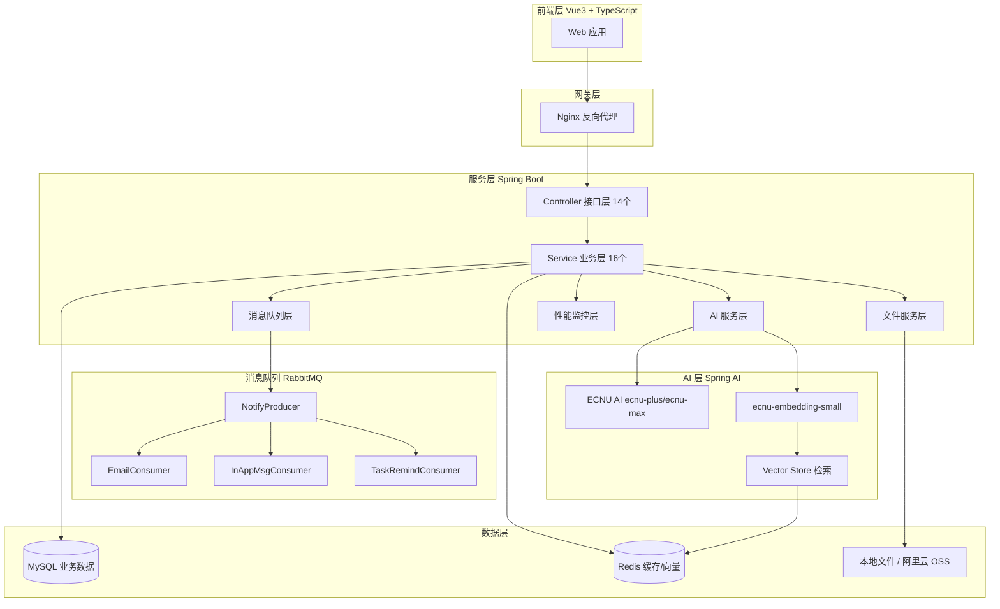
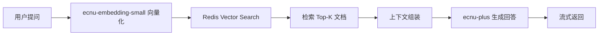
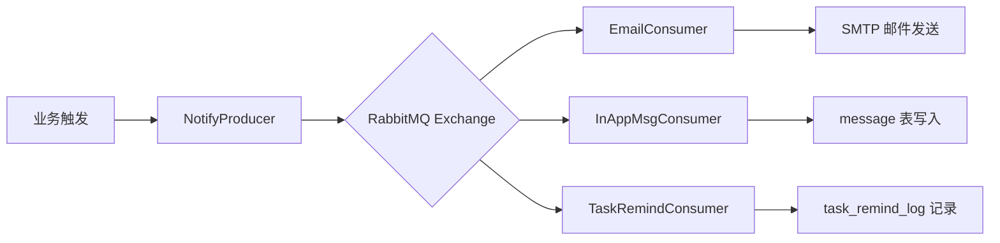
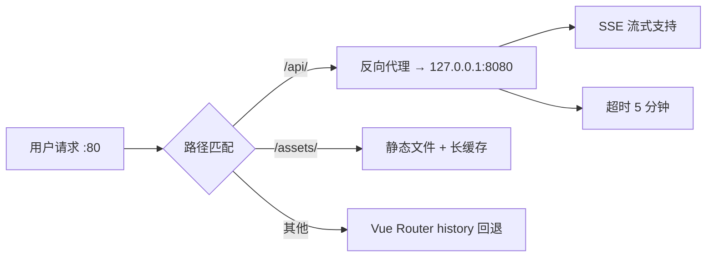

# 人力资源中心官网

<div align="center">

[](https://spring.io/projects/spring-boot)
[](https://vuejs.org/)
[](https://openjdk.org/)
[](https://www.typescriptlang.org/)
[](https://docs.spring.io/spring-ai/reference/)
[](https://baomidou.com/)
[](https://www.mysql.com/)
[](https://redis.io/)
[](https://www.rabbitmq.com/)

**基于 Spring Boot + Vue3 + Spring AI 的智能化学生会人力资源管理系统**

集成 RAG 知识库问答、AI 智能助手、流式对话输出、任务管理、消息通知等先进功能

[快速开始](#快速开始) · [功能特性](#功能特性) · [技术架构](#技术架构) · [部署指南](#部署指南)

</div>

---

## 📖 项目概述

人力资源中心官网是一个面向学生会组织的数字化管理平台，采用前后端分离架构，基于 Spring AI 接入 ECNU AI（华东师范大学 AI 平台），提供智能化的成员管理、活动管理、任务管理、消息通知和 AI 辅助决策能力。

### 核心能力

- 🤖 **AI 智能助手** - 基于 ECNU AI（ecnu-plus）的流式对话，支持工具调用（ecnu-max）与知识库问答
- 📚 **RAG 知识库** - 检索增强生成，基于 Redis Vector Store 的语义检索与智能回答
- 👥 **成员管理** - 多角色权限体系，支持往届成员追溯与激活码注册
- 📋 **活动管理** - 活动全生命周期管理，支持策划案 AI 生成（HTML 格式 + 沙箱渲染）
- ✅ **任务管理** - 任务创建、分配、催促、完成全流程，支持邮件+站内信通知
- 💬 **消息中心** - 站内信系统，支持系统通知、任务提醒、已读管理
- 📁 **资料管理** - 三级分类体系，阿里云 OSS 预签名 URL 安全下载
- 🏛️ **历史档案** - 往届活动和成员档案管理

---

## ✨ 功能特性

### 后端能力

| 功能模块 | 技术实现 | 说明 |
|---------|---------|------|
| **认证授权** | JWT + Spring Security | 无状态认证，Redis 存储 Token 黑名单 |
| **角色体系** | 注解 + AOP | 游客/部员/部长三级权限，自定义注解声明式控制 |
| **任务管理** | MyBatis-Plus + 逻辑删除 | 任务创建/分配/催促/完成，24小时催促冷却 |
| **消息通知** | RabbitMQ 异步 | 站内信 + 邮件通知，MQ 解耦保证最终一致性 |
| **角色变更审计** | role_change_log | 角色任命/变更全记录，支持历史追溯 |
| **AI 对话** | Spring AI + OpenAI 兼容接口 | ECNU AI 流式输出，支持上下文记忆与工具调用 |
| **RAG 问答** | Redis Vector Store | 向量检索 + 语义增强回答，智能文本分块 |
| **文件管理** | 本地存储 + 阿里云 OSS | 预签名 URL 安全下载，支持多场景上传 |
| **数据访问** | MyBatis-Plus | 内置分页、逻辑删除、自动填充 |
| **数据库迁移** | Flyway | 8个版本迁移脚本，版本化Schema演进 |
| **性能监控** | 自定义监控服务 | 内存、向量索引、RAG 状态监控，Redis 内存清理 |
| **异常处理** | 全局异常处理器 | 统一错误码体系，业务/系统异常分离 |

### 前端能力

| 功能模块 | 技术实现 | 说明 |
|---------|---------|------|
| **UI 框架** | Element Plus + Vue3 | 现代化组件库，暖色调珊瑚橙主题 |
| **状态管理** | Pinia (Composition API) | 轻量级状态管理，Token + 用户信息持久化 |
| **类型安全** | TypeScript | 全链路类型支持，全局类型定义 |
| **流式渲染** | SSE + markstream-vue | AI 消息实时流式 Markdown 渲染 |
| **HTTP 客户端** | 原生 fetch 自定义 HttpClient | 支持 SSE 流式请求、文件上传进度、超时控制 |
| **Markdown 渲染** | markdown-it + DOMPurify | 安全的富文本显示，支持锚点/表情/任务列表 |
| **HTML 渲染** | iframe 沙箱 | 策划案 HTML 安全渲染 |
| **构建工具** | rolldown-vite | 基于 Rust 的高性能构建 |
| **权限控制** | 路由守卫 + composables | usePermission 组合式函数，五级权限检查 |
| **错误处理** | 统一错误码映射 | errorCodeMap + errorHandler，全局异常拦截 |
| **视觉设计** | CSS 变量设计系统 | 毛玻璃效果、渐变卡片、响应式断点 |

---

## 🏗️ 技术架构

### 系统架构图


```mermaid
graph TB
    subgraph 前端层["前端层 Vue3 + TypeScript"]
        A[Web 应用]
    end

    subgraph 网关层["网关层"]
        B[Nginx 反向代理]
    end

    subgraph 服务层["服务层 Spring Boot"]
        C[Controller 接口层 14个]
        D[Service 业务层 16个]
        E[AI 服务层]
        F[文件服务层]
        G[消息队列层]
        H[性能监控层]
    end

    subgraph 数据层["数据层"]
        I[(MySQL 业务数据)]
        J[(Redis 缓存/向量)]
        K[本地文件 / 阿里云 OSS]
    end

    subgraph MQ层["消息队列 RabbitMQ"]
        L[NotifyProducer]
        M[EmailConsumer]
        N[InAppMsgConsumer]
        O[TaskRemindConsumer]
    end

    subgraph AI 层["AI 层 Spring AI"]
        P[ECNU AI ecnu-plus/ecnu-max]
        Q[ecnu-embedding-small]
        R[Vector Store 检索]
    end

    A --> B
    B --> C
    C --> D
    D --> E
    D --> F
    D --> G
    D --> H
    D --> I
    D --> J
    F --> K
    G --> L
    L --> M
    L --> N
    L --> O
    E --> P
    E --> Q
    Q --> R
    R --> J
```

### 技术栈版本

#### 后端技术栈

| 技术 | 版本 | 用途 |
|------|------|------|
| Spring Boot | 3.3.5 | 核心应用框架 |
| Spring AI | 1.0.0 | AI 能力抽象层 |
| Spring AI OpenAI | 由 BOM 管理 | OpenAI 兼容接口（ECNU AI） |
| Spring AI Redis Vector Store | 由 BOM 管理 | 向量存储与检索 |
| Spring Security | 6.x | 安全认证授权 |
| Spring AMQP | 3.x | RabbitMQ 消息队列 |
| MyBatis-Plus | 3.5.12 | ORM 框架（内置分页、逻辑删除） |
| Flyway | 由 Spring Boot 管理 | 数据库版本化迁移 |
| MySQL Connector | 8.0.33 | 关系型数据库驱动 |
| Redis + Lettuce | 7.x | 缓存 + 向量存储 + 对话记忆 |
| RabbitMQ | 3.12+ | 异步消息通知（邮件/站内信/任务催促） |
| JWT (jjwt) | 0.11.5 | 令牌认证 |
| Hutool | 5.8.22 | Java 工具库 |
| Lombok | 1.18.38 | 代码简化 |
| 阿里云 OSS | 3.17.2 | 对象存储（可选） |
| Apache POI | 5.2.5 | Word 文档解析（RAG 知识库） |
| PDFBox | 2.0.30 | PDF 文档解析（RAG 知识库） |
| SnakeYAML | 2.2 | 提示词 YAML 配置 |
| Jakarta Mail | 由 Spring Boot 管理 | 邮件发送 |

#### 前端技术栈

| 技术 | 版本 | 用途 |
|------|------|------|
| Vue | 3.5.22 | 渐进式框架 |
| TypeScript | 5.9.0 | 类型系统 |
| Element Plus | 2.11.8 | UI 组件库 |
| @element-plus/icons-vue | 2.3.2 | 图标库 |
| Pinia | 3.0.3 | 状态管理 |
| Vue Router | 4.6.3 | 路由管理 |
| rolldown-vite | latest | 构建工具（基于 Rust） |
| markdown-it | 14.1.0 | Markdown 解析 |
| markdown-it-anchor | 9.2.0 | 标题锚点 |
| markdown-it-container | 4.0.0 | 容器块 |
| markdown-it-emoji | 3.0.0 | 表情符号 |
| markdown-it-task-lists | 2.1.1 | 任务列表 |
| markstream-vue | 0.0.4-beta.8 | 流式 Markdown 渲染 |
| marked | 17.0.2 | Markdown 解析（辅助） |
| DOMPurify | 3.3.1 | XSS 防护 |

---

## 📁 项目结构

```
HumanResourceOfficial/
├── src/main/java/com/redmoon2333/          # 后端源码
│   ├── annotation/                          # 自定义注解（权限控制）
│   ├── aspect/                              # AOP 切面
│   ├── config/                              # 配置类（17个）
│   ├── controller/                          # 控制器层（14个）
│   ├── dto/                                 # 数据传输对象（34个）
│   ├── entity/                              # 实体类（14个）
│   ├── enums/                               # 枚举类
│   ├── exception/                           # 异常处理
│   ├── mapper/                              # MyBatis-Plus 映射器（14个）
│   ├── mq/                                  # 消息队列
│   │   ├── producer/                        #   NotifyProducer 通知生产者
│   │   └── consumer/                        #   EmailConsumer / InAppMsgConsumer / TaskRemindConsumer
│   ├── service/                             # 业务服务层（16个）
│   ├── util/                                # 工具类（10个）
│   ├── validation/                          # 自定义校验
│   └── Main.java                            # 启动类
├── src/main/resources/
│   ├── db/migration/                        # Flyway 迁移脚本（8个版本）
│   │   ├── V1__baseline.sql                 #   基线建表
│   │   ├── V2__add_user_student_id.sql      #   学号字段
│   │   ├── V3__seed_student_id.sql          #   学号填充
│   │   ├── V4__create_message_table.sql     #   消息表
│   │   ├── V5__create_task_tables.sql       #   任务相关表
│   │   ├── V6__add_role_audit_log.sql       #   角色变更审计
│   │   ├── V7__update_v_user_roles_view.sql #   视图更新
│   │   └── V8__fix_activation_code.sql      #   激活码状态修复
│   ├── mapper/                              # MyBatis XML（8个）
│   ├── prompttemplate/                      # AI 提示词模板
│   ├── rag-knowledge-base/                  # RAG 知识库文档（8类27文件）
│   ├── application.yml                      # 主配置文件
│   └── application-dev.yml                  # 开发环境配置
├── hrofficial-frontend/                     # 前端项目
│   ├── src/
│   │   ├── api/                             # API 接口定义（14个模块）
│   │   ├── components/                      # 公共组件（9个）
│   │   ├── composables/                     # 组合式函数
│   │   ├── directives/                      # 自定义指令
│   │   ├── router/                          # 路由配置
│   │   ├── stores/                          # Pinia 状态管理
│   │   ├── styles/                          # 样式设计系统
│   │   ├── types/                           # TypeScript 类型定义
│   │   ├── utils/                           # 工具函数
│   │   └── views/                           # 页面组件（15个）
│   └── package.json
├── deploy/                                  # 部署配置
│   ├── Dockerfile                           # 后端 Docker 镜像
│   ├── docker-compose.yml                   # Docker Compose 编排
│   ├── .env.example                         # 环境变量模板
│   ├── .dockerignore                        # Docker 构建忽略
│   ├── nginx/                               # Nginx 配置
│   │   └── hrofficial.conf                  # 站点配置（前端静态 + API 代理）
│   └── init/                                # 数据库初始化
│       └── init.sql                         # 建表脚本（首次运行自动执行）
├── .github/workflows/                       # CI/CD 配置
│   ├── backend-build-test.yml               # 后端构建测试
│   ├── docker-build-push.yml                # Docker 镜像构建推送
│   └── env.example                          # GitHub Secrets 说明
├── docs/                                    # 项目文档
└── pom.xml                                  # Maven 配置
```

---

## 🚀 快速开始

### 环境要求

- **Java**: 17+
- **Maven**: 3.6+
- **Node.js**: ^20.19.0 或 >=22.12.0
- **MySQL**: 8.0+
- **Redis**: 7.0+ (推荐 Redis Stack，需支持 RediSearch 向量检索)
- **RabbitMQ**: 3.12+ (可选，不启动时消息通知功能降级为同步)

### 1. 克隆项目

```bash
git clone <repository-url>
cd HumanResourceOfficial
```

### 2. 数据库初始化

```sql
CREATE DATABASE hrofficial
  CHARACTER SET utf8mb4
  COLLATE utf8mb4_unicode_ci;
```

导入数据库表结构：

```bash
mysql -u root -p hrofficial < deploy/init/init.sql
```

> **注意**：应用启动时 Flyway 会自动执行 `src/main/resources/db/migration/` 下的迁移脚本，无需手动执行。

### 3. 环境变量配置

复制环境变量模板并填写：

```bash
cp deploy/.env.example .env
```

**必填配置：**

| 环境变量 | 说明 |
|---------|------|
| `DB_PASSWORD` | MySQL root 密码 |
| `JWT_SECRET` | JWT 密钥（至少 256 位，用于 HS256 算法） |
| `CHATECNU_API_KEY` | ECNU AI 平台 API Key |

**可选配置（有默认值）：**

| 环境变量 | 默认值 | 说明 |
|---------|--------|------|
| `DB_URL` | `jdbc:mysql://localhost:3306/hrofficial?...` | 数据库连接 URL |
| `DB_USERNAME` | `root` | 数据库用户名 |
| `CHATECNU_BASE_URL` | `https://chat.ecnu.edu.cn/open/api/v1` | ECNU AI 接口地址 |
| `AI_TOOL_MODEL` | `ecnu-max` | AI 工具调用模型 |
| `JWT_EXPIRATION` | `604800000`（7天） | JWT 过期时间（毫秒） |
| `REDIS_HOST` | `localhost` | Redis 主机 |
| `REDIS_PORT` | `6379` | Redis 端口 |
| `REDIS_PASSWORD` | (空) | Redis 密码 |
| `RABBITMQ_HOST` | `localhost` | RabbitMQ 主机 |
| `RABBITMQ_PORT` | `5672` | RabbitMQ 端口 |
| `RABBITMQ_USERNAME` | `guest` | RabbitMQ 用户名 |
| `RABBITMQ_PASSWORD` | `guest` | RabbitMQ 密码 |
| `MAIL_HOST` | `smtp.qq.com` | 邮件 SMTP 主机 |
| `MAIL_USERNAME` | (空) | 邮件发送账号 |
| `MAIL_PASSWORD` | (空) | 邮件授权码 |
| `ALIYUN_OSS_ENDPOINT` | `oss-cn-beijing.aliyuncs.com` | OSS Endpoint |
| `ALIYUN_OSS_ACCESS_KEY_ID` | (空) | OSS AccessKey ID |
| `ALIYUN_OSS_ACCESS_KEY_SECRET` | (空) | OSS AccessKey Secret |
| `ALIYUN_OSS_BUCKET_NAME` | (空) | OSS Bucket 名称 |
| `FILE_ACCESS_URL` | `http://localhost:8080` | 文件访问基础 URL |

> **注意**：开发环境下，前端通过 Vite 代理（`/api` → `http://localhost:8080`）访问后端，无需额外配置前端环境变量。

### 4. 启动后端

```bash
mvn spring-boot:run

# 或打包后运行
mvn clean package -DskipTests
java -jar target/HumanResourceOfficial-1.0-SNAPSHOT.jar
```

服务启动后访问：`http://localhost:8080`

### 5. 启动前端

```bash
cd hrofficial-frontend
npm install
npm run dev
```

前端访问地址：`http://localhost:5173`

---

## 🤖 AI 与 RAG 功能

### AI 智能对话

系统通过 Spring AI 接入 ECNU AI 平台（OpenAI 兼容接口），支持：

- **流式输出** - 基于 SSE 实时显示 AI 回复
- **上下文记忆** - 基于 Redis 的对话历史（TTL 7 天）
- **角色设定** - 针对学生会场景优化的系统提示词（YAML 配置）
- **工具调用** - AI 可调用查询人员信息、统计数据等工具（ecnu-max 模型）
- **RAG 增强** - 结合知识库进行智能问答

### AI 模型配置

| 用途 | 模型 | 配置项 |
|------|------|--------|
| 通用对话 | `ecnu-plus` | `spring.ai.openai.chat.options.model` |
| 工具调用 | `ecnu-max` | `spring.ai.openai.tool-model` |
| 向量化 | `ecnu-embedding-small` (1024维) | `rag.embedding-model` |

### RAG 知识库问答

基于 Spring AI 的 RAG 实现：


```mermaid
flowchart LR
    A[用户提问] --> B[ecnu-embedding-small 向量化]
    B --> C[Redis Vector Search]
    C --> D[检索 Top-K 文档]
    D --> E[上下文组装]
    E --> F[ecnu-plus 生成回答]
    F --> G[流式返回]
```

**智能文本分块特性：**

- 语义分块：按章节、段落、句子边界智能分割
- 自动文档类型识别：结构化/叙述性/技术文档
- 分块重叠：保留上下文连贯性（400 字符分块，100 字符重叠）
- 低内存模式：支持低配服务器部署（可配置内存警告/危险阈值）
- 文档解析：支持 PDF（PDFBox）和 Excel（Apache POI）自动解析

**知识库初始化：**

```bash
curl -X POST http://localhost:8080/api/rag/initialize \
  -H "Authorization: Bearer YOUR_TOKEN" \
  -H "Content-Type: application/json" \
  -d '{"forceReindex": false}'
```

**知识库目录结构：**

```
rag-knowledge-base/
├── 00-使用说明.txt           # 知识库编写规范
├── 01-组织概况/              # 学生会简介、组织文化
├── 02-规章制度/              # 学生会章程
├── 03-活动管理/              # 活动策划、执行流程
├── 04-部门信息/              # 各部门介绍（5个中心）
├── 05-财务制度/              # 经费管理制度
├── 06-校园生活/              # 校园实用信息（交通/饮食/住宿等）
├── 07-学习指导/              # 选课、学习技巧、竞赛
└── 08-职业发展/              # 实习、社会实践
```

### 策划案生成

AI 可根据输入参数生成 HTML 格式的活动策划案，前端通过 iframe 沙箱安全渲染，包含活动目的、流程、分工、注意事项等完整内容。

---

## 🔐 权限系统

### 角色体系

| 角色 | 权限范围 |
|------|---------|
| **游客** | 查看活动介绍、往届活动、往届成员 |
| **部员** | 游客权限 + 资料查看/下载、AI 对话、策划案生成、文件上传、查看/完成个人任务、消息中心 |
| **部长** | 部员权限 + 所有管理功能（增删改）、任务管理、角色管理、RAG 管理、激活码管理、每日一图管理 |

### 权限注解使用

```java
@RequireMemberRole("查看资料")    // 需要部员及以上权限
public ResponseEntity<?> viewMaterials() { }

@RequireMinisterRole("删除活动")   // 需要部长权限
public ResponseEntity<?> deleteActivity(@PathVariable Long id) { }
```

### 前端权限控制

路由元信息 + 导航守卫 + `usePermission` 组合式函数，五级权限检查：

| 权限级别 | 路由 meta | 说明 |
|---------|----------|------|
| 公开 | `public: true` | 无需登录 |
| 仅游客 | `guestOnly: true` | 已登录用户重定向 |
| 需登录 | `requiresAuth: true` | 需要有效 Token |
| 需部员 | `requiresMember: true` | 需要激活的部员身份 |
| 需部长 | `requiresMinister: true` | 需要部长/副部长身份 |

---

## 📚 API 文档

### 认证接口

| 方法 | 路径 | 权限 | 说明 |
|------|------|------|------|
| POST | `/api/auth/register` | 公开 | 用户注册（需激活码） |
| POST | `/api/auth/login` | 公开 | 用户登录 |
| POST | `/api/auth/logout` | 登录 | 用户登出 |
| GET | `/api/auth/current-user` | 登录 | 获取当前用户信息 |
| PUT | `/api/auth/update-profile` | 登录 | 更新个人资料 |
| POST | `/api/auth/generate-code` | 部长 | 生成激活码 |

### 消息接口

| 方法 | 路径 | 权限 | 说明 |
|------|------|------|------|
| GET | `/api/messages` | 登录 | 分页获取消息列表（支持 type/isRead 筛选） |
| GET | `/api/messages/unread-count` | 登录 | 获取未读消息数 |
| POST | `/api/messages/{id}/read` | 登录 | 标记消息已读 |
| POST | `/api/messages/read-all` | 登录 | 标记全部已读 |
| DELETE | `/api/messages/{id}` | 登录 | 删除消息 |
| POST | `/api/messages` | 登录 | 发送站内信 |

### 角色管理接口

| 方法 | 路径 | 权限 | 说明 |
|------|------|------|------|
| GET | `/api/roles/users` | 部长 | 分页获取用户列表 |
| PUT | `/api/roles/users/{userId}` | 部长 | 更新用户角色（含变更原因） |
| POST | `/api/roles/users/{userId}/appoint-minister` | 部长 | 任命部长 |
| POST | `/api/roles/users/{userId}/appoint-deputy` | 部长 | 任命副部长 |

### 任务管理接口

| 方法 | 路径 | 权限 | 说明 |
|------|------|------|------|
| POST | `/api/tasks` | 部长 | 创建任务（含分配执行人） |
| GET | `/api/tasks/mine` | 登录 | 获取我的任务（作为执行人） |
| GET | `/api/tasks/created` | 部长 | 获取我创建的任务 |
| GET | `/api/tasks/{id}` | 登录 | 获取任务详情 |
| POST | `/api/tasks/assignments/{id}/done` | 登录 | 标记任务完成 |
| POST | `/api/tasks/assignments/{id}/remind` | 部长 | 催促任务（24h冷却） |
| PUT | `/api/tasks/{id}` | 部长 | 更新任务 |
| DELETE | `/api/tasks/{id}` | 部长 | 删除任务 |
| GET | `/api/tasks/candidates` | 部长 | 获取候选人列表 |

### AI 接口

| 方法 | 路径 | 权限 | 说明 |
|------|------|------|------|
| POST | `/api/ai/chat/stream` | 登录 | AI 流式对话（SSE） |
| POST | `/api/ai/chat-with-rag` | 登录 | RAG 增强对话（SSE） |
| POST | `/api/ai/plan/generate` | 登录 | 生成活动策划案 |
| POST | `/api/ai/plan/generate/stream` | 登录 | 流式生成活动策划案（SSE） |
| GET | `/api/ai/chat-history` | 登录 | 获取对话历史 |
| DELETE | `/api/ai/chat-history` | 登录 | 删除对话历史 |

### RAG 管理接口

| 方法 | 路径 | 权限 | 说明 |
|------|------|------|------|
| POST | `/api/rag/initialize` | 部长 | 初始化/重建知识库 |
| GET | `/api/rag/stats` | 登录 | 获取知识库统计 |
| GET | `/api/rag/test-retrieve` | 登录 | 测试向量检索 |
| GET | `/api/rag/debug/list-files` | 登录 | 列出知识库文件 |

### 活动管理接口

| 方法 | 路径 | 权限 | 说明 |
|------|------|------|------|
| GET | `/api/activities` | 公开 | 获取活动列表 |
| GET | `/api/activities/{id}` | 公开 | 获取活动详情 |
| GET | `/api/activities/{id}/images` | 公开 | 获取活动图片列表 |
| GET | `/api/activities/images/batch` | 公开 | 批量获取所有活动图片 |
| POST | `/api/activities` | 部长 | 创建活动 |
| PUT | `/api/activities/{id}` | 部长 | 更新活动 |
| DELETE | `/api/activities/{id}` | 部长 | 删除活动 |
| POST | `/api/activities/{id}/images` | 部长 | 上传活动图片 |
| DELETE | `/api/activities/images/{imageId}` | 部长 | 删除活动图片 |

### 资料管理接口

| 方法 | 路径 | 权限 | 说明 |
|------|------|------|------|
| GET | `/api/materials` | 登录 | 获取资料列表 |
| GET | `/api/materials/{id}` | 登录 | 获取资料详情 |
| GET | `/api/materials/categories` | 登录 | 获取分类列表 |
| GET | `/api/materials/category/{id}` | 登录 | 按分类获取资料 |
| GET | `/api/materials/subcategory/{id}` | 登录 | 按子分类获取资料 |
| GET | `/api/materials/search` | 登录 | 搜索资料 |
| GET | `/api/materials/category/{id}/subcategories` | 登录 | 获取子分类列表 |
| POST | `/api/materials` | 部长 | 上传资料 |
| DELETE | `/api/materials/{id}` | 部长 | 删除资料 |
| POST | `/api/materials/category` | 部长 | 创建分类 |
| PUT | `/api/materials/category/{id}` | 部长 | 更新分类 |
| DELETE | `/api/materials/category/{id}` | 部长 | 删除分类 |
| POST | `/api/materials/subcategory` | 部长 | 创建子分类 |
| PUT | `/api/materials/subcategory/{id}` | 部长 | 更新子分类 |
| DELETE | `/api/materials/subcategory/{id}` | 部长 | 删除子分类 |

### 每日一图接口

| 方法 | 路径 | 权限 | 说明 |
|------|------|------|------|
| GET | `/api/daily-images` | 公开 | 获取启用图片列表 |
| GET | `/api/daily-images/all` | 部长 | 获取所有图片（含禁用） |
| GET | `/api/daily-images/{id}` | 部长 | 获取图片详情 |
| POST | `/api/daily-images` | 部长 | 添加图片 |
| PUT | `/api/daily-images/{id}` | 部长 | 更新图片信息 |
| PUT | `/api/daily-images/{id}/status` | 部长 | 更新图片启用状态 |
| DELETE | `/api/daily-images/{id}` | 部长 | 删除图片 |

### 往届活动接口

| 方法 | 路径 | 权限 | 说明 |
|------|------|------|------|
| GET | `/api/past-activities` | 公开 | 分页查询往届活动 |
| GET | `/api/past-activities/{id}` | 公开 | 获取往届活动详情 |
| GET | `/api/past-activities/years` | 公开 | 获取年份列表 |
| GET | `/api/past-activities/years/{year}/count` | 公开 | 按年份统计数量 |
| POST | `/api/past-activities` | 部长 | 创建往届活动 |
| PUT | `/api/past-activities/{id}` | 部长 | 更新往届活动 |
| DELETE | `/api/past-activities/{id}` | 部长 | 删除往届活动 |

### 用户管理接口

| 方法 | 路径 | 权限 | 说明 |
|------|------|------|------|
| GET | `/api/users/alumni` | 部长 | 获取往届成员列表 |
| GET | `/api/users/search/name` | 部长 | 按姓名精确搜索 |
| GET | `/api/users/search/name/like` | 部长 | 按姓名模糊搜索 |
| GET | `/api/users/activation-codes` | 部长 | 获取激活码列表 |
| PUT | `/api/users/activation-codes/refresh-expired` | 部长 | 刷新过期激活码状态 |
| POST | `/api/users/cleanup-memory` | 部长 | 清理 Redis 内存 |

### OSS 接口

| 方法 | 路径 | 权限 | 说明 |
|------|------|------|------|
| POST | `/api/oss/presigned-url` | 登录 | 获取通用预签名 URL |
| GET | `/api/oss/presigned-url/material/{id}` | 登录 | 按资料 ID 获取预签名 URL |
| POST | `/api/oss/presigned-url/activity-image` | 部长 | 获取活动图片上传预签名 URL |

### MQ 监控接口

| 方法 | 路径 | 权限 | 说明 |
|------|------|------|------|
| GET | `/api/mq/health` | 公开 | RabbitMQ 健康检查 |

### 性能监控接口

| 方法 | 路径 | 权限 | 说明 |
|------|------|------|------|
| GET | `/api/performance/report` | 部长 | 获取综合性能报告 |
| POST | `/api/performance/reset` | 部长 | 重置监控数据 |

---

## 📨 消息通知架构

系统通过 RabbitMQ 实现异步消息通知，保证最终一致性：


```mermaid
flowchart LR
    A[业务触发] --> B[NotifyProducer]
    B --> C{RabbitMQ Exchange}
    C --> D[EmailConsumer]
    C --> E[InAppMsgConsumer]
    C --> F[TaskRemindConsumer]
    D --> G[SMTP 邮件发送]
    E --> H[message 表写入]
    F --> I[task_remind_log 记录]
```

**通知类型（NotifyType）：**

| 类型 | 触发场景 | 通知渠道 |
|------|---------|---------|
| TASK_ASSIGNED | 任务分配 | 站内信 + 邮件 |
| TASK_REMINDED | 任务催促 | 站内信 + 邮件 |
| TASK_COMPLETED | 任务完成 | 站内信 |
| ROLE_CHANGED | 角色变更 | 站内信 |

> **降级策略**：RabbitMQ 不可用时，消息通知降级为同步处理，不影响核心业务流程。

---

## ⚙️ 配置说明

### 核心配置项

```yaml
spring:
  datasource:
    url: ${DB_URL:jdbc:mysql://localhost:3306/hrofficial?...}
    username: ${DB_USERNAME:root}
    password: ${DB_PASSWORD:}

  data:
    redis:
      host: ${REDIS_HOST:localhost}
      port: ${REDIS_PORT:6379}
      password: ${REDIS_PASSWORD:}

  rabbitmq:
    host: ${RABBITMQ_HOST:localhost}
    port: ${RABBITMQ_PORT:5672}
    username: ${RABBITMQ_USERNAME:guest}
    password: ${RABBITMQ_PASSWORD:guest}

  mail:
    host: ${MAIL_HOST:smtp.qq.com}
    username: ${MAIL_USERNAME:}
    password: ${MAIL_PASSWORD:}

  ai:
    openai:
      base-url: ${CHATECNU_BASE_URL:https://chat.ecnu.edu.cn/open/api/v1}
      api-key: ${CHATECNU_API_KEY:}
      chat:
        options:
          model: ecnu-plus
          temperature: 0.7
      embedding:
        options:
          model: ecnu-embedding-small
    tool-model: ${AI_TOOL_MODEL:ecnu-max}
    vectorstore:
      redis:
        index-name: campus-knowledge-index
        prefix: "rag:embedding:"

jwt:
  secret: ${JWT_SECRET:YourJWTSecretKeyMustBeAtLeast256BitsLongForHS256Algorithm}
  expiration: ${JWT_EXPIRATION:604800000}

aliyun:
  oss:
    endpoint: ${ALIYUN_OSS_ENDPOINT:oss-cn-beijing.aliyuncs.com}
    accessKeyId: ${ALIYUN_OSS_ACCESS_KEY_ID:}
    accessKeySecret: ${ALIYUN_OSS_ACCESS_KEY_SECRET:}
    bucketName: ${ALIYUN_OSS_BUCKET_NAME:}

rag:
  chunk-size: 400
  chunk-overlap: 100
  embedding-dimensions: 1024
  retrieval-top-k: 5
  enable-semantic-chunking: true

ai:
  chat:
    memory:
      ttl: 168
```

---

## 🔒 安全说明

- **JWT 认证** - 无状态令牌，Redis 存储 Token 黑名单，支持登出失效
- **密码加密** - BCrypt 哈希存储
- **SQL 注入防护** - MyBatis-Plus 预编译语句
- **XSS 防护** - 前端 DOMPurify 双配置（Markdown 场景 + HTML 场景）
- **文件安全** - 阿里云 OSS 预签名 URL 限时访问
- **环境隔离** - 敏感配置通过环境变量注入
- **激活码注册** - 新用户注册需要激活码，防止恶意注册
- **请求日志** - RequestLoggingFilter 记录请求信息
- **内存保护** - Redis 内存清理任务，防止内存溢出
- **数据隔离** - 用户只能访问自己的消息/任务，防止越权

> ⚠️ **注意**：`jwt.secret` 有默认值仅供开发使用，生产环境**必须**通过 `JWT_SECRET` 环境变量覆盖。

---

## 🐳 部署指南

### 服务器目录结构

在服务器上按以下结构组织部署文件：

```
/home/hrofficial/
├── hrofficial-deploy/              # 从仓库 deploy/ 目录复制
│   ├── docker-compose.yml          # Docker Compose 编排
│   ├── .env                        # 环境变量（从 .env.example 复制并填写）
│   ├── nginx/
│   │   └── hrofficial.conf         # Nginx 站点配置
│   ├── init/
│   │   └── init.sql                # 数据库初始化脚本（首次运行自动执行）
│   └── rag-knowledge-base/         # RAG 知识库文件（从仓库复制或自行补充）
│       ├── 00-使用说明.txt
│       ├── 01-组织概况/
│       ├── 02-规章制度/
│       └── ...
├── frontend/                       # 前端构建产物
│   └── dist/                       # npm run build 输出
└── uploads/                        # 上传文件存储（Docker Volume 自动管理）
```

### Docker Compose 一键部署（推荐）

#### 1. 配置 Docker 镜像加速（国内服务器必须）

```bash
sudo mkdir -p /etc/docker
sudo tee /etc/docker/daemon.json <<'EOF'
{
  "registry-mirrors": [
    "https://docker.1ms.run",
    "https://docker.xuanyuan.me"
  ]
}
EOF
sudo systemctl daemon-reload
sudo systemctl restart docker
```

#### 2. 上传部署文件

将 `deploy/` 目录下的文件上传到服务器 `/home/hrofficial/hrofficial-deploy/`：

```bash
# 在本地执行
scp -r deploy/* user@server:/home/hrofficial/hrofficial-deploy/
```

#### 3. 配置环境变量

```bash
cd /home/hrofficial/hrofficial-deploy
cp .env.example .env
# 编辑 .env，填写必填配置：DB_PASSWORD, JWT_SECRET, CHATECNU_API_KEY
vim .env
```

#### 4. 启动后端服务

```bash
docker-compose up -d

# 查看日志
docker-compose logs -f backend
```

**首次运行自动初始化：** MySQL 容器首次启动时，会自动执行 `init/init.sql` 创建数据库、表结构和测试数据。后续 Flyway 迁移在应用启动时自动执行。

#### 5. 构建并部署前端

```bash
# 在本地构建
cd hrofficial-frontend
npm install
npm run build

# 将 dist/ 上传到服务器
scp -r dist/ user@server:/home/hrofficial/frontend/
```

#### 6. 配置 Nginx

将 `deploy/nginx/hrofficial.conf` 链接到 Nginx 配置目录：

```bash
# 方式一：软链接（推荐）
sudo ln -s /home/hrofficial/hrofficial-deploy/nginx/hrofficial.conf /etc/nginx/conf.d/hrofficial.conf

# 方式二：直接复制
sudo cp /home/hrofficial/hrofficial-deploy/nginx/hrofficial.conf /etc/nginx/conf.d/

# 检查配置并重载
sudo nginx -t
sudo systemctl reload nginx
```

### 服务说明

| 服务 | 端口 | 说明 |
|------|------|------|
| MySQL | 仅容器内部 | 业务数据库（首次启动自动建表+测试数据） |
| Redis Stack | 仅容器内部 | 缓存 + 向量存储 |
| RabbitMQ | 仅容器内部 | 消息队列（管理面板 15672） |
| Backend | 127.0.0.1:8080 | Spring Boot 后端服务（仅 Nginx 可访问） |
| Nginx | 80 | 前端静态文件 + API 反向代理（宿主机） |

> **安全说明**：MySQL、Redis 和 RabbitMQ 不暴露端口到宿主机，Backend 仅绑定 `127.0.0.1`，所有外部流量通过 Nginx 代理。

### Nginx 配置说明

`deploy/nginx/hrofficial.conf` 的核心逻辑：


```mermaid
graph LR
    A[用户请求 :80] --> B{路径匹配}
    B -->|/api/| C[反向代理 → 127.0.0.1:8080]
    B -->|/assets/| D[静态文件 + 长缓存]
    B -->|其他| E[Vue Router history 回退]
    C --> F[SSE 流式支持]
    C --> G[超时 5 分钟]
```

- `/api/` → 反向代理到后端 `127.0.0.1:8080`，支持 SSE 流式响应
- `/assets/` → 静态资源长缓存（Vite 构建带 hash 文件名）
- 其他路径 → `try_files` 回退到 `index.html`（Vue Router history 模式）

### RAG 知识库更新

知识库文件通过 Docker Volume 挂载到容器中，更新步骤：

```bash
# 1. 在宿主机上增删知识库文件
vim /home/hrofficial/hrofficial-deploy/rag-knowledge-base/09-新分类/新文件.txt

# 2. 调用 RAG 初始化接口重新索引
curl -X POST http://localhost:8080/api/rag/initialize \
  -H "Authorization: Bearer YOUR_TOKEN" \
  -H "Content-Type: application/json" \
  -d '{"forceReindex": false}'

# 无需重新构建或重启 Docker 容器
```

### 环境变量说明

**必填：**

| 环境变量 | 说明 |
|---------|------|
| `DB_PASSWORD` | MySQL root 密码 |
| `JWT_SECRET` | JWT 密钥（至少 256 位） |
| `CHATECNU_API_KEY` | ECNU AI 平台 API Key |

**RAG 知识库：**

| 环境变量 | 默认值 | 说明 |
|---------|--------|------|
| `RAG_KB_HOST_PATH` | `./rag-knowledge-base` | 宿主机知识库目录路径（Docker 挂载用） |
| `RAG_KB_PATH` | `file:/app/rag-knowledge-base` | 容器内知识库路径 |

**Docker 镜像：**

| 环境变量 | 默认值 | 说明 |
|---------|--------|------|
| `DOCKER_IMAGE` | `redmoon2333/hrofficial-backend:latest` | 后端 Docker 镜像地址 |

### 手动部署

```bash
# 1. 初始化数据库
mysql -u root -p < deploy/init/init.sql

# 2. 构建后端 JAR
mvn clean package -DskipTests

# 3. 运行后端
java -jar target/HumanResourceOfficial-1.0-SNAPSHOT.jar \
  --spring.profiles.active=prod \
  -DJWT_SECRET=your_jwt_secret \
  -DCHATECNU_API_KEY=your_ecnu_api_key \
  -DDB_PASSWORD=your_db_password

# 4. 构建前端
cd hrofficial-frontend
npm install
npm run build

# 5. 使用 Nginx 托管前端静态文件并反向代理后端
```

### CI/CD 自动部署

项目配置了 GitHub Actions 流水线：

| 工作流 | 触发条件 | 功能 |
|--------|---------|------|
| `backend-build-test.yml` | push/PR 到 main/develop | Maven 编译、测试、SpotBugs、JaCoCo |
| `docker-build-push.yml` | push 到 main/develop，推送 v* 标签 | 构建 Docker 镜像并推送到 Docker Hub |

**GitHub Secrets 配置：**

| Secret | 说明 |
|--------|------|
| `DOCKER_USERNAME` | Docker Hub 用户名 |
| `DOCKER_PASSWORD` | Docker Hub 密码/Token |
| `CHATECNU_API_KEY` | ECNU AI API Key |
| `ALIYUN_OSS_ACCESS_KEY_ID` | 阿里云 OSS AccessKey ID |
| `ALIYUN_OSS_ACCESS_KEY_SECRET` | 阿里云 OSS AccessKey Secret |
| `ALIYUN_OSS_BUCKET_NAME` | 阿里云 OSS Bucket 名称 |

---

## 🤝 贡献指南

1. Fork 本仓库
2. 创建特性分支：`git checkout -b feature/AmazingFeature`
3. 提交更改：`git commit -m 'feat: Add some AmazingFeature'`
4. 推送分支：`git push origin feature/AmazingFeature`
5. 创建 Pull Request

### 代码规范

- 遵循阿里巴巴 Java 开发手册
- 使用中文编写注释和文档
- 保持代码简洁，遵循单一职责原则
- 严格遵循分层架构：Controller → Service → Mapper/DAO
- API 设计遵循 RESTful 规范
- 提交信息遵循 Conventional Commits 规范

---

## 🙏 致谢

- [Spring Boot](https://spring.io/projects/spring-boot)
- [Spring AI](https://docs.spring.io/spring-ai/reference/)
- [MyBatis-Plus](https://baomidou.com/)
- [Vue.js](https://vuejs.org/)
- [Element Plus](https://element-plus.org/)
- [ECNU AI](https://chat.ecnu.edu.cn/)
- [Redis](https://redis.io/)
- [RabbitMQ](https://www.rabbitmq.com/)

---

<div align="center">

**如果这个项目对你有帮助，请给个 Star ⭐**

</div>
