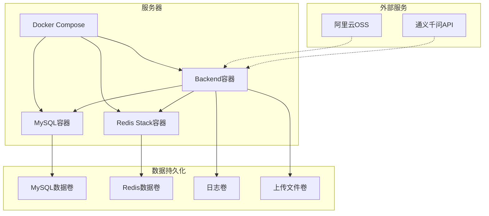
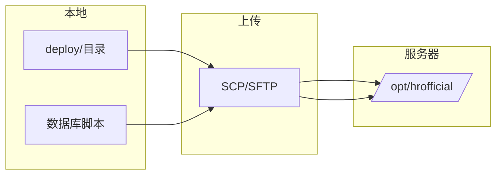
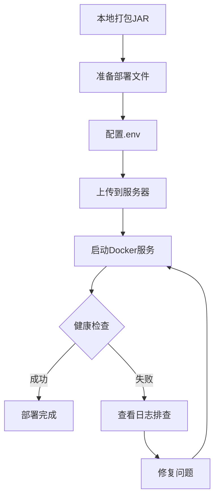

# 人力资源中心官网 - 完整部署指南

## 目录

1. [部署概述](#1-部署概述)
2. [环境要求](#2-环境要求)
3. [部署文件清单](#3-部署文件清单)
4. [本地打包流程](#4-本地打包流程)
5. [服务器部署流程](#5-服务器部署流程)
6. [常用运维命令](#6-常用运维命令)
7. [故障排查](#7-故障排查)

---

## 1. 部署概述

### 1.1 部署架构



### 1.2 部署方式

本项目采用 **本地打包 + 服务器部署** 的方式：

1. **本地**：打包JAR包，准备部署文件
2. **上传**：将关键文件上传到服务器
3. **服务器**：使用Docker Compose一键部署

---

## 2. 环境要求

### 2.1 本地环境

| 软件 | 版本要求 | 用途 |
|------|----------|------|
| JDK | 21+ | 编译运行 |
| Maven | 3.8+ | 项目构建 |
| Git | 最新版 | 版本控制 |

### 2.2 服务器环境

| 软件 | 版本要求 | 用途 |
|------|----------|------|
| Docker | 24.0+ | 容器运行 |
| Docker Compose | 2.20+ | 容器编排 |
| 内存 | ≥2GB | 运行服务 |
| 磁盘 | ≥10GB | 数据存储 |

### 2.3 服务器资源规划

| 服务 | 内存占用 | 磁盘占用 |
|------|----------|----------|
| 后端服务 | 256-512MB | ~100MB |
| MySQL | 128-256MB | ~1GB |
| Redis Stack | 128-256MB | ~500MB |
| **总计** | **~1GB** | **~2GB** |

---

## 3. 部署文件清单

### 3.1 deploy目录结构

```
deploy/
├── Dockerfile              # 后端服务镜像构建文件
├── docker-compose.yml      # Docker Compose编排配置
├── .env.example            # 环境变量模板
├── deploy.sh               # Linux部署脚本
├── deploy.bat              # Windows部署脚本
├── init/
│   └── init_database.sql   # 数据库初始化脚本
└── docs/
    └── DEPLOYMENT_GUIDE.md # 本文档
```

### 3.2 需上传到服务器的文件



**必须上传的文件：**

| 文件 | 说明 |
|------|------|
| `Dockerfile` | 镜像构建文件 |
| `docker-compose.yml` | 容器编排配置 |
| `.env` | 环境变量（从.env.example复制并填写） |
| `deploy.sh` | 部署脚本 |
| `init/init_database.sql` | 数据库初始化脚本 |

---

## 4. 本地打包流程

### 4.1 步骤一：克隆代码

```bash
git clone <repository_url>
cd HumanResourceOfficial
```

### 4.2 步骤二：打包JAR

```bash
# 清理并打包
mvn clean package -DskipTests

# 查看生成的JAR包
ls -la target/*.jar
```

### 4.3 步骤三：准备部署文件

```bash
# 创建部署目录
mkdir -p deploy/init

# 复制数据库初始化脚本
cp database/init_database.sql deploy/init/

# 复制环境变量模板
cp .env.example deploy/

# 设置脚本执行权限
chmod +x deploy/deploy.sh
```

### 4.4 步骤四：配置环境变量

```bash
cd deploy
cp .env.example .env
vim .env  # 填写实际配置
```

**必须配置的变量：**

```bash
# 数据库密码（必须修改）
DB_PASSWORD=your_secure_password

# JWT密钥（必须修改，至少32字符）
JWT_SECRET=your_random_secret_key_at_least_32_chars

# 通义千问API密钥（必须配置）
ALIWEN_API_KEY=sk-xxxxxxxx
```

---

## 5. 服务器部署流程

### 5.1 步骤一：上传文件

**方式一：使用SCP（推荐）**

```bash
# 在本地执行
scp -r deploy/ user@server_ip:/opt/hrofficial/
```

**方式二：使用SFTP工具**

- 使用FileZilla、WinSCP等工具
- 上传整个deploy目录到服务器 `/opt/hrofficial/`

### 5.2 步骤二：服务器准备

```bash
# SSH登录服务器
ssh user@server_ip

# 创建部署目录
sudo mkdir -p /opt/hrofficial
sudo chown -R $USER:$USER /opt/hrofficial

# 进入部署目录
cd /opt/hrofficial
```

### 5.3 步骤三：启动服务

```bash
# 添加执行权限
chmod +x deploy.sh

# 启动所有服务
./deploy.sh start
```

### 5.4 步骤四：验证部署

```bash
# 查看服务状态
./deploy.sh status

# 查看后端日志
./deploy.sh logs backend

# 测试API
curl http://localhost:8080/actuator/health
```

### 5.5 部署流程图



---

## 6. 常用运维命令

### 6.1 服务管理

```bash
# 启动服务
./deploy.sh start

# 停止服务
./deploy.sh stop

# 重启服务
./deploy.sh restart

# 查看状态
./deploy.sh status
```

### 6.2 日志查看

```bash
# 查看所有日志
./deploy.sh logs

# 查看后端日志
./deploy.sh logs backend

# 查看MySQL日志
./deploy.sh logs mysql

# 查看Redis日志
./deploy.sh logs redis
```

### 6.3 数据库操作

```bash
# 初始化数据库
./deploy.sh init-db

# 备份数据库
./deploy.sh backup-db

# 手动进入MySQL
docker exec -it hrofficial-mysql mysql -uroot -p
```

### 6.4 更新部署

```bash
# 重新构建并部署
./deploy.sh rebuild

# 仅重启后端服务
docker-compose restart backend
```

---

## 7. 故障排查

### 7.1 常见问题

#### 问题1：容器启动失败

```bash
# 查看容器日志
docker-compose logs backend

# 检查容器状态
docker ps -a

# 检查资源使用
docker stats
```

#### 问题2：数据库连接失败

```bash
# 检查MySQL是否运行
docker exec hrofficial-mysql mysqladmin ping -h localhost

# 检查网络连通性
docker exec hrofficial-backend ping mysql

# 验证数据库配置
docker exec hrofficial-mysql mysql -uroot -p -e "SHOW DATABASES;"
```

#### 问题3：Redis连接失败

```bash
# 检查Redis是否运行
docker exec hrofficial-redis redis-cli ping

# 检查Redis模块
docker exec hrofficial-redis redis-cli MODULE LIST
```

#### 问题4：内存不足

```bash
# 查看内存使用
free -h

# 查看Docker资源使用
docker stats --no-stream

# 调整JVM内存（修改.env）
# JAVA_OPTS=-Xms128m -Xmx256m
```

### 7.2 日志位置

| 日志类型 | 位置 |
|----------|------|
| 后端应用日志 | `/var/lib/docker/volumes/hrofficial-backend-logs/_data` |
| MySQL日志 | `docker logs hrofficial-mysql` |
| Redis日志 | `docker logs hrofficial-redis` |

### 7.3 紧急恢复

```bash
# 完全重置
./deploy.sh clean
./deploy.sh start

# 从备份恢复数据库
docker exec -i hrofficial-mysql mysql -uroot -p < backup.sql
```

---

## 附录

### A. 端口说明

| 端口 | 服务 | 说明 |
|------|------|------|
| 8080 | 后端服务 | HTTP API |
| 3306 | MySQL | 数据库 |
| 6379 | Redis | 缓存/向量存储 |
| 8001 | Redis Insight | Redis管理界面 |

### B. 数据卷说明

| 数据卷 | 用途 |
|--------|------|
| hrofficial-mysql-data | MySQL数据持久化 |
| hrofficial-redis-data | Redis数据持久化 |
| hrofficial-backend-logs | 应用日志 |
| hrofficial-backend-uploads | 上传文件 |

### C. 安全建议

1. **修改默认密码**：数据库密码、JWT密钥等
2. **配置防火墙**：仅开放必要端口
3. **启用HTTPS**：配置反向代理和SSL证书
4. **定期备份**：数据库和上传文件
5. **日志监控**：设置日志告警

---

**文档版本:** 1.0  
**更新日期:** 2025-02-12
