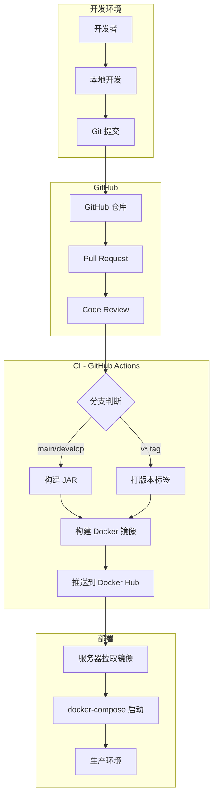

# CI/CD 配置与部署指南

## 📖 概述

本文档详细介绍人力资源中心官网项目的 CI/CD 配置和部署流程，包括 GitFlow 工作流、GitHub Actions 自动构建、Docker 镜像管理和服务器部署。

## 🏗️ 架构概览



## 🔧 前置准备

### 1. Docker Hub 账户

1. 注册 Docker Hub: https://hub.docker.com/
2. 创建镜像仓库：`redmoon-2333/humanresourceofficial`
3. 生成 Personal Access Token:
   - 进入 Settings -> Security
   - 点击 "New Access Token"
   - 填写描述，权限选择 "Read" 和 "Write"
   - 保存生成的 Token

### 2. GitHub Secrets 配置

进入仓库 Settings -> Secrets and variables -> Actions:

```bash
# 必需的 Secrets
DOCKER_USERNAME=redmoon-2333
DOCKER_PASSWORD=your_personal_access_token

# 可选的 Secrets
ALIYUN_OSS_ACCESS_KEY_ID=your_key
ALIYUN_OSS_ACCESS_KEY_SECRET=your_secret
CHATECNU_API_KEY=your_api_key
```

## 🌿 GitFlow 分支策略

### 分支说明

| 分支 | 用途 | 自动构建 | 自动部署 |
|------|------|---------|---------|
| `main` | 生产环境 | ✅ 打 latest 标签 | ✅ 手动部署 |
| `develop` | 开发集成 | ✅ 打 develop 标签 | ⚠️ 测试环境 |
| `feature/*` | 特性开发 | ❌ | ❌ |
| `release/*` | 预发布 | ❌ | ⚠️ 测试环境 |
| `hotfix/*` | 热修复 | ❌ | ✅ 紧急部署 |
| `v*` | 版本标签 | ✅ 打版本标签 | ✅ 生产部署 |

### 分支保护规则

#### main 分支
- 强制 Pull Request
- 至少 1 人审核通过
- CI 检查必须通过
- 禁止直接推送

#### develop 分支
- 强制 Pull Request
- CI 检查必须通过
- 允许 Maintainers 强制推送

## 🚀 GitHub Actions 工作流

### 1. 后端构建测试 (.github/workflows/backend-build-test.yml)

**触发条件**:
- push 到 main/develop
- pull request 到 main/develop

**执行步骤**:
1. 检出代码
2. 设置 JDK 21
3. Maven 依赖缓存
4. 编译项目
5. 运行单元测试
6. 打包 JAR
7. 上传构建产物

**示例输出**:
```
✅ Backend build successful
📦 JAR artifact uploaded: HumanResourceOfficial-1.0-SNAPSHOT.jar
```

### 2. Docker 镜像构建推送 (.github/workflows/docker-build-push.yml)

**触发条件**:
- push 到 main 分支 → 打 `latest` 标签
- push 到 develop 分支 → 打 `develop` 标签
- push 到 v* 标签 → 打版本标签 (v1.0.0, v1.0)
- 手动触发 (Workflow Dispatch)

**执行步骤**:
1. 检出代码
2. 设置 JDK 21
3. Maven 构建 JAR
4. 构建 Docker 镜像 (多阶段构建)
5. 打标签
6. 推送到 Docker Hub

**镜像标签规则**:

| 触发方式 | 镜像标签 | 示例 |
|---------|---------|------|
| push main | latest | `redmoon-2333/humanresourceofficial:latest` |
| push develop | develop | `redmoon-2333/humanresourceofficial:develop` |
| push v1.0.0 | v1.0.0, v1.0 | `redmoon-2333/humanresourceofficial:v1.0.0` |
| 其他提交 | dev-{commit} | `redmoon-2333/humanresourceofficial:dev-a1b2c3d` |

**手动触发示例**:
```yaml
# 在 Actions 页面手动运行
docker_registry: docker.io
docker_username: redmoon-2333
docker_password: your_token
```

## 📦 Docker 镜像管理

### 镜像结构

```
redmoon-2333/humanresourceofficial
├── latest        # 最新生产版本 (main 分支)
├── develop       # 最新开发版本 (develop 分支)
├── v1.0.0        # 具体版本号
├── v1.0          # 主版本。次版本
└── dev-xxxxx     # 开发版本
```

### 多阶段构建优化

**Dockerfile 优化点**:
1. 使用 Maven 官方镜像构建
2. 利用 Docker 缓存层 (先复制 pom.xml)
3. 使用 JRE 精简镜像运行
4. 非 root 用户运行
5. 健康检查配置
6. JVM 参数优化

**镜像大小对比**:
```
传统构建：~900MB
多阶段构建：~250MB  (节省 72%)
```

### 拉取镜像

```bash
# 拉取最新生产版本
docker pull redmoon-2333/humanresourceofficial:latest

# 拉取开发版本
docker pull redmoon-2333/humanresourceofficial:develop

# 拉取特定版本
docker pull redmoon-2333/humanresourceofficial:v1.0.0

# 使用私有仓库凭证
docker login -u redmoon-2333 -p your_token
docker pull redmoon-2333/humanresourceofficial:latest
```

## 🖥️ 服务器部署

### 环境要求

| 组件 | 最低配置 | 推荐配置 |
|------|---------|---------|
| CPU | 2 核 | 4 核 |
| 内存 | 2GB | 4GB |
| 磁盘 | 20GB | 50GB |
| Docker | 20.10+ | 24.0+ |
| Docker Compose | 2.0+ | 2.20+ |

### 部署步骤

#### 1. 准备服务器

```bash
# 安装 Docker
curl -fsSL https://get.docker.com | bash -s docker

# 安装 Docker Compose
sudo curl -L "https://github.com/docker/compose/releases/download/v2.20.0/docker-compose-$(uname -s)-$(uname -m)" -o /usr/local/bin/docker-compose
sudo chmod +x /usr/local/bin/docker-compose

# 启动 Docker
sudo systemctl enable docker
sudo systemctl start docker
```

#### 2. 创建部署目录

```bash
mkdir -p /opt/hrofficial/{deploy,uploads,knowledge-base}
cd /opt/hrofficial/deploy
```

#### 3. 配置环境变量

```bash
# 复制环境变量模板
cp .env.example .env

# 编辑配置
vim .env
```

**关键配置项**:
```bash
# 数据库密码 (强密码)
DB_PASSWORD=YourStrongPassword123!

# JWT 密钥 (至少 32 字符)
JWT_SECRET=your_jwt_secret_key_must_be_at_least_32_characters_long

# AI API 配置
CHATECNU_API_KEY=your_chatecnu_api_key

# 文件访问 URL(服务器公网 IP)
FILE_ACCESS_URL=http://your-server-ip:8080
```

#### 4. 准备数据库初始化脚本

```bash
# 创建 init 目录
mkdir -p deploy/init

# 放入数据库初始化 SQL
cat > deploy/init/init.sql << 'EOF'
CREATE DATABASE IF NOT EXISTS hrofficial 
  CHARACTER SET utf8mb4 
  COLLATE utf8mb4_unicode_ci;

USE hrofficial;

-- 导入表结构 (根据实际情况调整)
-- source /path/to/schema.sql
EOF
```

#### 5. 准备 Nginx 配置

```bash
cat > deploy/nginx.conf << 'EOF'
server {
    listen 80;
    server_name _;

    location / {
        root /usr/share/nginx/html;
        index index.html;
        try_files $uri $uri/ /index.html;
    }

    location /api {
        proxy_pass http://backend:8080;
        proxy_http_version 1.1;
        proxy_set_header Upgrade $http_upgrade;
        proxy_set_header Connection 'upgrade';
        proxy_set_header Host $host;
        proxy_cache_bypass $http_upgrade;
    }

    location /health {
        access_log off;
        return 200 "healthy\n";
        add_header Content-Type text/plain;
    }
}
EOF
```

#### 6. 启动服务

```bash
# 拉取最新镜像
docker-compose pull

# 启动所有服务
docker-compose up -d

# 查看启动状态
docker-compose ps

# 查看日志
docker-compose logs -f backend
```

#### 7. 验证部署

```bash
# 检查服务健康状态
curl http://localhost/health
curl http://localhost:8080/actuator/health

# 检查数据库连接
docker-compose exec mysql mysql -uroot -p$DB_PASSWORD -e "SHOW DATABASES;"

# 检查 Redis
docker-compose exec redis redis-cli ping
```

### 部署命令速查

```bash
# 启动服务
docker-compose up -d

# 停止服务
docker-compose down

# 重启服务
docker-compose restart

# 查看日志
docker-compose logs -f
docker-compose logs -f backend
docker-compose logs -f mysql

# 更新镜像并重启
docker-compose pull
docker-compose up -d

# 进入容器
docker-compose exec backend sh

# 查看资源使用
docker stats

# 备份数据
docker run --rm \
  -v hrofficial-mysql-data:/data \
  -v $(pwd):/backup \
  alpine tar czf /backup/mysql-backup-$(date +%F).tar.gz /data
```

## 🔐 安全配置

### 1. 环境变量安全

```bash
# 设置文件权限
chmod 600 .env

# 不要提交到 Git
echo ".env" >> .gitignore
```

### 2. 数据库安全

```bash
# 修改 root 密码
# 创建专用数据库用户
docker-compose exec mysql mysql -uroot -p -e "
  CREATE USER 'hrofficial'@'%' IDENTIFIED BY 'strong_password';
  GRANT ALL PRIVILEGES ON hrofficial.* TO 'hrofficial'@'%';
  FLUSH PRIVILEGES;
"
```

### 3. 防火墙配置

```bash
# 只开放必要端口
sudo ufw allow 80/tcp    # HTTP
sudo ufw allow 443/tcp   # HTTPS (可选)
sudo ufw enable

# 禁止直接访问数据库端口
# (3306, 6379 只在容器网络内部访问)
```

### 4. HTTPS 配置 (推荐)

```nginx
# 使用 Let's Encrypt 免费证书
server {
    listen 443 ssl http2;
    server_name your-domain.com;

    ssl_certificate /etc/letsencrypt/live/your-domain.com/fullchain.pem;
    ssl_certificate_key /etc/letsencrypt/live/your-domain.com/privkey.pem;

    # ... 其他配置
}

server {
    listen 80;
    server_name your-domain.com;
    return 301 https://$server_name$request_uri;
}
```

## 🐛 常见问题处理

### Q1: 镜像拉取失败

**问题**: `ERROR: failed to solve: failed to cache mount output file`

**解决**:
```bash
# 清理 Docker 缓存
docker system prune -a

# 重新拉取
docker-compose pull

# 检查磁盘空间
df -h
```

### Q2: 数据库连接失败

**问题**: `Communications link failure`

**解决**:
```bash
# 等待数据库完全启动
docker-compose logs mysql

# 检查数据库容器状态
docker-compose ps

# 重启数据库
docker-compose restart mysql

# 检查环境变量
docker-compose exec backend env | grep DB_
```

### Q3: Redis 向量命令不可用

**问题**: `ERR unknown command 'FT.CREATE'`

**解决**:
```bash
# 确保使用 redis-stack 镜像
# docker-compose.yml 中应该是:
# image: redis/redis-stack-server:7.4.0-v0

# 验证向量命令
docker-compose exec redis redis-cli FT.INFO campus-knowledge-index
```

### Q4: 端口被占用

**问题**: `Port 8080 is already in use`

**解决**:
```bash
# 查看占用进程
sudo lsof -i :8080
# 或
netstat -tulpn | grep 8080

# 杀死进程
sudo kill -9 <PID>

# 或修改端口配置
# .env 中设置:
BACKEND_PORT=8888
FRONTEND_PORT=8080
```

### Q5: 容器启动后立即退出

**问题**: `Container exited with code 1`

**解决**:
```bash
# 查看详细日志
docker-compose logs backend

# 常见问题:
# 1. 数据库未就绪 → 等待健康检查通过
# 2. 环境变量缺失 → 检查.env 文件
# 3. JAR 文件不存在 → 检查挂载路径
# 4. 内存不足 → 增加服务器内存或调整 JVM 参数

# 临时进入容器调试
docker-compose run --rm backend sh
```

### Q6: GitHub Actions 构建失败

**问题**: `Login to Docker Hub failed`

**解决**:
```bash
# 检查 Secrets 配置
# GitHub -> Settings -> Secrets and variables -> Actions

# 确保配置了:
# DOCKER_USERNAME (Docker Hub 用户名)
# DOCKER_PASSWORD (Personal Access Token, 不是密码!)

# 重新生成 Token:
# Docker Hub -> Settings -> Security -> New Access Token
```

## 📊 监控与维护

### 1. 应用监控

```bash
# 查看应用健康状态
curl http://localhost:8080/actuator/health

# 查看性能指标
curl http://localhost:8080/actuator/metrics

# 查看 RAG 状态
curl http://localhost:8080/api/performance/rag-status
```

### 2. 日志管理

```bash
# 查看实时日志
docker-compose logs -f

# 查看最近 100 行
docker-compose logs --tail=100 backend

# 导出日志
docker-compose logs backend > backend.log
```

### 3. 数据备份

```bash
# 备份数据库
docker-compose exec mysql \
  mysqldump -uroot -p$DB_PASSWORD hrofficial \
  > backup-$(date +%F).sql

# 备份 Redis
docker-compose exec redis redis-cli BGSAVE

# 备份文件
tar -czf uploads-backup-$(date +%F).tar.gz uploads/
```

### 4. 定期维护

```bash
# 清理停止的容器
docker container prune

# 清理未使用的镜像
docker image prune -a

# 清理所有未使用资源
docker system prune -a

# 查看资源使用
docker stats
```

## 🔄 升级流程

### 小版本升级 (v1.0.x → v1.0.y)

```bash
# 1. 备份数据
docker-compose exec mysql mysqldump -uroot -p hrofficial > backup.sql

# 2. 拉取新镜像
docker-compose pull backend

# 3. 重启服务
docker-compose up -d

# 4. 验证功能
curl http://localhost:8080/actuator/health
```

### 大版本升级 (v1.x → v2.0)

```bash
# 1. 阅读更新说明
# 检查是否有数据库迁移脚本

# 2. 备份所有数据
docker-compose exec mysql mysqldump -uroot -p hrofficial > backup.sql
tar -czf volumes-backup.tar.gz \
  $(docker volume ls -q | grep hrofficial)

# 3. 在测试环境先部署
# 验证所有功能正常

# 4. 生产环境部署 (维护窗口)
docker-compose down
docker-compose pull
docker-compose up -d

# 5. 执行数据库迁移 (如有)
docker-compose exec backend \
  java -jar app.jar --spring.sql.init.mode=always

# 6. 验证并监控
```

## 📝 附录

### 环境变量完整列表

```bash
# 数据库
DB_NAME=hrofficial
DB_USERNAME=root
DB_PASSWORD=your_password
MYSQL_PORT=3306

# Redis
REDIS_HOST=redis
REDIS_PORT=6379
REDIS_PASSWORD=

# JWT
JWT_SECRET=your_jwt_secret_at_least_32_chars
JWT_EXPIRATION=604800000

# AI API
CHATECNU_API_KEY=your_api_key
CHATECNU_BASE_URL=https://chat.ecnu.edu.cn/open/api

# OSS (可选)
ALIYUN_OSS_ACCESS_KEY_ID=your_key_id
ALIYUN_OSS_ACCESS_KEY_SECRET=your_key_secret
ALIYUN_OSS_BUCKET_NAME=your_bucket

# 文件访问
FILE_ACCESS_URL=http://your-server:8080

# 端口
BACKEND_PORT=8080
FRONTEND_PORT=80
```

### 容器端口映射

| 容器 | 内部端口 | 外部端口 | 说明 |
|------|---------|---------|------|
| mysql | 3306 | 3306 | 数据库 (建议不映射) |
| redis | 6379 | 6379 | 缓存/向量 (建议不映射) |
| backend | 8080 | 8080 | 后端 API |
| frontend | 80 | 80 | 前端 Nginx |

### 相关文档链接

- [GitFlow 使用指南](./GITFLOW_GUIDE.md)
- [项目 README](./README.md)
- [Docker 官方文档](https://docs.docker.com/)
- [GitHub Actions 文档](https://docs.github.com/en/actions)
- [Spring Boot Actuator](https://docs.spring.io/spring-boot/docs/current/reference/htmlsingle/#actuator)