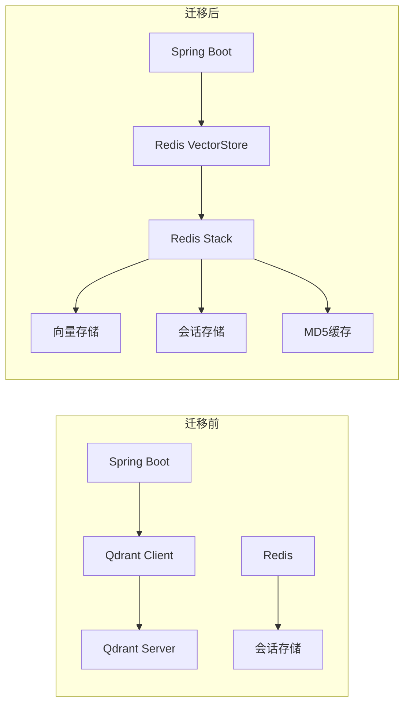
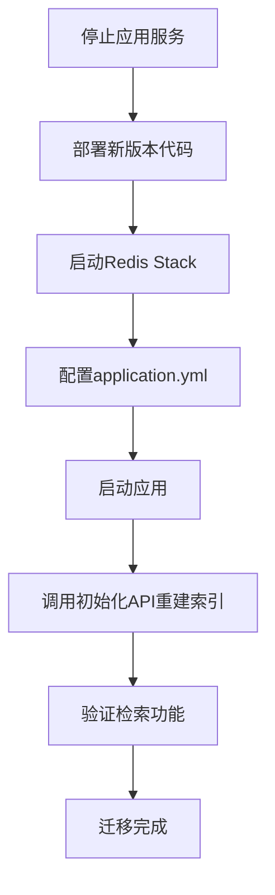

# Qdrant 到 Redis Stack 向量存储迁移文档

## 1. 迁移概述

本次迁移将项目的向量数据库从 Qdrant 重构为 Redis Stack 的向量存储方案。

### 1.1 迁移原因

| 对比项 | Qdrant | Redis Stack |
|--------|--------|-------------|
| 部署复杂度 | 需要独立部署服务 | 复用现有Redis实例 |
| 资源占用 | 独立进程，额外内存开销 | 与Redis共享资源 |
| 运维成本 | 需要额外监控和维护 | 统一Redis运维体系 |
| 低配服务器友好度 | 较低 | 较高（资源复用） |

### 1.2 架构变化



## 2. 代码变更清单

### 2.1 依赖变更 (pom.xml)

**移除的依赖：**
```xml
<!-- 已移除 -->
<dependency>
    <groupId>io.qdrant</groupId>
    <artifactId>client</artifactId>
    <version>1.9.1</version>
</dependency>
```

**新增的依赖：**
```xml
<dependency>
    <groupId>org.springframework.ai</groupId>
    <artifactId>spring-ai-starter-vector-store-redis</artifactId>
    <version>1.0.0</version>
</dependency>
```

### 2.2 配置类变更

| 文件 | 变更类型 | 说明 |
|------|----------|------|
| `QdrantConfig.java` | 删除 | 不再需要Qdrant客户端配置 |
| `VectorStoreConfig.java` | 重构 | 移除Qdrant相关代码，保留EmbeddingModel配置 |
| `RagConfig.java` | 更新 | 移除Qdrant特定配置项 |

## 3. 配置说明

### 3.1 application.yml 配置示例

```yaml
spring:
  ai:
    vectorstore:
      redis:
        initialize-schema: true
        index-name: campus-knowledge-index
        prefix: "rag:embedding:"
```

### 3.2 Redis Stack 要求

**Warning:** 必须使用支持以下模块的Redis版本：
- RediSearch (用于向量索引)
- RedisJSON (用于JSON文档存储)

**Docker部署示例：**
```bash
docker run -d --name redis-stack \
  -p 6379:6379 \
  -p 8001:8001 \
  redis/redis-stack:latest
```

## 4. 数据迁移指南

### 4.1 迁移步骤



### 4.2 重新索引

迁移后需要重新初始化知识库：

```bash
curl -X POST http://localhost:8080/api/rag/init \
  -H "Content-Type: application/json" \
  -d '{
    "sourcePath": "src/main/resources/rag-knowledge-base",
    "forceReindex": true
  }'
```

## 5. 性能对比

### 5.1 内存占用

| 组件 | Qdrant方案 | Redis Stack方案 |
|------|-----------|-----------------|
| 向量存储进程 | ~200MB+ | 0（复用Redis） |
| Redis进程 | ~50MB | ~100MB（含向量） |
| 总计 | ~250MB+ | ~100MB |

---

**文档版本:** 1.0  
**更新日期:** 2025-02-12
