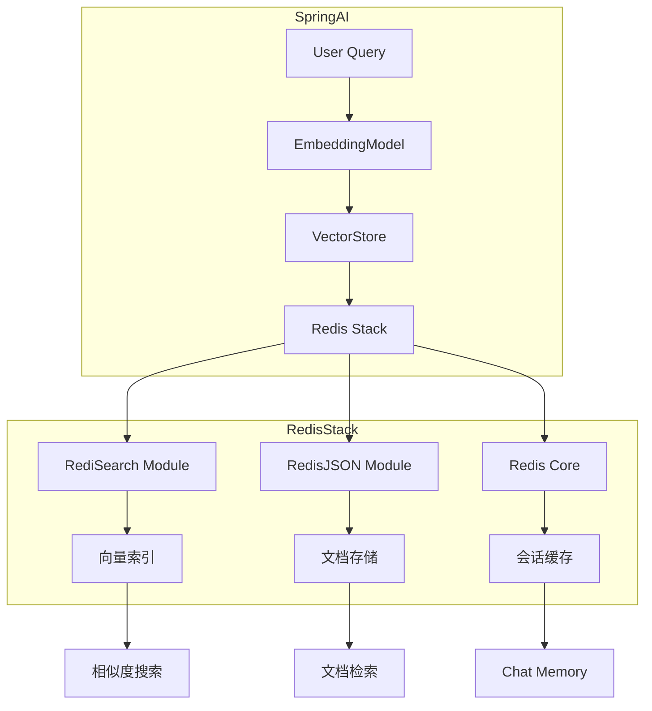

# Redis Stack 在 Spring AI 中的使用文档

## 1. 组件版本对照表

### 核心依赖版本矩阵

| 组件 | 版本 | 说明 |
|------|------|------|
| Java | 21 | 必须，Spring AI 要求 |
| Spring Boot | 3.3.5 | 来自你的 pom.xml |
| Spring AI | 1.0.0 | `spring-ai-bom` 管理 |
| Spring Data Redis | 随 Spring Boot | 基础 Redis 连接 |
| Jedis | 随 Spring Boot | Redis 客户端 |

### Redis Stack 版本要求

| Redis Stack 版本 | RediSearch 版本 | RedisJSON 版本 | 最低 Redis 要求 | 向量搜索支持 |
|------------------|-----------------|----------------|-----------------|-------------|
| 7.4.x (最新) | 2.8.x | 2.6.x | Redis 7.2+ | ✅ 完整 |
| 7.2.x | 2.6.x | 2.4.x | Redis 7.2+ | ✅ 完整 |
| 6.2.x | 2.4.x - 2.6.x | 2.0.x - 2.4.x | Redis 6.0+ | ✅ 支持 |
| < 6.2 | < 2.4 | < 2.0 | Redis 6.0+ | ⚠️ 部分支持 |

**推荐配置**：Redis Stack 7.2.x 或 7.4.x + RediSearch 2.6+ + RedisJSON 2.4+

### Embedding 模型维度对照

| 模型 | 向量维度 | 配置参数 |
|------|---------|---------|
| ecnu-embedding-small | 1024 | `embedding-dimensions: 1024` |
| text-embedding-ada-002 | 1536 | `embedding-dimensions: 1536` |
| text-embedding-3-small | 1536 | `embedding-dimensions: 1536` |
| text-embedding-3-large | 3072 | `embedding-dimensions: 3072` |

---

## 2. Docker 部署 Redis Stack

### 快速启动（推荐）

```bash
# 方式一：最新版本
docker run -d --name redis-stack \
  -p 6379:6379 \
  -p 8001:8001 \
  redis/redis-stack:latest

# 方式二：指定版本（稳定性更好）
docker run -d --name redis-stack \
  -p 6379:6379 \
  -p 8001:8001 \
  redis/redis-stack:7.2.0-v10
```

**端口说明**：

- `6379` - Redis 主端口
- `8001` - Redis Insight (Web 管理界面)

### 验证模块加载

```bash
# 连接 Redis
redis-cli

# 检查已加载的模块
MODULE LIST

# 应该看到 RediSearch 和 RedisJSON
# redisearch    # RediSearch 模块
# ReJSON        # RedisJSON 模块
```

---

## 3. Maven 依赖配置

### pom.xml 关键依赖

```xml
<!-- Spring AI BOM -->
<dependencyManagement>
    <dependencies>
        <dependency>
            <groupId>org.springframework.ai</groupId>
            <artifactId>spring-ai-bom</artifactId>
            <version>${spring-ai.version}</version>
            <type>pom</type>
            <scope>import</scope>
        </dependency>
    </dependencies>
</dependencyManagement>

<dependencies>
    <!-- Spring AI Redis Vector Store -->
    <dependency>
        <groupId>org.springframework.ai</groupId>
        <artifactId>spring-ai-starter-vector-store-redis</artifactId>
    </dependency>

    <!-- Spring Data Redis -->
    <dependency>
        <groupId>org.springframework.boot</groupId>
        <artifactId>spring-boot-starter-data-redis</artifactId>
    </dependency>

    <!-- Jedis 客户端 -->
    <dependency>
        <groupId>redis.clients</groupId>
        <artifactId>jedis</artifactId>
    </dependency>
</dependencies>
```

---

## 4. 核心配置

### application.yml 配置

```yaml
spring:
  # Redis 基础连接配置
  data:
    redis:
      host: ${REDIS_HOST:localhost}
      port: ${REDIS_PORT:6379}
      password: ${REDIS_PASSWORD:}
      database: 0
      timeout: 10000ms
      lettuce:
        pool:
          max-active: 8
          max-idle: 8
          min-idle: 0

  # Spring AI Vector Store 配置
  ai:
    vectorstore:
      redis:
        # 自动创建索引（首次添加数据时）
        initialize-schema: true
        # 索引名称
        index-name: campus-knowledge-index
        # Redis key 前缀
        prefix: "rag:embedding:"
```

### VectorStoreConfig.java 配置类

```java
@Configuration
public class VectorStoreConfig {

    @Value("${spring.ai.vectorstore.redis.index-name:spring-ai-index}")
    private String indexName;

    @Value("${spring.ai.vectorstore.redis.prefix:embedding:}")
    private String prefix;

    @Value("${spring.data.redis.host:localhost}")
    private String redisHost;

    @Value("${spring.data.redis.port:6379}")
    private int redisPort;

    @Bean
    public JedisPooled jedisPooled() {
        return new JedisPooled(redisHost, redisPort);
    }

    @Bean
    public VectorStore vectorStore(EmbeddingModel embeddingModel, JedisPooled jedis) {
        return RedisVectorStore.builder(jedis, embeddingModel)
                .indexName(indexName)
                .prefix(prefix)
                .initializeSchema(true)  // 自动创建索引
                .build();
    }
}
```

---

## 5. RedisVectorStore 高级配置选项

```java
RedisVectorStore vectorStore = RedisVectorStore.builder(jedisPooled, embeddingModel)
    .indexName("custom-index")                    // 索引名
    .prefix("custom-prefix:")                     // key 前缀
    .contentFieldName("content")                  // 内容字段
    .embeddingFieldName("embedding")              // 向量字段
    .vectorAlgorithm(Algorithm.HNSW)              // HNSW 或 FLAT
    .distanceMetric(DistanceMetric.COSINE)        // COSINE / L2 / IP
    .hnswM(16)                                    // HNSW M 参数
    .hnswEfConstruction(200)                      // HNSW 构建参数
    .hnswEfRuntime(10)                            // HNSW 搜索参数
    .textScorer(TextScorer.BM25)                 // BM25 评分
    .metadataFields(                              // 元数据字段
        MetadataField.tag("category"),
        MetadataField.numeric("year"),
        MetadataField.text("description")
    )
    .initializeSchema(true)
    .build();
```

### 向量算法对比

| 算法 | 适用场景 | 精度 | 内存占用 | 搜索速度 |
|------|---------|------|---------|---------|
| **HNSW** | 大规模向量 (百万级+) | 高 | 较高 | 快 |
| **FLAT** | 小规模向量 (<10万) | 最高 | 低 | 慢 |

### 距离度量对比

| 度量方式 | 适用场景 |
|---------|---------|
| **COSINE** (余弦相似度) | 推荐使用，文本嵌入 |
| **L2** (欧氏距离) | 图像/特征向量 |
| **IP** (内积) | 已标准化的向量 |

---

## 6. Redis Chat Memory 配置

### RedisMemoryConfig.java

```java
@Configuration
public class RedisMemoryConfig {

    @Bean
    @Primary
    public ChatMemory chatMemory(StringRedisTemplate redisTemplate, ObjectMapper objectMapper) {
        return new RedisChatMemory(redisTemplate, objectMapper);
    }
}
```

### RedisChatMemory 核心实现

```java
@Component
public class RedisChatMemory implements ChatMemory {

    private final StringRedisTemplate redisTemplate;
    private static final Duration EXPIRATION = Duration.ofDays(7);
    private static final String KEY_PREFIX = "chat:memory:";
    private static final int MAX_MESSAGE_PAIRS = 20;

    @Override
    public void add(String conversationId, List<Message> messages) {
        String key = KEY_PREFIX + conversationId;
        // ... 滑动窗口策略保存消息
    }

    @Override
    public List<Message> get(String conversationId) {
        String key = KEY_PREFIX + conversationId;
        // ... 从 Redis 获取消息历史
    }
}
```

### 配置参数

```yaml
ai:
  chat:
    memory:
      ttl: 168  # 7天过期（小时）
```

---

## 7. 架构流程图



---

## 8. 常见问题排查

### 问题 1：向量维度不匹配

```
Error: ERR unsupported module command
```

**原因**：Embedding 模型输出维度与 Redis 索引维度不一致

**解决**：

```java
// 测试实际输出维度
float[] embedding = embeddingModel.embed("测试文本");
logger.info("实际维度: {}", embedding.length);

// 删除旧索引重建
jedis.ftDropIndex("campus-knowledge-index");
```

### 问题 2：索引不存在

```
Error: No such index
```

**原因**：`initialize-schema` 未设置为 `true` 或索引未正确创建

**解决**：

```java
// 手动触发索引创建
@EventListener(ApplicationReadyEvent.class)
public void ensureIndexExists() {
    // 插入并删除测试文档触发索引创建
    Document testDoc = new Document("__init_test__", "test");
    vectorStore.add(List.of(testDoc));
    vectorStore.delete(List.of(testDoc.getId()));
}
```

### 问题 3：RediSearch 模块未加载

```bash
# 检查模块
redis-cli MODULE LIST

# 如果没有 redisearch，手动加载
redis-cli MODULE LOAD /usr/lib/redis/modules/redisearch.so
```

---

## 9. 快速复现清单

- [ ] Docker 部署 Redis Stack（推荐 7.2.x-v10）
- [ ] 确认 RediSearch 和 RedisJSON 模块已加载
- [ ] Java 21 + Maven 配置
- [ ] pom.xml 添加 Spring AI Redis 依赖
- [ ] application.yml 配置 Redis 连接
- [ ] 配置 VectorStoreConfig.java
- [ ] 测试向量存储功能

---

## 10. 相关资源

- [Spring AI Redis Vector Store 官方文档](https://github.com/spring-projects/spring-ai/tree/main/vector-stores/spring-ai-redis-store)
- [Redis Stack 官方下载](https://redis.io/download/redis-stack/)
- [RediSearch 文档](https://redis.io/docs/stack/search/)

---

**前置知识路径**：

1. Redis 基础 → 2. Spring Data Redis → 3. Spring AI 概览 → 4. Redis Vector Store
