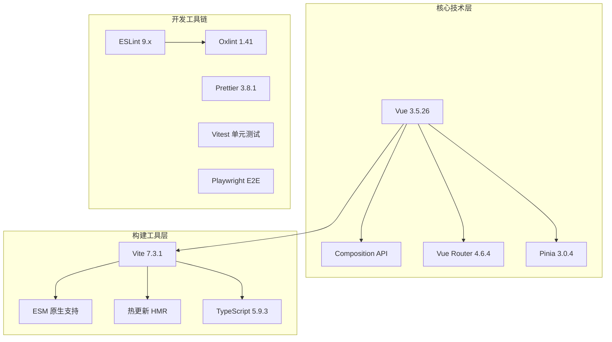
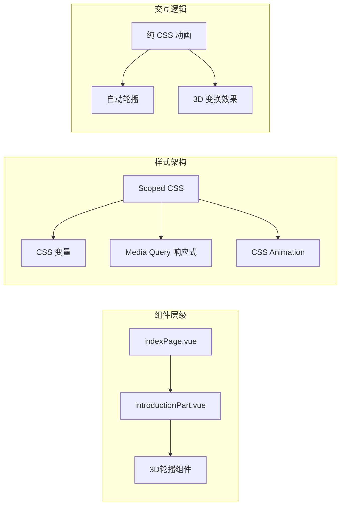
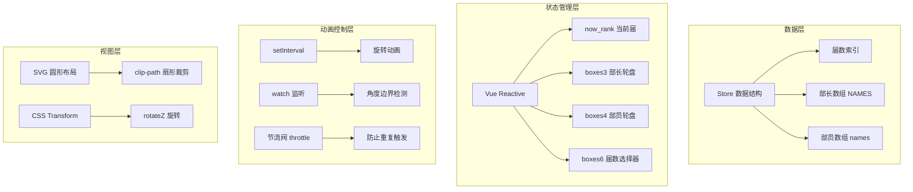
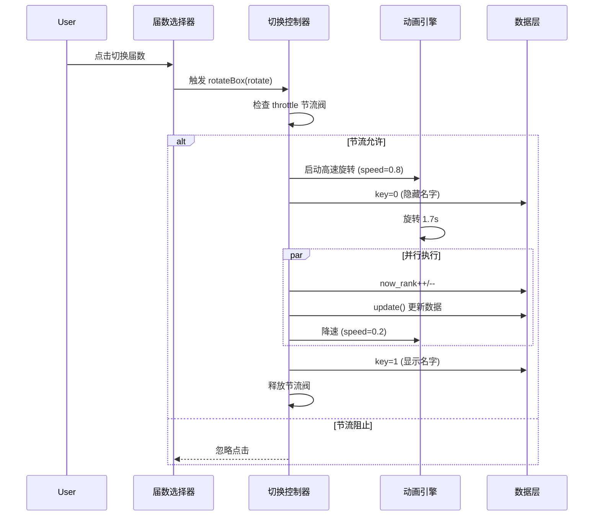
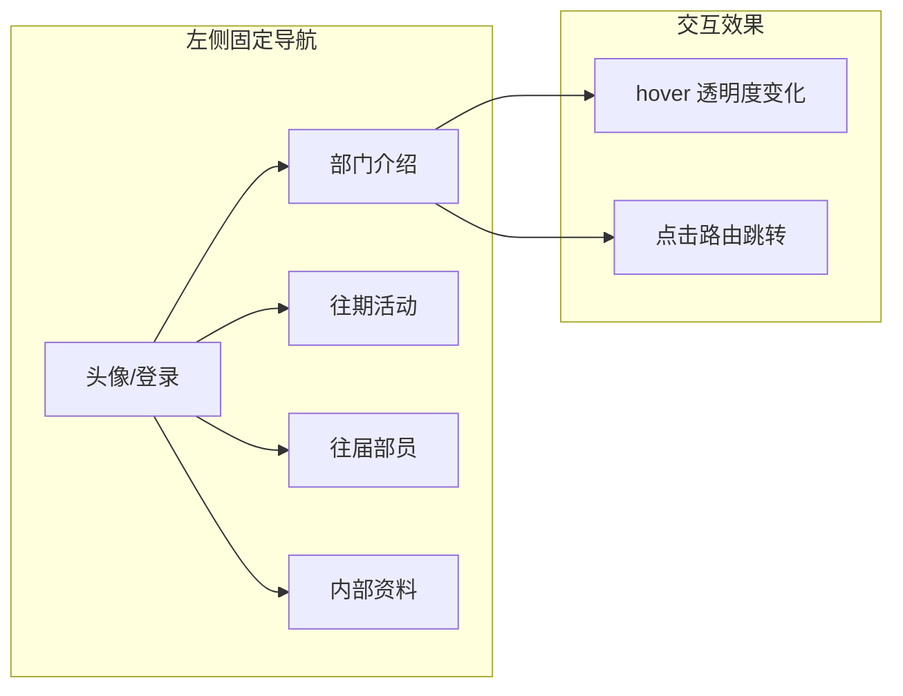
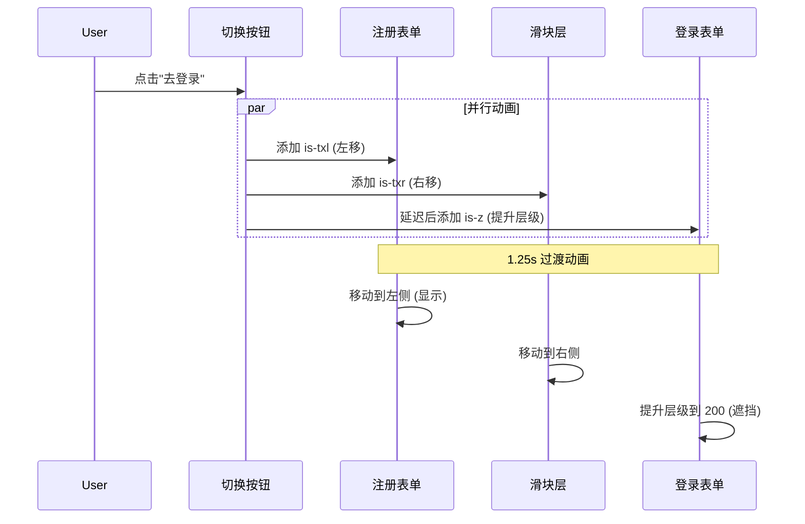

# 人力资源中心官网 - 部门介绍、往届成员与登录注册实现方案系统性总结

## 一、项目概述

### 1.1 项目背景
本项目为**软件工程学院人力资源中心**官方展示网站，采用 Vue 3 + Vite 技术栈构建，旨在展示部门职能、活动介绍、往届成员信息等内容。

### 1.2 技术栈选型



### 1.3 项目结构

```
src/
├── components/
│   ├── index/
│   │   ├── indexPage.vue          # 主页面布局容器
│   │   ├── navigationBar.vue      # 左侧导航栏
│   │   ├── introductionPart.vue   # 部门介绍模块
│   │   ├── member/
│   │   │   └── memberPart.vue     # 往届成员模块
│   │   ├── acitivity/
│   │   │   └── activityPart.vue   # 往期活动模块
│   │   ├── materials/
│   │   │   └── studyMaterials.vue # 内部资料模块
│   │   └── personal/
│   │       └── personalData.vue   # 个人中心模块
│   └── login/
│       └── loginPage.vue          # 登录页面
├── router/
│   └── index.ts                   # 路由配置
├── stores/
│   └── counter.ts                 # Pinia 状态管理
├── pictures/                      # 静态图片资源
│   ├── introduction/              # 部门介绍图片
│   ├── member/                    # 成员模块图片
│   ├── activity/                  # 活动封面图片
│   └── navigation/                # 导航栏图标
├── assets/                        # 全局样式
└── App.vue                        # 根组件
```

---

## 二、部门介绍模块 (introductionPart.vue)

### 2.1 功能需求分析

| 需求项 | 描述 | 优先级 |
|--------|------|--------|
| 部门简介展示 | 文字描述部门职能与工作内容 | 高 |
| 部门活动介绍 | 分类展示企业参观、定向越野、技能培训三大活动 | 高 |
| 日常展示 | 轮播图展示部门日常活动照片 | 中 |
| 响应式适配 | 支持移动端、平板、桌面端 | 中 |

### 2.2 技术架构设计



### 2.3 UI/UX 设计方案

#### 2.3.1 视觉设计规范

| 设计元素 | 实现方案 | 代码示例 |
|----------|----------|----------|
| 主色调 | 橙色渐变 `#fad312` → `#ff7e5f` | `background: linear-gradient(to top, #fad312, #ff7e5f)` |
| 强调色 | 深蓝色 `#001EF7` | 章节标题背景 |
| 文字描边 | `text-shadow` 模拟 | 多方向阴影实现黑色描边 |
| 卡片边框 | 双层边框效果 | `box-shadow` + `border` |

#### 2.3.2 布局结构

```
┌─────────────────────────────────────┐
│         人力资源中心 (主标题)          │
├─────────────────────────────────────┤
│  [部门简介]                          │
│  ┌───────────────────────────────┐  │
│  │  文字内容区域，带橙色高亮强调   │  │
│  └───────────────────────────────┘  │
├─────────────────────────────────────┤
│  [部门活动]                          │
│  ┌───────────────────────────────┐  │
│  │  01 企业参观活动 >>            │  │
│  │  文字描述...                   │  │
│  │  02 定向越野活动 >>            │  │
│  │  文字描述...                   │  │
│  │  03 技能培训沙龙 >>            │  │
│  │  文字描述...                   │  │
│  └───────────────────────────────┘  │
├─────────────────────────────────────┤
│  [我们的日常]                        │
│  ┌───────────────────────────────┐  │
│  │  文字描述 + 3D轮播图           │  │
│  │       [3D Carousel]           │  │
│  └───────────────────────────────┘  │
└─────────────────────────────────────┘
```

### 2.4 核心功能实现

#### 2.4.1 3D 旋转轮播图

**技术原理**：利用 CSS3 `transform-style: preserve-3d` 和 `perspective` 实现 3D 空间效果

```css
/* 3D 场景容器 */
.shell {
    perspective: 1000px;          /* 透视距离 */
    transform-style: preserve-3d; /* 保持3D变换 */
}

/* 旋转内容容器 */
.Content {
    transform-style: preserve-3d;
    transform: translateZ(-35vw) rotateY(0);
    animation: carousel 18s infinite cubic-bezier(0.77, 0, 0.175, 1);
}

/* 单个轮播项 - 六边形分布 */
.item:nth-child(1) { transform: rotateY(0) translateZ(35vw); }
.item:nth-child(2) { transform: rotateY(60deg) translateZ(35vw); }
.item:nth-child(3) { transform: rotateY(120deg) translateZ(35vw); }
.item:nth-child(4) { transform: rotateY(180deg) translateZ(35vw); }
.item:nth-child(5) { transform: rotateY(240deg) translateZ(35vw); }
.item:nth-child(6) { transform: rotateY(300deg) translateZ(35vw); }
```

**关键参数说明**：

| 参数 | 值 | 作用 |
|------|-----|------|
| `perspective` | 1000px | 设置观察者与 z=0 平面的距离 |
| `translateZ` | -35vw / 35vw | 控制旋转半径 |
| `rotateY` | 60° 增量 | 六边形分布，360°/6=60° |
| 动画周期 | 18s | 每3秒切换一张图片 |

#### 2.4.2 文字描边效果

```css
/* 主标题多层阴影描边 */
.main-title {
    text-shadow:
        -2px -2px 0 #f8651b,   /* 左上 */
        2px -2px 0 #f8651b,    /* 右上 */
        -2px 2px 0 #f8651b,    /* 左下 */
        2px 2px 0 #f8651b,     /* 右下 */
        5px 5px 0 #ff6505;     /* 橙色偏移阴影 */
}

/* Webkit 文字描边（现代浏览器） */
.NAME {
    -webkit-text-stroke: 1px rgb(177, 177, 177);
}
```

### 2.5 响应式设计

```css
/* 平板适配 */
@media (max-width: 768px) {
    .right {
        width: calc(75% - 60px);
        left: calc(25% + 30px);
        padding: 20px;
    }
    .main-title { font-size: 1.8rem; }
    .content { font-size: 0.9rem; }
}

/* 手机适配 */
@media (max-width: 480px) {
    .right {
        width: calc(70% - 40px);
        left: calc(30% + 20px);
        padding: 15px;
    }
    .main-title { font-size: 1.5rem; }
    .section-title { font-size: 1.1rem; }
}
```

### 2.6 优缺点分析

| 优点 | 缺点 | 改进建议 |
|------|------|----------|
| 纯 CSS 3D 轮播，性能优异 | 图片数量固定为6张，扩展性差 | 使用动态渲染，支持任意数量图片 |
| 视觉效果丰富，视觉冲击力强 | 移动端 3D 效果可能卡顿 | 移动端降级为 2D 轮播 |
| 响应式适配完善 | 图片路径硬编码 | 使用配置化数据管理 |
| 无需 JavaScript 参与动画 | 不支持用户交互控制 | 添加暂停、手动切换功能 |

---

## 三、往届成员模块 (memberPart.vue)

### 3.1 功能需求分析

| 需求项 | 描述 | 实现复杂度 |
|--------|------|------------|
| 届数切换 | 支持多届成员数据切换（21-25届） | 高 |
| 部长展示 | 圆形轮盘展示部长名单 | 高 |
| 部员展示 | 外圈轮盘展示部员名单 | 高 |
| 旋转动画 | 平滑的旋转切换动画效果 | 高 |
| 节流控制 | 防止快速点击导致动画混乱 | 中 |

### 3.2 技术架构设计



### 3.3 数据结构设计

```typescript
// 成员数据结构
interface MemberData {
    NAMES: string[]  // 部长名单（大写表示重要性）
    names: string[]  // 部员名单
}

// Store 数据存储
const Store = ref({
    '25': {
        NAMES: ['胡淙煜', '杨智杰', '张祥瑞', '黎菲', '唐梓毓'],
        names: ['刘馨屿', '王思棠', '韩钰柯', '任剑卿', '梅子涵', 
                '许诺', '张皓', '刘奕翔', '李珉轩', '陈鲁宇', '高嘉铭']
    },
    '24': {
        NAMES: ['顾翌炜', '陆尚辰', '戴琪洋', '季凡景'],
        names: ['王梓涵', '黎菲', '傅佳琳', '唐梓毓', '蒋威博',
                '胡淙煜', '周劲松', '杨智杰', '徐晨凯', '张祥瑞']
    }
    // ... 其他届数
})

// 轮盘项数据结构
interface BoxItem {
    id: number
    name: string
    rotate: number  // 当前旋转角度
}
```

### 3.4 核心算法实现

#### 3.4.1 轮盘角度计算算法

```typescript
// 部长轮盘：根据人数计算角度分布
const initMinisterBoxes = (count: number) => {
    return Array.from({ length: count }, (_, i) => ({
        id: i + 1,
        name: '',
        rotate: -i * 45 + 90  // 45° 间隔，起始偏移90°
    }))
}

// 部员轮盘：更密集的分布
const initMemberBoxes = (count: number) => {
    return Array.from({ length: count }, (_, i) => ({
        id: i + 1,
        name: '',
        rotate: -i * 15 + 90  // 15° 间隔
    }))
}
```

#### 3.4.2 边界检测与循环算法

```typescript
// 监听角度变化，实现无限循环滚动
boxes3.value.forEach((box) => {
    watch(
        () => box.rotate,
        (newRotate, oldRotate) => {
            // 检测是否越过显示边界（91°）
            if (newRotate > 91 && oldRotate <= 91) {
                // 快速跳转到下一轮起始位置
                box.rotate += 45 * (8 - NAMES.value.length)
                if (key.value === 0) box.name = ''
            } 
            // 360° 归一化
            else if (newRotate === 360) {
                box.rotate = 0
            }
            // 进入显示区域（269°-360°），显示名字
            else if (newRotate % 360 > 269 && oldRotate % 360 <= 269) {
                if (key.value === 1) {
                    box.name = NAMES.value[box.id - 1]
                }
            }
        }
    )
})
```

**算法原理图解**：

```
                    0°/360°
                      │
                      ▼
            ┌─────────────────┐
           ╱    显示区域      ╲
          ╱   (269°-360°)      ╲
         ╱    名字可见          ╲
270° ───┤                         ├── 90°
        │      圆心              │
        │        ●               │
         ╲    隐藏区域          ╱
          ╲   (0°-269°)        ╱
           ╲   名字隐藏       ╱
            └─────────────────┘
                      │
                    180°
```

#### 3.4.3 届数切换动画流程



### 3.5 UI/UX 设计方案

#### 3.5.1 视觉层次结构

```
┌─────────────────────────────────────────────────────────────┐
│                                                             │
│    ┌─────────────────────────────────────────────────┐     │
│    │              部长轮盘 (内圈)                      │     │
│    │         45°间隔，蓝色描边文字                      │     │
│    │              ┌───┐                              │     │
│    │         ─────┤ ● ├───── 中心点                   │     │
│    │              └───┘                              │     │
│    └─────────────────────────────────────────────────┘     │
│         ┌─────────────────────────────────────────┐         │
│         │           部员轮盘 (外圈)                │         │
│         │      15°间隔，灰色描边文字               │         │
│         └─────────────────────────────────────────┘         │
│                                                             │
│    ┌─────────────────────────────────────────────────┐     │
│    │  届数选择器 (右下角)                             │     │
│    │  [21] [22] [23] [24] [25]                       │     │
│    │       ↑ 当前选中                                 │     │
│    └─────────────────────────────────────────────────┘     │
│                                                             │
└─────────────────────────────────────────────────────────────┘
```

#### 3.5.2 关键 CSS 技术

```css
/* 扇形裁剪 - 只显示下半圆 */
.clip-half {
    clip-path: polygon(
        50% 50%,    /* 中心点 */
        50% 0%,     /* 上中 */
        0% 0%,      /* 左上 */
        0% 100%,    /* 左下 */
        50% 100%    /* 下中 */
    );
}

/* 旋转定位 - 以圆心为变换原点 */
.rotate-item {
    position: absolute;
    left: 200px;                    /* 半径距离 */
    transform-origin: -200px 50%;   /* 圆心位置 */
    transform: rotateZ(45deg);      /* 旋转角度 */
}

/* 文字反向旋转保持水平 */
.text-level {
    transform: translate(0, -50%) rotateZ(-45deg);
}
```

### 3.6 性能优化措施

| 优化点 | 实现方案 | 效果 |
|--------|----------|------|
| 节流控制 | 1.5s 节流阀防止频繁切换 | 避免动画堆积 |
| 虚拟显示 | 只渲染可见范围内的届数选项 | 减少 DOM 节点 |
| 硬件加速 | 使用 `transform` 代替 `top/left` | 触发 GPU 加速 |
| 动画降速 | 1.5s 后从 0.8 降至 0.2 | 先快后慢，视觉舒适 |
| 计算属性缓存 | `visibleBoxes` 缓存过滤结果 | 减少重复计算 |

### 3.7 实现难点与解决方案

#### 难点 1：无限循环滚动的无缝衔接

**问题**：轮盘旋转时，名字需要在特定角度显示/隐藏，且需要无限循环

**解决方案**：
```typescript
// 使用 watch 监听角度变化
watch(() => box.rotate, (newVal, oldVal) => {
    // 当元素旋转到下方（>91°），快速跳回上方
    if (newVal > 91 && oldVal <= 91) {
        box.rotate += 45 * (8 - NAMES.value.length)
    }
    // 360° 归一化，防止数值溢出
    if (newVal >= 360) box.rotate -= 360
})
```

#### 难点 2：不同人数的自适应布局

**问题**：每届部长/部员人数不同，需要自适应角度间隔

**解决方案**：
```typescript
// 动态计算角度间隔
const angleStep = 360 / count
boxes.value = Array.from({ length: count }, (_, i) => ({
    rotate: -i * angleStep + 90
}))
```

#### 难点 3：切换时的状态同步

**问题**：切换届数时，新旧数据需要平滑过渡

**解决方案**：
```typescript
// 三阶段切换策略
const switchRank = (direction: number) => {
    // 阶段1：高速旋转 + 隐藏名字
    key.value = 0
    speed.value = 0.8
    
    // 阶段2：更新数据
    setTimeout(() => update(), 1200)
    
    // 阶段3：降速 + 显示名字
    setTimeout(() => {
        speed.value = 0.2
        key.value = 1
    }, 1700)
}
```

### 3.8 优缺点分析

| 优点 | 缺点 | 改进建议 |
|------|------|----------|
| 视觉效果独特，辨识度高 | 数据硬编码，维护困难 | 接入后端 API 动态获取 |
| 动画流畅，交互反馈明确 | 不支持搜索和筛选 | 添加搜索框和筛选条件 |
| 纯前端实现，无后端依赖 | 首次加载所有数据 | 实现懒加载和分页 |
| 响应式设计完善 | 移动端操作不便 | 添加触摸滑动支持 |
| 节流控制防止误操作 | 无法展示成员详情 | 添加点击弹窗显示详情 |

---

## 四、路由与导航设计

### 4.1 路由配置

```typescript
// router/index.ts
const router = createRouter({
    history: createWebHistory(import.meta.env.BASE_URL),
    routes: [
        {
            path: '/',
            redirect: '/introduction',  // 默认重定向到部门介绍
            component: indexPage,
            children: [
                { path: '/introduction', component: introductionPart },
                { path: '/member', component: member },
                { path: '/personal', component: personalData },
                { path: '/materials', component: studyMaterials },
                { path: '/activity', component: activityPart }
            ]
        },
        { path: '/login', component: loginPage }
    ]
})
```

### 4.2 导航栏设计



### 4.3 页面切换动画

```css
/* 淡入淡出效果 */
.fade-enter-active,
.fade-leave-active {
    transition: opacity 1s ease;
}

.fade-enter-from,
.fade-leave-to {
    opacity: 0;
}
```

---

## 五、代码组织与规范

### 5.1 组件命名规范

| 类型 | 命名规范 | 示例 |
|------|----------|------|
| 页面组件 | `*Page.vue` | `indexPage.vue`, `loginPage.vue` |
| 功能模块 | `*Part.vue` | `introductionPart.vue`, `activityPart.vue` |
| 子组件 | 语义化命名 | `navigationBar.vue`, `memberPart.vue` |

### 5.2 样式组织策略

```vue
<style scoped>
/* 1. 布局样式 */
.container { ... }

/* 2. 组件样式 */
.box1, .box2 { ... }

/* 3. 动画定义 */
@keyframes scaleUp { ... }

/* 4. 响应式（放最后） */
@media (max-width: 768px) { ... }
</style>
```

### 5.3 状态管理策略

```typescript
// 组件级状态 - 使用 ref/reactive
const now_rank = ref(25)
const boxes3 = ref<BoxItem[]>([])

// 应用级状态 - 使用 Pinia（预留扩展）
// stores/member.ts
export const useMemberStore = defineStore('member', {
    state: () => ({
        currentRank: 25,
        memberData: {}
    }),
    actions: {
        async fetchMemberData(rank: number) { ... }
    }
})
```

---

## 六、性能与兼容性

### 6.1 性能指标

| 指标 | 当前状态 | 优化目标 |
|------|----------|----------|
| 首屏加载 | 依赖静态资源 | 启用 CDN + 懒加载 |
| 动画帧率 | 60fps (CSS动画) | 保持 60fps |
| 内存占用 | 无内存泄漏 | 组件卸载清理定时器 |
| 打包体积 | 待分析 | 代码分割 + 压缩 |

### 6.2 浏览器兼容性

| 特性 | 支持情况 | 降级方案 |
|------|----------|----------|
| CSS3 3D Transform | IE11+ | 2D 降级 |
| clip-path | IE 不支持 | 使用 border-radius |
| Web Animations API | 现代浏览器 | CSS Animation 兜底 |

### 6.3 优化建议

1. **图片优化**
   - 使用 WebP 格式
   - 实现图片懒加载
   - 添加占位符防止布局抖动

2. **代码分割**
   ```typescript
   // 路由懒加载
   const introductionPart = () => import('@/components/index/introductionPart.vue')
   ```

3. **缓存策略**
   - 静态资源长期缓存
   - API 数据本地缓存

---

## 七、总结与展望

### 7.1 技术亮点

1. **纯 CSS 3D 轮播**：无需 JavaScript，性能优异
2. **复杂动画状态管理**：watch + 节流阀实现精细控制
3. **响应式布局完善**：三端适配，体验一致
4. **组件化架构清晰**：职责分离，易于维护

### 7.2 待改进项

| 优先级 | 改进项 | 技术方案 |
|--------|--------|----------|
| 高 | 数据接口化 | 接入后端 API，替换硬编码 |
| 高 | 图片优化 | CDN + WebP + 懒加载 |
| 中 | 成员详情弹窗 | 点击显示详细信息 |
| 中 | 搜索筛选 | 添加成员搜索功能 |
| 低 | 触摸交互 | 移动端手势支持 |

### 7.3 架构演进方向


---

## 八、登录注册动态切换方案 (loginPage.vue)

### 8.1 功能需求分析

| 需求项 | 描述 | 实现复杂度 |
|--------|------|------------|
| 双表单切换 | 登录/注册表单平滑切换 | 高 |
| 滑块动画 | 装饰性滑块跟随切换移动 | 高 |
| 视觉层次 | 3D 纵深感的空间布局 | 中 |
| 返回导航 | 支持返回上一页 | 低 |
| 表单验证 | 基础必填校验 | 低 |

### 8.2 技术架构设计

```mermaid
flowchart TB
    subgraph 视图层
        A[登录表单 b-container] --> C[表单容器]
        B[注册表单 a-container] --> C
        D[切换滑块 switch] --> C
    end
    
    subgraph 状态管理层
        E[CSS Class 切换] --> F[is-txr 滑块右移]
        E --> G[is-txl 表单左移]
        E --> H[is-z 层级提升]
        E --> I[is-hidden 显隐控制]
    end
    
    subgraph 动画控制层
        J[transition 1.25s] --> K[平滑过渡]
        L[@keyframes is-gx] --> M[滑块宽度弹性动画]
    end
```

### 8.3 布局结构图解

```
初始状态（显示登录）：
┌─────────────────────────────────────────────────────────────┐
│                                                             │
│   ┌─────────────────────┐   ┌─────────────────────────┐    │
│   │                     │   │    欢迎回来！            │    │
│   │   登录账号           │   │    已经有账号了喵~       │    │
│   │   ┌─────────────┐   │   │    快去登录吧！          │    │
│   │   │  用户名      │   │   │                         │    │
│   │   └─────────────┘   │   │   [  去 登 录  ]         │    │
│   │   ┌─────────────┐   │   │                         │    │
│   │   │  密码        │   │   └─────────────────────────┘    │
│   │   └─────────────┘   │            ↑ switch (滑块层)      │
│   │   忘记密码？        │   ┌─────────────────────────┐      │
│   │                     │   │    你好，新伙伴！        │      │
│   │   [  登 录  ]       │   │    (隐藏状态)            │      │
│   │                     │   └─────────────────────────┘      │
│   └─────────────────────┘                                   │
│    b-container (z-index: 0)                                 │
│                                                             │
└─────────────────────────────────────────────────────────────┘

切换后状态（显示注册）：
┌─────────────────────────────────────────────────────────────┐
│                                                             │
│   ┌─────────────────────┐   ┌─────────────────────────┐    │
│   │    你好，新伙伴！    │   │                         │    │
│   │    还没有账号？      │   │   创建账号              │    │
│   │    去注册一个吧！    │   │   ┌─────────────┐       │    │
│   │                     │   │   │  用户名      │       │    │
│   │   [  去 注 册  ]    │   │   └─────────────┘       │    │
│   │                     │   │   ┌─────────────┐       │    │
│   └─────────────────────┘   │   │  密码        │       │    │
│            ↑ switch (滑块)   │   └─────────────┘       │    │
│   ┌─────────────────────┐   │   ┌─────────────┐       │    │
│   │    欢迎回来！        │   │   │  确认密码    │       │    │
│   │    (隐藏状态)        │   │   └─────────────┘       │    │
│   └─────────────────────┘   │   ┌─────────────┐       │    │
│                             │   │  姓名        │       │    │
│                             │   └─────────────┘       │    │
│                             │   ┌─────────────┐       │    │
│                             │   │  身份        │       │    │
│                             │   └─────────────┘       │    │
│                             │   ┌─────────────┐       │    │
│                             │   │  激活码      │       │    │
│                             │   └─────────────┘       │    │
│                             │                         │    │
│                             │   [  注 册  ]           │    │
│                             │                         │    │
│                             └─────────────────────────┘    │
│                              a-container (z-index: 200)    │
│                                                             │
└─────────────────────────────────────────────────────────────┘
```

### 8.4 核心实现机制

#### 8.4.1 三层 z-index 架构

```css
/* 层级定义 */
.a-container, .b-container { z-index: 100; }  /* 表单层 */
.b-container { z-index: 0; }                   /* 登录默认底层 */
.switch { z-index: 200; }                      /* 滑块最上层 */

/* 切换时动态调整 */
.is-z { z-index: 200; }  /* 当前激活表单提升层级 */
```

**层级切换原理**：
```
登录状态：
┌─────────────┐
│   switch    │  z:200  ← 最上层（滑块）
├─────────────┤
│  b-container│  z:0    ← 登录表单（可见）
├─────────────┤
│  a-container│  z:100  ← 注册表单（被滑块遮挡）
└─────────────┘

注册状态：
┌─────────────┐
│   switch    │  z:200  ← 最上层（滑块右移）
├─────────────┤
│  a-container│  z:200  ← 注册表单提升（可见）
├─────────────┤
│  b-container│  z:0    ← 登录表单（被滑块遮挡）
└─────────────┘
```

#### 8.4.2 位移动画实现

```css
/* 滑块右移 - 从左侧移动到右侧 */
.is-txr {
    left: calc(100% - 400px);  /* 400px 为滑块宽度 */
    transition: 1.25s;
    transform-origin: left;
}

/* 表单左移 - 从右侧移动到左侧 */
.is-txl {
    left: 0;
    transition: 1.25s;
    transform-origin: right;
}
```

**动画时序图**：


#### 8.4.3 弹性宽度动画

```css
/* 滑块切换时的弹性效果 */
.is-gx {
    animation: is-gx 1.25s;
}

@keyframes is-gx {
    0%, 10%, 100% { width: 400px; }   /* 起始/结束宽度 */
    30%, 50% { width: 500px; }        /* 中间拉伸 100px */
}
```

**效果说明**：滑块移动过程中先拉伸后收缩，模拟弹性物理效果，增强视觉动感。

### 8.5 状态切换逻辑

```typescript
// 切换表单核心函数
const changeForm = (e: Event) => {
    // 1. 添加弹性动画类
    switchCtn.classList.add('is-gx')
    setTimeout(() => {
        switchCtn.classList.remove('is-gx')
    }, 1500)

    // 2. 滑块位置切换
    switchCtn.classList.toggle('is-txr')
    
    // 3. 装饰圆圈跟随移动
    switchCircle[0].classList.toggle('is-txr')
    switchCircle[1].classList.toggle('is-txr')
    
    // 4. 提示文字显隐切换
    switchC1.classList.toggle('is-hidden')  // 欢迎回来
    switchC2.classList.toggle('is-hidden')  // 你好新伙伴
    
    // 5. 表单位置切换
    aContainer.classList.toggle('is-txl')   // 注册表单左移
    bContainer.classList.toggle('is-txl')   // 登录表单左移
    
    // 6. 层级切换（关键！）
    bContainer.classList.toggle('is-z')     // 登录提升/降低层级
}
```

### 8.6 视觉设计细节

#### 8.6.1 新拟态风格 (Neumorphism)

```css
/* 凸起效果 - 按钮/输入框 */
.form_input {
    background-color: #ecf0f3;
    box-shadow: 
        inset 2px 2px 4px #d1d9e6,    /* 内阴影 - 凹陷感 */
        inset -2px -2px 4px #f9f9f9;  /* 内高光 */
}

/* 聚焦状态 - 加深凹陷 */
.form_input:focus {
    box-shadow: 
        inset 4px 4px 4px #d1d9e6,
        inset -4px -4px 4px #f9f9f9;
}

/* 按钮 - 凸起效果 */
.button {
    background: linear-gradient(135deg, #ff7e5f 0%, #feb47b 100%);
    box-shadow: 
        8px 8px 16px #d1d9e6,    /* 外阴影 */
        -8px -8px 16px #f9f9f9;  /* 外高光 */
}

/* 悬停 - 轻微下沉 */
.button:hover {
    box-shadow: 
        6px 6px 10px #d1d9e6,
        -6px -6px 10px #f9f9f9;
    transform: scale(0.985);
}

/* 点击 - 深度下沉 */
.button:active {
    box-shadow: 
        2px 2px 6px #d1d9e6,
        -2px -2px 6px #f9f9f9;
    transform: scale(0.97);
}
```

#### 8.6.2 装饰性圆圈

```css
/* 底部大圆 - 营造空间感 */
.switch_circle {
    position: absolute;
    width: 500px;
    height: 500px;
    border-radius: 50%;
    background-color: #ecf0f3;
    box-shadow: 
        inset 8px 8px 12px #b8bec7,    /* 内阴影 */
        inset -8px -8px 12px #fff;     /* 内高光 */
    bottom: -60%;  /* 大部分在可视区域外 */
    left: -60%;
    transition: 1.25s;
}

/* 顶部小圆 - 平衡视觉 */
.switch_circle-t {
    top: -30%;
    left: 60%;
    width: 300px;
    height: 300px;
}
```

### 8.7 响应式适配

```css
/* 等比缩放策略 - 保持布局不变 */
@media (max-width: 1200px) {
    .shell { transform: scale(0.7); }
}
@media (max-width: 1000px) {
    .shell { transform: scale(0.6); }
}
@media (max-width: 800px) {
    .shell { transform: scale(0.5); }
}
@media (max-width: 600px) {
    .shell { transform: scale(0.4); }
}
```

**适配策略分析**：
- **优点**：保持设计完整性，无需重构布局
- **缺点**：小屏幕文字可读性下降
- **改进建议**：小屏幕切换为上下布局

### 8.8 代码组织特点

| 特点 | 实现方式 | 评价 |
|------|----------|------|
| DOM 操作 | `querySelector` + 原生事件 | 非 Vue 惯用法，但实现简单 |
| 状态管理 | CSS Class 切换 | 纯 CSS 驱动，性能优异 |
| 事件绑定 | 生命周期手动绑定/解绑 | 防止内存泄漏 |
| 类型安全 | TypeScript 类型声明 | 良好的类型约束 |

### 8.9 优缺点分析

| 优点 | 缺点 | 改进建议 |
|------|------|----------|
| 视觉效果惊艳，交互流畅 | 小屏幕体验不佳 | 添加移动端专属布局 |
| 纯 CSS 动画，性能优秀 | DOM 操作非 Vue 惯用 | 改用 ref + 计算属性 |
| 新拟态风格统一 | 表单验证过于简单 | 添加完整校验逻辑 |
| 层级管理清晰 | 硬编码样式值多 | 提取 CSS 变量 |

### 8.10 与 Vue 最佳实践对比

**当前实现**：
```typescript
// 原生 DOM 操作
onMounted(() => {
    switchCtn = document.querySelector('#switch-cnt')
    switchBtn = document.querySelectorAll('.switch-btn')
    // ...
})
```

**Vue 惯用写法**（改进建议）：
```typescript
// 使用 ref 和计算属性
const isLogin = ref(true)
const containerClass = computed(() => ({
    'is-txr': !isLogin.value,
    'is-txl': isLogin.value
}))

// 模板绑定
<div :class="containerClass">
```

---

## 附录

### A. 关键文件清单

| 文件路径 | 功能描述 | 代码行数 |
|----------|----------|----------|
| `src/components/index/introductionPart.vue` | 部门介绍模块 | ~414 |
| `src/components/index/member/memberPart.vue` | 往届成员模块 | ~591 |
| `src/components/index/navigationBar.vue` | 导航栏组件 | ~102 |
| `src/components/login/loginPage.vue` | 登录注册切换 | ~422 |
| `src/router/index.ts` | 路由配置 | ~46 |

### B. 依赖版本

```json
{
    "vue": "^3.5.26",
    "vue-router": "^4.6.4",
    "pinia": "^3.0.4",
    "vite": "^7.3.1",
    "typescript": "~5.9.3"
}
```

---

*文档生成时间：2026-02-13*  
*适用于版本：v0.0.0*  
*维护者：人力资源中心技术组*
